# [Project Name]

[Brief description - at least 3-4 sentences about what this project demonstrates and its practical use case]

## How It Works

[Brief explanation of the system flow with a simple mermaid diagram]

```mermaid
flowchart TD
    A["📥 Input Source<br/>Collect data"] --> B["🔄 Process<br/>Transform data"]
    B --> C["�� Output Target<br/>Send/control device"]
    C --> D["⏳ Wait<br/>Sleep for interval"]
    D --> A

    style A fill:#e1f5fe
    style B fill:#f3e5f5
    style C fill:#e8f5e8
    style D fill:#f1f8e9
```



## Why Choose This Approach?

**No C/C++ development required!** Explain why this project makes sense to implement with the FixedIT Data Agent instead of creating an ACAP from scratch.

## Table of Contents

- [Project Name](#project-name)
- [How It Works](#how-it-works)
- [Why Choose This Approach?](#why-choose-this-approach)
- [Compatibility](#compatibility)
  - [AXIS OS Compatibility](#axis-os-compatibility)
  - [FixedIT Data Agent Compatibility](#fixedit-data-agent-compatibility)
- [Quick Setup](#quick-setup)
- [Troubleshooting](#troubleshooting)
- [Files](#files)
- [Configuration Details](#configuration-details)
- [Local Testing on Host](#local-testing-on-host)
  - [Prerequisites](#prerequisites)
  - [Host Testing Limitations](#host-testing-limitations)
  - [Test Commands](#test-commands)

## Compatibility

### AXIS OS Compatibility

- **Minimum AXIS OS version**: [X.X] or later
- **Required tools**: [List any special commands like `jq`, etc. that does not exist in all AXIS OS versions]
- **Other notes**: [Specify if requires basic/digest auth, HTTPS support, etc.]

### FixedIT Data Agent Compatibility

- **Minimum Data Agent version**: [X.X]
- **Required features**: [Any specific agent features needed]

## Quick Setup

1. **Configure FixedIT Data Agent variables:**

   Configure the parameters `X` and `Y`. Set the custom environment variables in the `Extra env` parameter as a semicolon-separated list of key-value pairs:

   ```txt
   VARIABLE_1=value1;VARIABLE_2=value2;VARIABLE_3=value3
   ```

2. **Upload the files to the FixedIT Data Agent**

3. **Enable the configuration files**

[Explain what should happen next]

### Troubleshooting

Enable the `Debug` option in the FixedIT Data Agent for detailed logs. [If applicable, debug files will appear in the `Uploaded helper files` section (refresh page to see updates).]

**Note**: Don't leave debug enabled long-term as it creates large log files.

## Files

- `config_*.conf` - [Brief description of each config file's purpose]
- `*.sh` - [Brief description of shell scripts]

## Configuration Details

[Technical details about how the system works, environment variables, data formats, etc.]

## Local Testing on Host

You can test this project locally using Telegraf before deploying to your Axis device.

### Prerequisites

- Install Telegraf on your development machine
- [Any other local requirements]

### Host Testing Limitations

[Explain which parts work on host vs. require actual Axis device, and why]

### Test Commands

First, set up the environment variables:

```bash
# Set up environment
export VARIABLE_1="test_value"
export HELPER_FILES_DIR="$(pwd)"
```

Then run the test:

```bash
# Test configuration
telegraf --config config_*.conf --test

# Run once
telegraf --config config_*.conf --once
```
