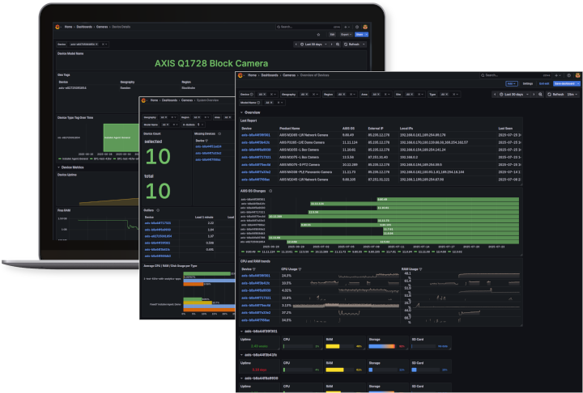
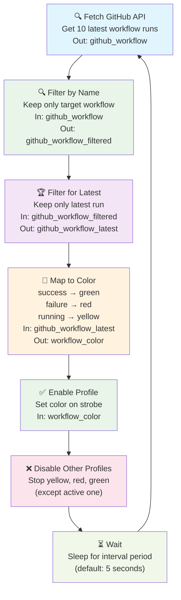
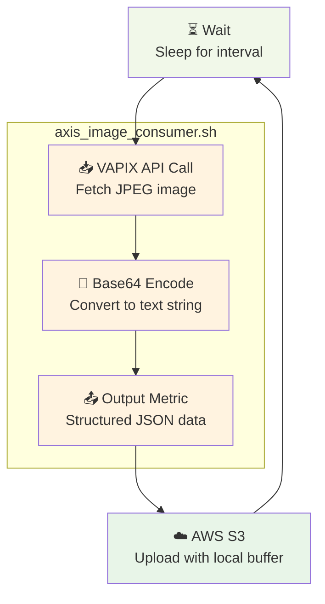

# FixedIT Data Agent Examples

This repository provides resources for the [FixedIT Data Agent ACAP](https://fixedit.ai/products-data-agent/) for the Axis network cameras and other Axis devices.

## Table of Contents

- [FixedIT Data Agent Examples](#fixedit-data-agent-examples)
  - [Table of Contents](#table-of-contents)
  - [📊 Server-side Dashboards](#server-side-dashboards)
    - [System Monitoring with InfluxDB2 and Grafana](#system-monitoring-with-influxdb2-and-grafana)
  - [🛠️ Edge Device Customization](#edge-device-customization)
    - [Visualizing a GitHub Workflow Status with an Axis Strobe](#visualizing-a-github-workflow-status-with-an-axis-strobe)
    - [Creating a Timelapse with AWS S3 Upload](#creating-a-timelapse-with-aws-s3-upload)

## 📊 Server-side Dashboards

The [dashboard-deployments](./dashboard-deployments) directory contains visualization dashboards that work with the FixedIT Data Agent. Some work directly with the bundled configurations (just spin them up and start visualizing), while others can be used as-is or customized for your needs. Advanced users often combine edge device customization with dashboard modifications to visualize new data types.

### System Monitoring with InfluxDB2 and Grafana

The dashboard stack in the image below is the system monitoring example for the bundled configuration in the FixedIT Data Agent, for more details see the [README](./dashboard-deployments/system-monitoring-influxdb2-flux-grafana/README.md) in the dashboard-deployments directory.

## 🛠️ Edge Device Customization

Project implementation examples that show how to extend and customize the FixedIT Data Agent by uploading custom configuration files and scripts. This makes it easy to create tailored edge applications for Axis devices without starting from scratch using the AXIS ACAP SDK.

### Visualizing a GitHub Workflow Status with an Axis Strobe

The [Strobe Color From GitHub Workflow](./project-strobe-color-from-github-workflow) project demonstrates real-time CI/CD status visualization by automatically controlling an Axis strobe light based on GitHub Actions workflow results. When your workflow succeeds, the strobe glows green; when it fails, it turns red; and yellow indicates tests are running. The FixedIT Data Agent should be running on the Axis strobe device, since this will poll the GitHub API, no other infrastructure is required.

```mermaid
flowchart TD
    A["🔍 Fetch GitHub API<br/>Get 10 latest workflow runs<br/>Out: github_workflow"] --> B["🔍 Filter by Name<br/>Keep only target workflow<br/>In: github_workflow<br/>Out: github_workflow_filtered"]
    B --> C["🏆 Filter for Latest<br/>Keep only latest run<br/>In: github_workflow_filtered<br/>Out: github_workflow_latest"]
    C --> D["🎨 Map to Color<br/>success → green<br/>failure → red<br/>running → yellow<br/>In: github_workflow_latest<br/>Out: workflow_color"]
    D --> E["✅ Enable Profile<br/>Set color on strobe<br/>In: workflow_color"]
    E --> F["❌ Disable Other Profiles<br/>Stop yellow, red, green<br/>(except active one)"]
    F --> G["⏳ Wait<br/>Sleep for interval period<br/>(default: 5 seconds)"]
    G --> A

    style A fill:#e1f5fe
    style B fill:#e8f5e8
    style C fill:#f3e5f5
    style D fill:#fff3e0
    style E fill:#e8f5e8
    style F fill:#fce4ec
    style G fill:#f1f8e9
```

This example showcases how simple configuration files and shell scripts can create powerful edge intelligence in your Axis strobes without traditional embedded development complexity. The project could easily be adapted to work together with other APIs to visualize statuses such as server health monitoring, weather warnings (like high wind alerts), IoT sensor data (temperature, moisture, etc.), security system states, or any REST API (or most other APIs) that provides status information.

### Creating a Timelapse with AWS S3 Upload

The [Timelapse with AWS S3 Upload](./project-timelapse-s3) project demonstrates automated timelapse video creation using the FixedIT Data Agent. This solution captures images at regular intervals from an AXIS device and uploads them to AWS S3 with timestamped filenames, creating a chronological sequence perfect for timelapse generation. Perfect for construction sites, environmental monitoring, safety applications, or any scenario requiring periodic visual documentation.

_Click the image above to watch the timelapse video on YouTube_

```mermaid
flowchart TD
    A["⏳ Wait<br/>Sleep for interval"] --> B1["📥 VAPIX API Call<br/>Fetch JPEG image"]
    B3 --> C["☁️ AWS S3<br/>Upload with local buffer"]
    C --> A

    subgraph "axis_image_consumer.sh"
        B1["📥 VAPIX API Call<br/>Fetch JPEG image"] --> B2["🔄 Base64 Encode<br/>Convert to text string"]
        B2 --> B3["📤 Output Metric<br/>Structured JSON data"]
    end

    style A fill:#f1f8e9
    style C fill:#e8f5e8
    style B1 fill:#fff3e0
    style B2 fill:#fff3e0
    style B3 fill:#fff3e0
```

The system leverages the FixedIT Data Agent's built-in capabilities to create sophisticated data workflow graphs without traditional embedded programming. This shows that it is possible to work with binary data such as images and video in the FixedIT Data Agent, it also shows how to use the AWS S3 output integration in the FixedIT Data Agent.
