# FixedIT Data Agent Examples

This repository provides resources for the [FixedIT Data Agent ACAP](https://fixedit.ai/products-data-agent/) for the Axis network cameras and other Axis devices.

## 📊 Server-side dashboards

The [dashboard-deployments](./dashboard-deployments) directory contains visualization dashboards that work with the FixedIT Data Agent. Some work directly with the bundled configurations (just spin them up and start visualizing), while others can be used as-is or customized for your needs. Advanced users often combine edge device customization with dashboard modifications to visualize new data types.

The dashboard stack in the image below is the system monitoring example for the bundled configuration in the FixedIT Data Agent, for more details see the [README](./dashboard-deployments/system-monitoring-influxdb2-flux-grafana/README.md) in the dashboard-deployments directory.

## 🛠️ Edge device customization

Project implementation examples that show how to extend and customize the FixedIT Data Agent by uploading custom configuration files and scripts. This makes it easy to create tailored edge applications for Axis devices without starting from scratch using the AXIS ACAP SDK.

The [GitHub Workflow to Strobe Color](./project-strobe-color-from-github-workflow) project demonstrates real-time CI/CD status visualization by automatically controlling an Axis strobe light based on GitHub Actions workflow results. When your workflow succeeds, the strobe glows green; when it fails, it turns red; and yellow indicates tests are running. The FixedIT Data Agent should be running on the Axis strobe device, since this will poll the GitHub API, no other infrastructure is required.

```mermaid
flowchart TD
    A["🔍 Fetch GitHub API<br/>Get latest workflow status"] --> B["📊 Parse Response<br/>Extract conclusion field"]
    B --> C["🎨 Map to Color<br/>success → green<br/>failure → red<br/>running → yellow"]
    C --> D["✅ Enable Profile<br/>Start target color strobe"]
    D --> E["❌ Disable Other Profiles<br/>Stop yellow, red, green<br/>(except active one)"]
    E --> F["⏳ Wait<br/>Sleep for interval period<br/>(default: 5 seconds)"]
    F --> A

    style A fill:#e1f5fe
    style B fill:#f3e5f5
    style C fill:#fff3e0
    style D fill:#e8f5e8
    style E fill:#fce4ec
    style F fill:#f1f8e9
```

This example showcases how simple configuration files and shell scripts can create powerful edge intelligence without traditional embedded development complexity.
