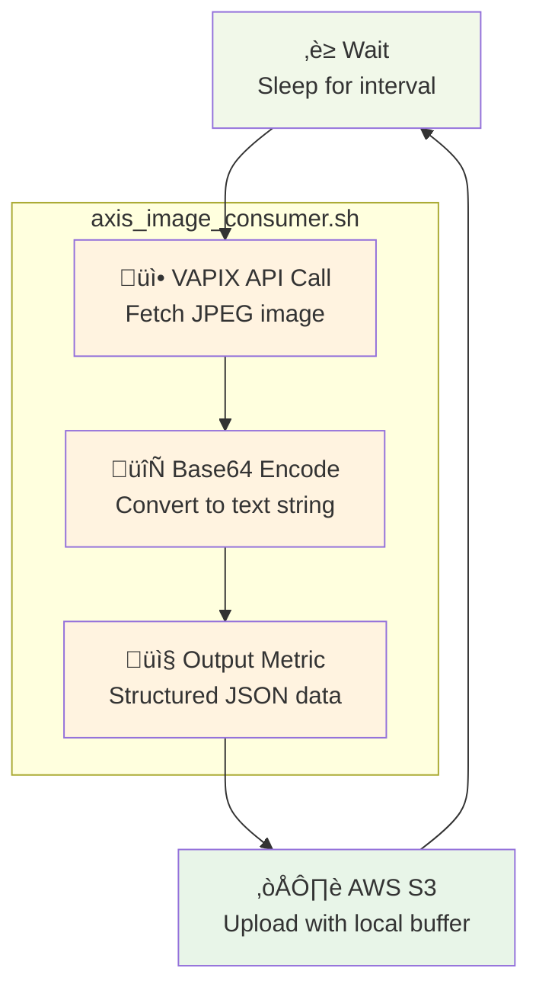

# FixedIT Data Agent Examples

This repository provides resources for the [FixedIT Data Agent ACAP](https://fixedit.ai/products-data-agent/) for the Axis network cameras and other Axis devices.

## Table of Contents

<!-- toc -->

- [📊 Server-side Dashboards](#%F0%9F%93%8A-server-side-dashboards)
  - [System Monitoring with InfluxDB2 and Grafana](#system-monitoring-with-influxdb2-and-grafana)
- [🛠️ Edge Device Customization](#%F0%9F%9B%A0%EF%B8%8F-edge-device-customization)
  - [Hello, World!](#hello-world)
  - [Creating a Timelapse with AWS S3 Upload](#creating-a-timelapse-with-aws-s3-upload)

<!-- tocstop -->

## 📊 Server-side Dashboards

The [dashboard-deployments](./dashboard-deployments) directory contains visualization dashboards that work with the FixedIT Data Agent. Some work directly with the bundled configurations (just spin them up and start visualizing), while others can be used as-is or customized for your needs. Advanced users often combine edge device customization with dashboard modifications to visualize new data types.

### System Monitoring with InfluxDB2 and Grafana

The dashboard stack in the image below is the system monitoring example for the bundled configuration in the FixedIT Data Agent, for more details see the [README](./dashboard-deployments/system-monitoring-influxdb2-flux-grafana/README.md) in the dashboard-deployments directory.

## 🛠️ Edge Device Customization

Project implementation examples that show how to extend and customize the FixedIT Data Agent by uploading custom configuration files and scripts. This makes it easy to create tailored edge applications for Axis devices without starting from scratch using the AXIS ACAP SDK.

### Hello, World!

The [Hello, World!](./project-hello-world) project demonstrates how to use the FixedIT Data Agent to upload custom config files and print messages to the standard output of the Telegraf process which will be captured by the FixedIT Data Agent and displayed in the `Logs` tab.

```mermaid
flowchart TD
    X0["⚙️ Configuration Variables:<br/>SYNC_INTERVAL_SECONDS, TELEGRAF_DEBUG"] --> X1
    X1["Telegraf Agent"]

    X2["Configuration override:<br/>'interval'"] --> A2

    A1["📥 Hello World Input 1<br/>Global Interval"] --> C
    A2["📥 Hello World Input 2<br/>5s Override Interval"] --> C
    C["📤 Output to stdout<br/>JSON format"]

    style X0 fill:#f5f5f5,stroke:#9e9e9e
    style X1 fill:#f5f5f5,stroke:#9e9e9e
    style X2 fill:#f5f5f5,stroke:#9e9e9e
    style A1 fill:#90EE90,stroke:#43a047
    style A2 fill:#90EE90,stroke:#43a047
    style C fill:#ffebee,stroke:#e53935
```

### Creating a Timelapse with AWS S3 Upload

The [Timelapse with AWS S3 Upload](./project-timelapse-s3) project demonstrates automated timelapse video creation using the FixedIT Data Agent. This solution captures images at regular intervals from an AXIS device and uploads them to AWS S3 with timestamped filenames, creating a chronological sequence perfect for timelapse generation. Perfect for construction sites, environmental monitoring, safety applications, or any scenario requiring periodic visual documentation.

_Click the image above to watch the timelapse video on YouTube_

The system leverages the FixedIT Data Agent's built-in capabilities to create sophisticated data workflow graphs without traditional embedded programming. This shows that it is possible to work with binary data such as images and video in the FixedIT Data Agent, it also shows how to use the AWS S3 output integration in the FixedIT Data Agent.
