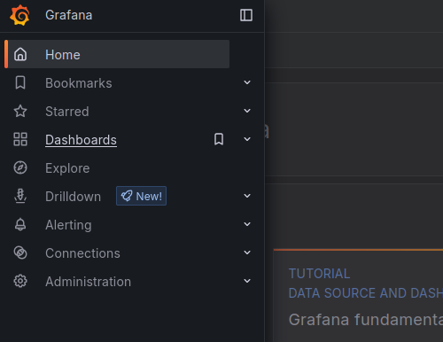
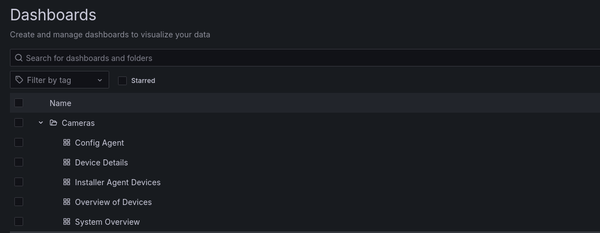
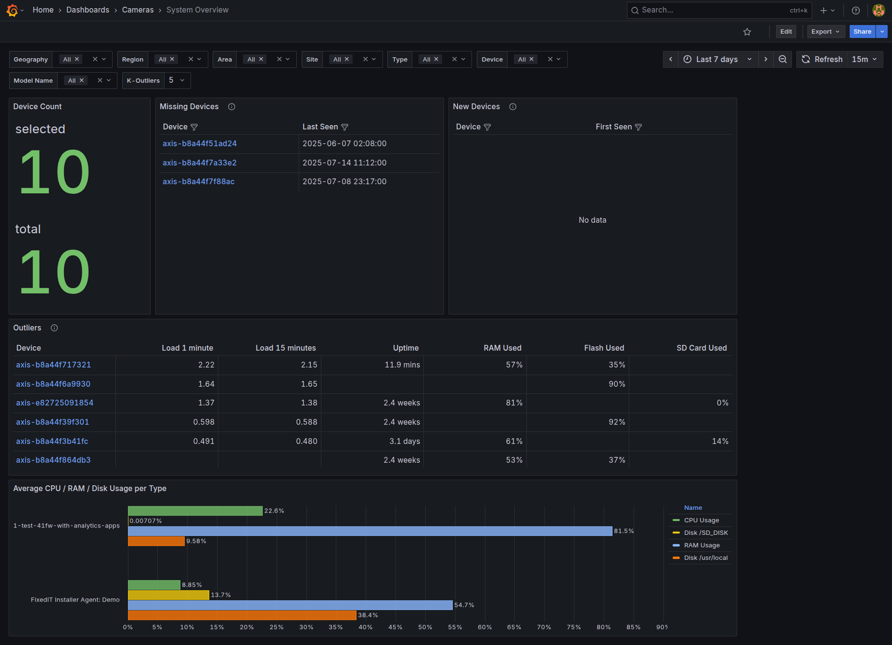
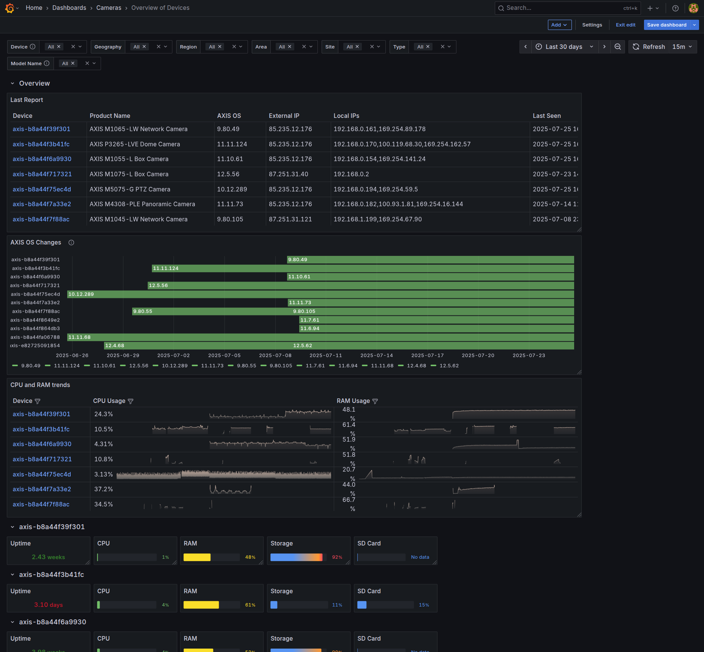
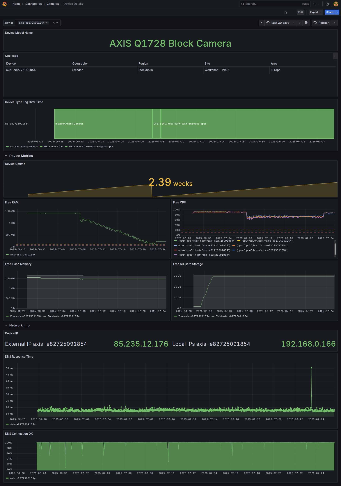

# InfluxDB and Grafana Monitoring Stack

This directory contains a complete system monitoring stack designed to work with the **FixedIT Data Agent** running on Axis devices. The stack includes InfluxDB for time-series data storage and Grafana with pre-built dashboards for visualizing system metrics and device health from your Axis device fleet.


## Table of Contents

<!-- toc -->

- [What This Stack Provides](#what-this-stack-provides)
- [The Database and Query Language](#the-database-and-query-language)
- [Prerequisites](#prerequisites)
- [Quick Start](#quick-start)
  - [Option A: Simple Demo (Recommended for Testing)](#option-a-simple-demo-recommended-for-testing)
  - [Option B: Production-Like Example](#option-b-production-like-example)
  - [Port Configuration](#port-configuration)
  - [Deployment Organization](#deployment-organization)
- [Configure Your FixedIT Data Agent](#configure-your-fixedit-data-agent)
- [Grafana Dashboards](#grafana-dashboards)
  - [Accessing the Dashboards](#accessing-the-dashboards)
  - [Pre-built Dashboard Overview](#pre-built-dashboard-overview)
    - [1. System Overview Dashboard](#1-system-overview-dashboard)
    - [2. Overview of Devices Dashboard](#2-overview-of-devices-dashboard)
    - [3. Device Details Dashboard](#3-device-details-dashboard)
  - [Integration with FixedIT Data Agent](#integration-with-fixedit-data-agent)
- [Using an older version of the FixedIT Data Agent](#using-an-older-version-of-the-fixedit-data-agent)
- [Known Issues and Limitations](#known-issues-and-limitations)
- [Helper Scripts](#helper-scripts)

<!-- tocstop -->

## What This Stack Provides

This monitoring solution gives you comprehensive visibility into your Axis devices through three specialized dashboards:

- **System Overview**: Fleet-wide metrics including connected devices, recently lost devices, and performance outliers
- **Overview of Devices**: Individual device information with detailed metrics, IP addresses, and system health
- **Device Details**: Deep-dive into specific device performance including CPU, RAM, network, and geo-location data

The stack is designed for DevOps and IT professionals who want to deploy monitoring infrastructure for devices running the FixedIT Data Agent, without needing to create dashboards from scratch.

## The Database and Query Language

This monitoring stack uses **InfluxDB 2** with the **Flux query language** for all data queries and dashboard visualizations.

**Important Note**: InfluxDB 3 has moved away from Flux to SQL-based queries. However, we chose to use InfluxDB 2 with Flux for this stack because:

- InfluxDB 2 with Flux is still the most widely adopted version in the community
- Most existing time-series monitoring setups use Flux
- The Flux query language is well-suited for time-series data analysis

If you're already using InfluxDB 3 in your environment, you would need to adapt the dashboard queries from Flux to SQL syntax.

## Prerequisites

- Docker and Docker Compose installed on your server
- Network connectivity between your Axis devices (running FixedIT Data Agent) and the server hosting this stack
- Basic familiarity with InfluxDB and Grafana (helpful but not required)

## Quick Start

Choose one of the deployment options below:

### Option A: Simple Demo (Recommended for Testing)

This is the quickest way to test the monitoring stack on your local machine. Everything is pre-configured with hardcoded values.

1. **Start the stack:**

   ```bash
   docker compose up -d
   ```

2. **Verify it's running:**
   - **InfluxDB**: [http://127.0.0.1:8086](http://127.0.0.1:8086) - login with username `test` and password `testtest`
   - **Grafana**: [http://127.0.0.1:3000](http://127.0.0.1:3000) - login with username `admin` and password `test`

⚠️ **Note**: This uses hardcoded credentials and ports. Only use for local testing.

### Option B: Production-Like Example

This provides a more secure example with environment variables and additional monitoring features. It's still an **example to build upon**, not a complete production solution.

1. **Generate secure environment variables:**

   ```bash
   ./helper_scripts/generate-env.sh
   source env.sh
   ```

2. **Start the enhanced stack:**
   ```bash
   docker compose -f docker-compose.yml -f docker-compose.prod.yml up -d
   ```

This example includes:

- Environment variables for all sensitive data
- Configurable ports for multiple instances
- Health checks for both services (needs some more work)

⚠️ **Note**: This is still an example configuration. For actual production use, you'll need additional security hardening, backup strategies, and monitoring.

### Port Configuration

The production-like setup uses configurable ports to allow running multiple instances on the same server. The demo setup uses hardcoded ports (8086 for InfluxDB, 3000 for Grafana) for simplicity. You can change the production ports by editing the `env.sh` file after generation with the `helper_scripts/generate-env.sh` script or by manually setting the environment variables before launching the stack.

### Deployment Organization

This dashboard stack can be deployed multiple times to the same server. This is useful if you want to monitor multiple sites and have them completely isolated from each other. To enable this, you need to use the production override file (`docker-compose.prod.yml`) with the generated environment variables. This will make sure that the ports are not the same and that a project specific prefix will be used for the container names.

The intended deployment pattern is to use **separate folders for different deployments**:

- Copy the content of this directory to separate folders (e.g., `site-1-dashboard/`, `site-2-dashboard/`, etc.)
- Each folder contains the same code and has its own `env.sh` file with unique credentials and ports
- Data volumes mount to consistent folder names within each deployment directory
- This makes it easy to see which code version was used for each deployment and keeps credentials isolated.

## Configure Your FixedIT Data Agent

After deploying the stack, configure your Axis devices to send data to it:

**For Simple Demo (Option A):**

- **InfluxDBHost**: `http://YOUR_SERVER_IP:8086`
- **InfluxDBToken**: `KLoG_Z0NsDIbVzS7zVn_VwhgxUgvwaGWE1wwO9SsGfNEeMaopLMsAA2aAGbCshpetVdu86Ig3-WTKugv6Srg6w==` (demo admin token)
- **InfluxDBOrganization**: `Whisperer`
- **InfluxDBBucket**: `Cameras`

_Note: The demo uses the admin token for simplicity. For any real testing beyond local evaluation, create dedicated tokens as described below._

**For Production-Like Example (Option B):**

- **InfluxDBHost**: `http://YOUR_SERVER_IP:${INFLUXDB_PORT}` (check your env.sh for port)
- **InfluxDBToken**: Create a dedicated token in InfluxDB (see security note below)
- **InfluxDBOrganization**: `Whisperer` (hardcoded in docker-compose.yml)
- **InfluxDBBucket**: `Cameras` (hardcoded in docker-compose.yml)

⚠️ **Security Best Practice**: Do NOT use `${INFLUXDB_ADMIN_TOKEN}` for your cameras. Instead, log into InfluxDB and create dedicated tokens with write-only permissions to the `Cameras` bucket. Ideally create one token per camera, or at minimum a shared token with restricted permissions.

**To create a camera token in InfluxDB:**

1. Log into InfluxDB UI with admin credentials
2. Go to "Data" → "API Tokens" → "Generate API Token"
3. Choose "Custom API Token"
4. Grant only "Write" permission to the `Cameras` bucket
5. Use this token for your FixedIT Data Agent configuration

**⚠️ Grafana Security Note**: Grafana also uses the admin token by default (configured via environment variables in docker-compose files). For better security, you should:

1. Create a separate token for Grafana with only "Read" permission to the `Cameras` bucket
2. Log into Grafana → Configuration → Data Sources → InfluxDB
3. Update the token field with your new read-only token
4. Test the connection to ensure it works

**Summary of recommended tokens for secure setup:**

- **Admin token**: Keep for InfluxDB administration only
- **Camera tokens**: Write-only access to `Cameras` bucket (one per camera ideally)
- **Grafana token**: Read-only access to `Cameras` bucket

Once configured, metrics will appear in the Grafana dashboards within a few minutes.

## Grafana Dashboards

Open the Grafana UI to access the pre-built dashboards. The URL and credentials depend on your deployment option:

- **Option A (Simple Demo)**: [http://127.0.0.1:3000](http://127.0.0.1:3000) - login with username `admin` and password `test`
- **Option B (Production-Like)**: Check your `env.sh` file for the port and admin password

### Accessing the Dashboards

After logging into Grafana, navigate to the dashboards by clicking on the Grafana icon and selecting "Dashboards":



The dashboards are organized in a "Cameras" folder for easy organization:



### Pre-built Dashboard Overview

This stack includes three comprehensive dashboards designed specifically for monitoring Axis devices running the FixedIT Data Agent:

#### 1. System Overview Dashboard

Provides fleet-wide visibility including connected device counts, recently lost devices, and performance outliers. This dashboard is designed to give you a high-level view of your entire device ecosystem without overwhelming detail on individual devices.



#### 2. Overview of Devices Dashboard

Shows detailed information for all connected devices including last report times, AXIS OS versions, IP addresses, and individual device performance metrics. Perfect for monitoring the health and status of your device fleet.



#### 3. Device Details Dashboard

Provides deep-dive analytics for individual devices, including detailed system metrics, geographic tagging information, and network performance data. Access this dashboard by clicking on any device identifier from the other dashboards.



### Integration with FixedIT Data Agent

These dashboards are designed to work seamlessly with the default configuration of the FixedIT Data Agent. The agent automatically collects and sends system metrics to InfluxDB, which are then visualized through these Grafana dashboards. No additional configuration is needed beyond setting up the InfluxDB connection details in your FixedIT Data Agent settings.

## Using an older version of the FixedIT Data Agent

After a new release of the FixedIT Data Agent is made, the old versions of the dashboards should continue to work thanks to the backwards compatibility of the data model. In a subsequent release of the dashboard, we might add new visualizations or features that are only available if you update the FixedIT Data Agent. If you are using older versions of the FixedIT Data Agent and do not intend to update, then you can always browse the [tags](https://github.com/fixedit-ai/fixedit-data-agent-examples/tags) of the repository to find a snapshot of the dashboard at that time.

## Known Issues and Limitations

**A note on efficiency**: Some of the dashboard visualizations are rather compute-intensive and may perform slowly when used with many cameras, a large amount of data or insufficient server resources. We will continue to optimize the dashboards and the data model to improve performance.

## Helper Scripts

The directory [helper_scripts](./helper_scripts/) contains scripts that can assist with deployment, see the [README](./helper_scripts/README.md) for more details.
