# Hello, World! (with exec input plugin)

This is a simple "Hello, world!" project that demonstrates how to use the [FixedIT Data Agent](https://fixedit.ai/products-data-agent/) to print messages to the standard output of the Telegraf process, which will be captured by the FixedIT Data Agent and displayed in the `Logs` tab.

This is very similar to the [project-hello-world](../project-hello-world/) project, but instead of using the `inputs.mock` plugin to generate the input data, we are using the `inputs.exec` plugin to run a shell command. This guide also adds the [Running the Example Together with the Default Config Files](#running-the-example-together-with-the-default-config-files) section to show how to send the data to an InfluxDB database and use it there.

## How It Works

This project defines two inputs that will run on an interval and produce a "Hello, World!" message. We make use of the `inputs.exec` plugin to run the `echo` command which will output the message. One input runs on the globally configured interval, and the other input runs on a more frequent interval. The `outputs.file` plugin is used to print all metrics to the standard output of the Telegraf process, which will be captured by the FixedIT Data Agent and displayed in the `Logs` tab.

```mermaid
flowchart TD
    X0["⚙️ Configuration Variables:<br/>SYNC_INTERVAL_SECONDS, TELEGRAF_DEBUG"] --> X1
    X1["Telegraf Agent"]

    X2["Configuration override:<br/>'interval'"] --> A2

    A1["📥 Hello World Input 1<br/>Global Interval"] --> C
    A2["📥 Hello World Input 2<br/>5s Override Interval"] --> C
    C["📤 Output to stdout<br/>JSON format"]

    style X0 fill:#f5f5f5,stroke:#9e9e9e
    style X1 fill:#f5f5f5,stroke:#9e9e9e
    style X2 fill:#f5f5f5,stroke:#9e9e9e
    style A1 fill:#90EE90,stroke:#43a047
    style A2 fill:#90EE90,stroke:#43a047
    style C fill:#ffebee,stroke:#e53935
```



Color scheme:

- Light green: Input nodes / data ingestion
- Red: Output nodes / notifications
- Light gray: Configuration data

## Why Choose This Approach?

With the FixedIT Data Agent, you can create your own edge-based workflows and automations that run directly in the Axis devices. You can do this without knowing anything about the Axis ACAP SDK, C and C++ programming. This makes the edge available to a much wider audience of developers, system integrators and IT professionals.

This simple project demonstrates how to configure different inputs with different intervals in the FixedIT Data Agent and how to propagate that data to the logs tab of the FixedIT Data Agent. It's a great starting point for understanding the basics of the agent's configuration system.

## Table of Contents

<!-- toc -->

- [Compatibility](#compatibility)
  - [AXIS OS Compatibility](#axis-os-compatibility)
  - [FixedIT Data Agent Compatibility](#fixedit-data-agent-compatibility)
- [Quick Setup](#quick-setup)
- [Files](#files)
- [Configuration Details](#configuration-details)
- [Running the Example Together with the Default Config Files](#running-the-example-together-with-the-default-config-files)
- [Local Testing on Host](#local-testing-on-host)
  - [Prerequisites](#prerequisites)
  - [Test Commands](#test-commands)

<!-- tocstop -->

## Compatibility

### AXIS OS Compatibility

- **Minimum AXIS OS version**: No special requirements
- **Required tools**: None

### FixedIT Data Agent Compatibility

- **Minimum Data Agent version**: 1.1
- **Required features**: `SYNC_INTERVAL_SECONDS` environment variable (added in FixedIT Data Agent v1.1).

## Quick Setup

1. **Disable the default config files**

The FixedIT Data Agent comes with default config files for collecting system metrics and sending them to a database. Since we don't want to use those now, click the `Disable` button next to the "Bundled config files"
in the "Configuration" tab of the FixedIT Data Agent.


2. **Upload and enable the `config.conf` file to the FixedIT Data Agent**

Click the `Upload Config` button in the "Configuration" tab of the FixedIT Data Agent and upload the `config.conf` file. Then press the `Enable` button next to the `config.conf` file.


3. **Go to the "Logs" tab and verify the data**

It might take a few seconds before Telegraf has been restarted with the new config file. After this, you should see the "Hello, World!" messages appearing as JSON in the Logs tab at two different intervals:

- One message following the global interval (defaults to 60 seconds in the FixedIT Data Agent but can be changed from the application settings)
- Another message every 5 seconds


4. **Reconfigure the FixedIT Data Agent variables:**

   The `config.conf` file is making use of the `SYNC_INTERVAL_SECONDS` and `TELEGRAF_DEBUG` environment variables. You can configure these in the "Settings" tab of the FixedIT Data Agent by going back to the camera web interface, going to the "Apps" section, pressing the three dots next to the FixedIT Data Agent and selecting "Settings". Try changing the "Sync interval seconds" to 10 seconds and the "Debug mode" to true.

   

   You should now see the global interval message appearing every 10 seconds instead. By scrolling down to the bottom of the logs where you find the internal Telegraf logs (by default printed to the "Standard Error" section), you will now see more verbose log messages such as `Wrote batch of 3 metrics in 4.322833ms` and `Buffer fullness: 0 / 10000 metrics`. This means that the metrics was successfully written to the output (`output.file` plugin) and that the buffer is now empty waiting for the next batch of metrics.

## Files

- `config.conf` - Combined configuration file containing both inputs and the output configuration

## Configuration Details

The project uses the following components:

1. **Input Configurations**
   - Global interval input: Uses the exec input plugin to run an echo command every `SYNC_INTERVAL_SECONDS` seconds.
   - Override interval input: Same as above, but every 5 seconds regardless of the value of the `SYNC_INTERVAL_SECONDS` variable.

2. **Output Configuration**
   - Uses the file output plugin configured to write to stdout
   - Data format is set to "json"

3. **Data Flow**
   - By default, all inputs are connected to all outputs.

## Running the Example Together with the Default Config Files

One of the steps in the quick setup was to disable the default config files. The reason for doing this is that the default behavior of Telegraf is to connect all inputs to all outputs. You can upload the same config file to the FixedIT Data Agent while having the bundled config files enabled. This will work assuming that you have already configured the InfluxDB variables according to the quick start guide for the FixedIT Data Agent.

When doing this, you will see a lot of output in the "Logs" tab. This is because your new "output everything to stdout" plugin will consume all metrics from all configuration files and print all of them to stdout. The same is true for the new inputs that you created, the "Hello, World!" messages will also be sent to InfluxDB using the output defined in the bundled config files.


All inputs are sent to all outputs (bundled plugins with blue border, new plugins with red border):

```mermaid
flowchart TD
    A1["📥 Hello World Input 1<br/>Global Interval"] --> C
    A2["📥 Hello World Input 2<br/>5s Override Interval"] --> C
    C["📤 Output to stdout<br/>JSON format"]

    D1["📥 System metric 1"] --> C
    D2["📥 System metric 2"] --> C
    D3["📥 System metric ..."] --> C

    C2["📤 Output to InfluxDB"]
    A1 --> C2
    A2 --> C2
    D1 --> C2
    D2 --> C2
    D3 --> C2

    style A1 fill:#F1FCF1,stroke:#ff0000
    style A2 fill:#F1FCF1,stroke:#ff0000
    style D1 fill:#F1FCF1,stroke:#24a9e1
    style D2 fill:#F1FCF1,stroke:#24a9e1
    style D3 fill:#F1FCF1,stroke:#24a9e1
    style C fill:#FFF9FA,stroke:#ff0000
    style C2 fill:#FFF9FA,stroke:#24a9e1
```



## Local Testing on Host

You can test this project locally using Telegraf before deploying to your Axis device.

### Prerequisites

- Requires Linux: since this example makes use of the `inputs.exec` plugin to run shell-commands, it will only work on Linux (or WSL under Windows). For a simple Windows example, see [project-hello-world](../project-hello-world/).
- Install Telegraf on your development machine.

### Test Commands

First, set up the two environment variables (which are automatically set by the FixedIT Data Agent when running the project in the Axis device):

```bash
export SYNC_INTERVAL_SECONDS="10"
export TELEGRAF_DEBUG="true"
```

Then run Telegraf with the configuration file:

```bash
telegraf --config config.conf
```

You should now see some internal Telegraf logs on `stderr` and the JSON messages with the "Hello, World!" string appearing every now and then on `stdout`.
