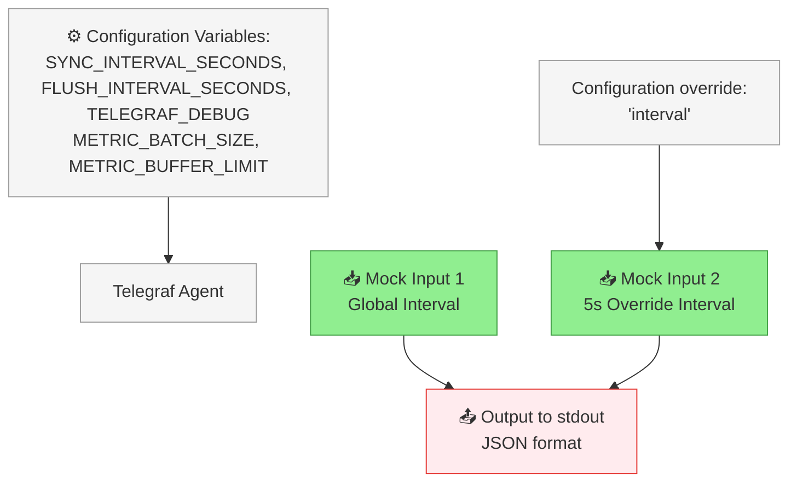
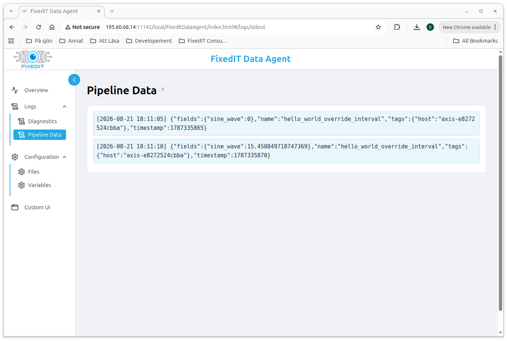
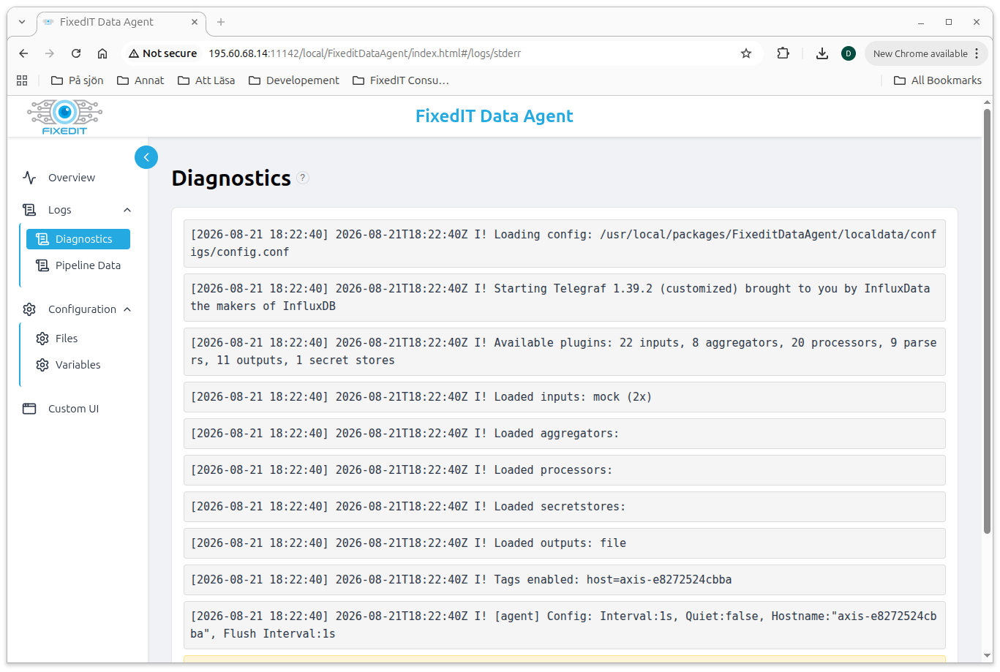
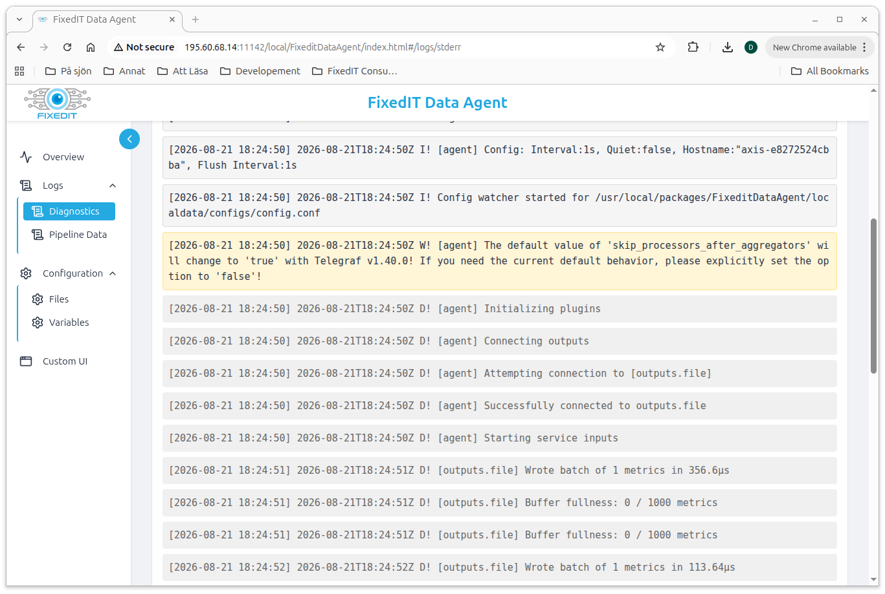
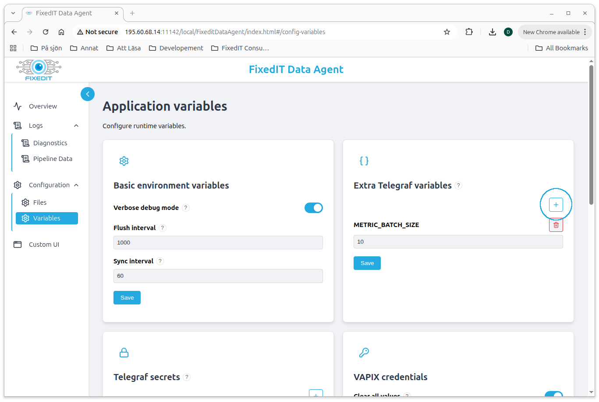

# Hello, World!

This is a simple "Hello, world!" project that demonstrates how to use the [FixedIT Data Agent](https://fixedit.ai/products-data-agent/) to print messages to the standard output of the Telegraf process, which will be captured by the FixedIT Data Agent and displayed in the `Logs->Pipeline Data` tab.

## How It Works

This project defines two inputs that will run on an interval and produce some numeric metrics and a "Hello, World!" message. We make use of the `inputs.mock` plugin to generate the input data randomly. One input runs on the globally configured interval, and the other input runs on a more frequent interval. The `outputs.file` plugin is used to print all metrics to the standard output of the Telegraf process, which will be captured by the FixedIT Data Agent and displayed in the `Logs->Pipeline Data` tab.



Color scheme:

- Light green: Input nodes / data ingestion
- Red: Output nodes / notifications
- Light gray: Configuration data

## Why Choose This Approach?

With the FixedIT Data Agent, you can create your own edge-based workflows and automations that run directly in the Axis devices. You can do this without knowing anything about the Axis ACAP SDK, C and C++ programming. This makes the edge available to a much wider audience of developers, system integrators and IT professionals.

This simple project demonstrates how to configure different inputs with different intervals in the FixedIT Data Agent and how to propagate that data to the `Logs->Pipeline Data` tab. It's a great starting point for understanding the basics of the agent's configuration system.

## Table of Contents

<!-- toc -->

- [Compatibility](#compatibility)
  - [AXIS OS Compatibility](#axis-os-compatibility)
  - [FixedIT Data Agent Compatibility](#fixedit-data-agent-compatibility)
- [Quick Setup](#quick-setup)
- [Files](#files)
- [Configuration Details](#configuration-details)
- [Advanced: Local Testing on Host](#advanced-local-testing-on-host)
  - [Prerequisites](#prerequisites)
  - [Test Commands](#test-commands)
- [Integrating with InfluxDB](#integrating-with-influxdb)

<!-- tocstop -->

## Compatibility

### AXIS OS Compatibility

- **Minimum AXIS OS version**: No special requirements
- **Required tools**: None

### FixedIT Data Agent Compatibility

- **Minimum Data Agent version**: 1.3
- **Required features**: `inputs.mock` (added in v1.3.0), and the `SYNC_INTERVAL_SECONDS` and `FLUSH_INTERVAL_SECONDS` environment variables (added in FixedIT Data Agent v1.1).

## Quick Setup

1. **Disable the default config files**

   The FixedIT Data Agent comes with default config files for collecting system metrics and sending them to a database. Since we don't want to use those now, click the `Disable` button next to the "Bundled config files" in the "Configuration" tab of the FixedIT Data Agent.

   

2. **Upload and enable the `config.conf` file to the FixedIT Data Agent**

   Click the `Upload Config` button in the "Configuration->Files" tab of the FixedIT Data Agent and upload the `config.conf` file. Then press the `Enable` button next to the `config.conf` file.

   

3. **Go to the "Logs->Pipeline Data" tab and verify the metrics**

   It might take a few seconds before Telegraf has been restarted with the new config file. After this, you should see the metrics appearing as JSON in the "Logs->Pipeline Data" tab at two different intervals:
   - The `hello_world_override_interval` metric with a new value in the `sine_wave` field every 5th second
   - The `hello_world_global_interval` metric with the `Hello, World!` string, a `random_value` and a `static_value` every 60 seconds

   

4. **Reconfigure the FixedIT Data Agent variables:**

   The `config.conf` file is making use of the `SYNC_INTERVAL_SECONDS`, `FLUSH_INTERVAL_SECONDS` and `TELEGRAF_DEBUG` environment variables which are by default set by the FixedIT Data Agent and controlled from the form in the "Basic environment variables" section in the "Configuration->Variables" tab.

   Try changing the "Sync interval" to 1 second.

   

   When inspecting the "Logs->Pipeline Data" tab again, you should now see the global interval message appearing every second instead.

   Next, navigate to the "Logs->Diagnostics" tab. You should see a few informational messages (and perhaps some warnings about upcoming deprecations), but no errors.

   

   If you enable the "Verbose debug mode" slider in the "Basic environment variables" section, you should start seeing much more verbose log messages in the bottom of the "Logs->Diagnostics" tab.

   

   Here you will see messages such as `Wrote batch of 1 metrics in 123.2µs` and `Buffer fullness: 0 / 1000 metrics`. This means that the metrics were successfully written to the output (the `stdout` path in the `outputs.file` plugin) and that the output buffer is now empty waiting for the next batch of metrics.

5. **Adding custom environment variables:**

   The `config.conf` file is also making use of the `METRIC_BATCH_SIZE` and `METRIC_BUFFER_LIMIT` environment variables. These are not standard variables known by the FixedIT Data Agent, but are custom variables that we referenced using a name we chose ourselves.

   The `METRIC_BATCH_SIZE` variable is used to set how many metrics Telegraf should wait for before flushing the buffer to the output (but flushing will also happen at least every `FLUSH_INTERVAL_SECONDS` seconds). Metric batching is mostly useful for remote outputs, e.g. when sending data to a database. Sending a batch with thousands of metrics at once is much more efficient than making thousands of individual API calls.

   For the purpose of learning, let's try to enable batching by setting a high flush interval like 1000 seconds in the "Basic environment variables" section. Then, try adding a `METRIC_BATCH_SIZE` variable with the value 10. You can do this by clicking the plus icon in the "Extra Telegraf Variables" section, specifying the name as `METRIC_BATCH_SIZE` and the value as `10`.

   

   This time, the first metrics appear only after Telegraf has collected 10 metrics. Telegraf schedules collections to fixed time boundaries rather than counting delay from startup. This behavior comes from [`round_interval`](https://docs.influxdata.com/telegraf/latest/configuration/#agent-configuration), which is enabled by default. With a 60-second global interval, the first batch will often contain metrics from the 5-second override interval. With a configured interval of 1 second, the first batch will usually appear sooner and can contain metrics from both inputs. If exact timing matters, Telegraf also supports more advanced interval tuning to control scheduling in more detail.

## Files

- `config.conf`: Combined configuration file containing both inputs and the output configuration.

## Configuration Details

The project uses the following components:

1. **Input Configurations**
   - Global interval input: Uses the `mock` input plugin to generate a `hello_world_global_interval` metric every `SYNC_INTERVAL_SECONDS` seconds.
   - Override interval input: Also uses the `mock` input plugin, but generating a `hello_world_override_interval` metric every 5 seconds regardless of the value of the `SYNC_INTERVAL_SECONDS` variable.

2. **Output Configuration**
   - Uses the `file` output plugin configured to write to `stdout`.
   - The output data format is set to `json`.

3. **Data Flow**
   - Since the output plugin does not specify any filters, it will consume all metrics produced by both input plugins.

## Advanced: Local Testing on Host

As your projects grow, it can be valuable to try changes on your computer first rather than uploading every tweak to the Axis device. Doing so requires a bit more setup, so you might want to skip this section until later.

### Prerequisites

- [Install Telegraf on your development machine](https://learning.fixedit.ai/posts/fixedit-data-agent-support-learning-running-telegraf-locally-on-windows)

### Test Commands

On the Axis device, the FixedIT Data Agent sets `SYNC_INTERVAL_SECONDS`, `FLUSH_INTERVAL_SECONDS`, and `TELEGRAF_DEBUG` for you. When running Telegraf on your host, export those variables first. On Linux:

```bash
export SYNC_INTERVAL_SECONDS="1"
export FLUSH_INTERVAL_SECONDS="1"
export TELEGRAF_DEBUG="true"
```

On Windows, in PowerShell:

```PowerShell
$env:SYNC_INTERVAL_SECONDS = "1"
$env:FLUSH_INTERVAL_SECONDS = "1"
$env:TELEGRAF_DEBUG = "true"
```

Then run Telegraf with the configuration file.

```bash
telegraf --config config.conf --non-strict-env-handling
```

You should now see some internal Telegraf logs on `stderr` and JSON metrics on `stdout`, including the `hello_world_global_interval` message every `SYNC_INTERVAL_SECONDS` seconds and `hello_world_override_interval` every 5 seconds.

## Integrating with InfluxDB

In this guide, we only exposed the data in the "Logs->Pipeline Data" tab of the FixedIT Data Agent. To produce real value, you can use other outputs such as InfluxDB, MQTT, cURL, etc. As a next step, see the [project-hello-world-exec](../project-hello-world-exec/) project.
