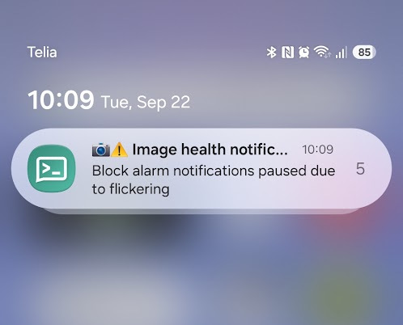
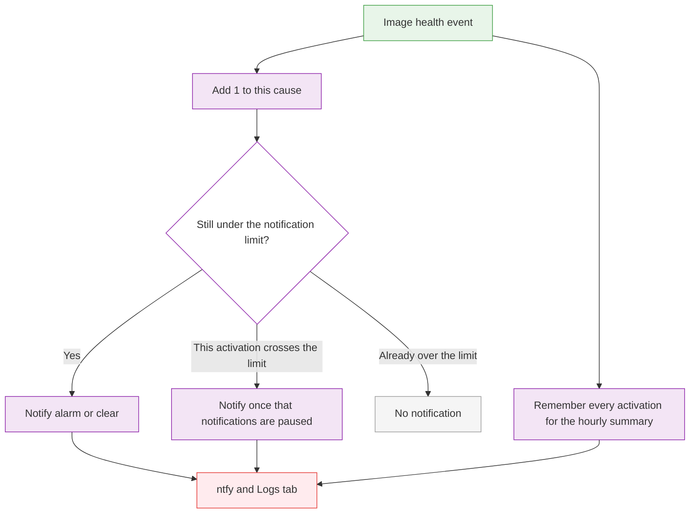

# Notification Handling for AXIS Image Health Analytics Events

This project demonstrates how to subscribe to events from [AXIS Image Health Analytics](https://www.axis.com/products/axis-image-health-analytics) with the [FixedIT Data Agent](https://fixedit.ai/products-data-agent/), apply some simple logic to the events, and send push notifications to a phone or computer using the open-source [ntfy](https://ntfy.sh/) service.

## Why Choose This Approach?

Axis devices produce a steady stream of metadata and alarms. Operators are expected to act on that stream, and a busy scene quickly turns into a flood of notifications. Built-in filters cover the common cases. They often cannot express the rule a site actually needs, such as "tell me when the image is blocked, but stop nagging me when heavy rain or snow keeps the same alarm firing for hours or days."

Turning that alarm off by hand is easy to forget to turn back on. The FixedIT Data Agent is where the rule lives instead. You describe which events matter, how often is too often, and where the result should go, and you can change those choices per site without building a new application. The camera then follows the rule, and operators see the alarms worth acting on.

## Table of Contents

<!-- toc -->

- [How It Works](#how-it-works)
- [Why Choose This Approach?](#why-choose-this-approach)
- [Compatibility](#compatibility)
  - [AXIS OS Compatibility](#axis-os-compatibility)
  - [FixedIT Data Agent Compatibility](#fixedit-data-agent-compatibility)
- [Quick Setup](#quick-setup)
  - [Troubleshooting](#troubleshooting)
- [Files](#files)
- [Configuration Details](#configuration-details)
  - [The Value Counter Processor](#the-value-counter-processor)
  - [The Cumulative Sum Processor](#the-cumulative-sum-processor)
  - [Ignoring the First Stateful Event](#ignoring-the-first-stateful-event)
- [Local Testing on Host](#local-testing-on-host)
  - [Prerequisites](#prerequisites)
  - [Host Testing Limitations](#host-testing-limitations)
  - [Test Commands](#test-commands)

<!-- tocstop -->

## Compatibility

### AXIS OS Compatibility

- **Minimum AXIS OS version**: TODO
- **Required tools**: [AXIS Image Health Analytics](https://www.axis.com/products/axis-image-health-analytics) must be installed and started (preinstalled on compatible cameras with AXIS OS 12.0 or later).
- **Other notes**: TODO

### FixedIT Data Agent Compatibility

- **Minimum Data Agent version**: 1.7
- **Required features**: Subcription support in the `event_handler` which was added in version 1.7.

## How It Works

This project implements two main features:

1. Send real-time notifications to a phone or computer using the [ntfy](https://ntfy.sh/) service when the AXIS Image Health Analytics detects an image health event. If too many activations occur within a short period of time, send one higher priority notification and then mute the notifications while the alarm is still flickering. This is configured with the `ALARM_QUIET_PERIOD` and `NOTIFY_MAX_BEFORE_PAUSE` environment variables. The latter is the maximum number notifications before muting the alarm and the former is the silence period after which the notifications are unmuted again.

2. Send a regular summary of the number of alarms within a period of time. The notification is sent only when there has been at least one alarm during that period. This could for example be an hourly digest of how many alarms have occurred during the last hour. The reporting period is configured with the `STATS_PERIOD` environment variable.

If only one of these two features is needed, the configuration file can easily be modified to disable or change the behavior that does not fit the needs.

The [ntfy](https://ntfy.sh/) service can easily be used without any registration or installation using their test server. For real deployments, a paid plan or the free self-hosted server are available. The project is fully open source.

The following diagram shows a simplified view of the data flow.

## Quick Setup

### Simple Example with Logging Only

1. **Start AXIS Image Health Analytics**

   In the camera web interface, go to Analytics → AXIS Image Health Analytics, start the application, and leave the detections you care about enabled (blocked, redirected, blurred, underexposed).

2. **Disable the bundled config files**

   The FixedIT Data Agent ships default configs that collect system metrics. Click Disable next to Bundled config files on the Configuration tab so this example is the only pipeline.

3. **Upload and enable `config.conf`**

   Click Upload Config and upload `config.conf`. Then enable it.

4. **Open the Logs tab**

   Go to the `Logs -> Pipeline Data` tab and you should see the first state being reported. Since the event is stateful, the first report will be the current state. The next report will come whenever the state changes.

### Example with Push Notifications

TODO

## Files

TODO

## Configuration Details

TODO

### The Value Counter Aggregator

The value counter counts how many matching metrics arrived during a time window, then emits one summary when that window ends. In this project it answers questions such as "how many times was the image blocked during the last hour?"

This project only counts activations (metrics where `active` is true). The `Cause` tag is used to split the metrics into separate totals, for example one count for Block, one for Blur, and so on.

The summary is named `image_health_stats` and is emitted once per `STATS_PERIOD`. This makes the plugin an aggregator rather than a processor. A processor looks at one metric at a time and can change it, rename it, or drop it, then immediately passes the result on. An aggregator waits until the window closes, then emits a new summary. The original metrics keep going to the outputs unless you set `drop_original = true`. It's worth noting that the aggregators run after all the processors have finished, so you can not depend on the load order or definition order in the config file, instead we make sure that the right metrics are available after all the processors have run.

If nothing matching is fed into the value counter during a window, it stays silent. You only get a digest for periods that had at least one counted activation.

By default the windows snap to the wall clock. The `[agent]` setting `round_interval` controls that, and it defaults to `true`. The boundary comes from `STATS_PERIOD`: `1m` lands on each minute, `1h` on the hour. Set `round_interval = false` under `[agent]` to start the first window when the agent starts and repeat from there.

If the agent starts at 09:00 and `STATS_PERIOD` is `1h`, the first three buckets look like this:

| Bucket      | What arrived                     | Reported at | What is reported |
| ----------- | -------------------------------- | ----------- | ---------------- |
| 09:00–10:00 | "Blur" alarms at 09:20 and 09:50 | 10:00       | Blur, count 2    |
| 10:00–11:00 | "Blur" alarm at 10:10            | 11:00       | Blur, count 1    |
| 11:00–12:00 | Nothing                          | No message  |                  |

### The Cumulative Sum Processor

The cumulative sum keeps a running total and attaches it to each metric as it arrives. In this project it answers questions such as "how many times has this alarm gone active since the last quiet period?"

Each alarm activation is given `incident = 1` to enable counting. The processor adds that to a total and stores it as `incident_sum` on the same metric. The `Cause` tag splits the totals, so "Block" and "Blur" count separately.

The running total is updated on every activation and the new value is attached to the same metric.

The total resets after `ALARM_QUIET_PERIOD` with no new activation for that cause (`expiry_interval`). It is not a sliding "last hour" window. If alarms keep arriving, the count keeps growing past that quiet period. If the cause stays quiet for the whole `ALARM_QUIET_PERIOD`, the next activation starts again at 1. It's worth noting that the expiration is only triggered when a metric updates the processor, therefore, we use a dummy metric that triggers the processor to run every second. This makes sure that a cause is expired as soon as the quiet period is over.

If the agent starts at 09:00 and `ALARM_QUIET_PERIOD` is `1h`, a Block series looks like this:

| Time  | What arrived | What is reported |
| ----- | ------------ | ---------------- |
| 09:20 | Block alarm  | Block, count 1   |
| 09:50 | Block alarm  | Block, count 2   |
| 10:10 | Block alarm  | Block, count 3   |
| 11:20 | Block alarm  | Block, count 1   |

The 11:20 alarm is more than one hour after 10:10, so the previous total has expired.

### Ignoring the First Stateful Event

AXIS Image Health Analytics exposes a stateful event. When the FixedIT Data Agent subscribes to this event, the camera sends the current state immediately. That means that the first message is not a change. If the image is already fine, it is a clear, and notifying the user about it would be noise. If the image is already alarming, that first activation should still send a notification.

Therefore, in this project, event metrics are counted before they are split into separate measurements. Each event gets `state_change = 1`, and the `cumulative_sum` plugin calculates the running total as `state_change_sum`.

The clear notification to ntfy can then filter on `state_change_sum > 1` to avoid sending the first clear notification.

As an example, if the state is clear when the agent starts:

| Order | What arrived | `state_change_sum` | Clear notification |
| ----- | ------------ | ------------------ | ------------------ |
| 1     | Clear        | 1                  | Skipped            |
| 2     | Block alarm  | 2                  | Sent as an alarm   |
| 3     | Clear        | 3                  | Sent               |

On the other hand, if the state is already alarming when the agent starts:

| Order | What arrived | `state_change_sum` | Clear notification |
| ----- | ------------ | ------------------ | ------------------ |
| 1     | Block alarm  | 1                  | Sent as an alarm   |
| 2     | Clear        | 2                  | Sent               |

### Limitations With This Approach

This implementation is intentionally created without any scripting to keep it simple and easy to understand for non-programmers. This design choice leads to some limitations. The two main limitations are that activations and deactivations of alarms are silenced independently. This means that the duration of the alarms plays a role and it can happen that either the activation or deactivation is silenced while the other one is not. The other problem is that there is no notification telling the user when a paused notification goes back to normal.

Both of these problems can be solved by replacing some of the built-in processors and aggregators for a scriped processor (Python-like Starlark) instead.
