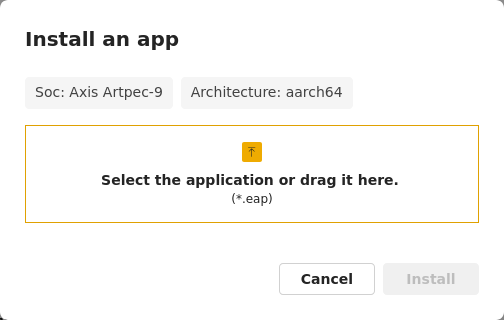
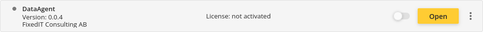
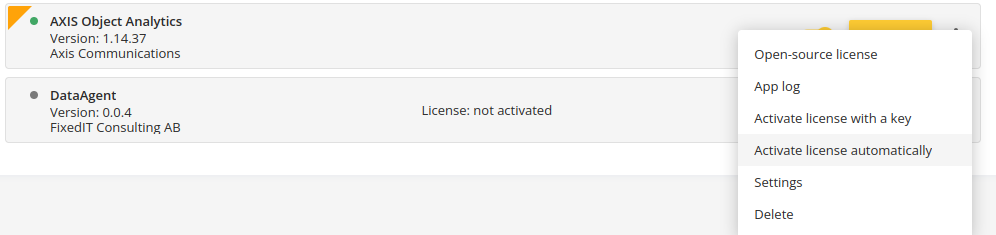
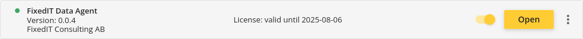
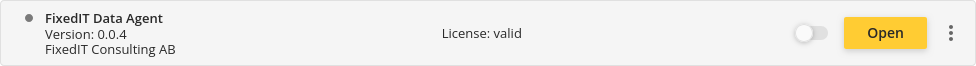
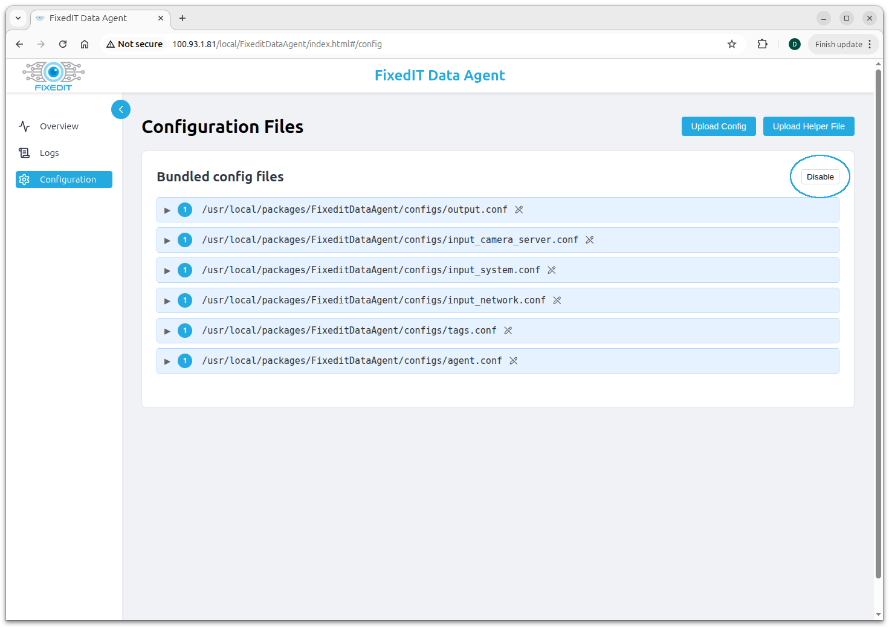
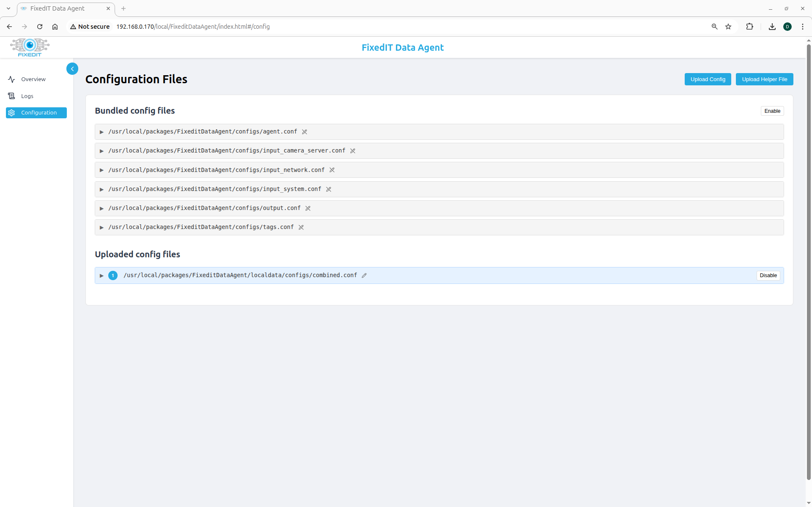
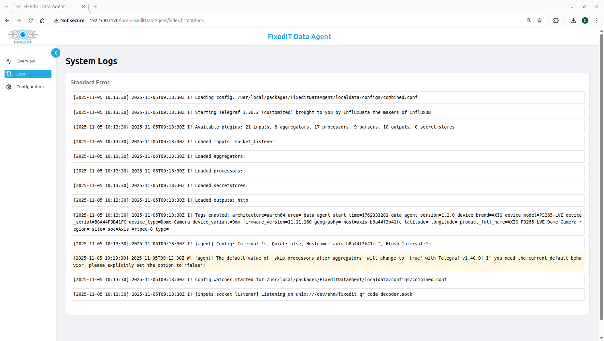
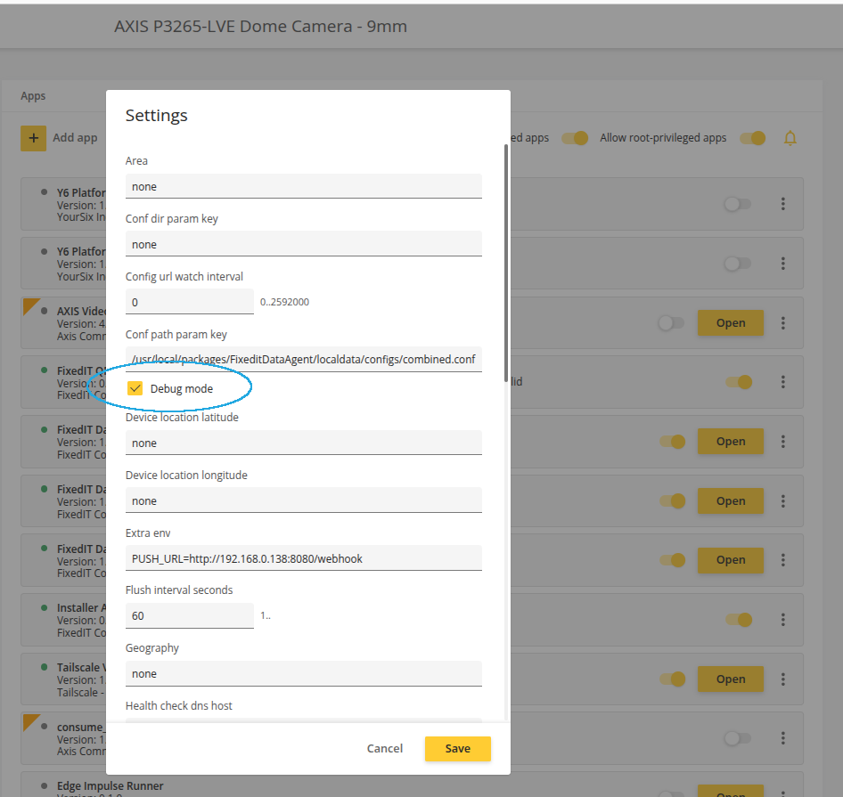
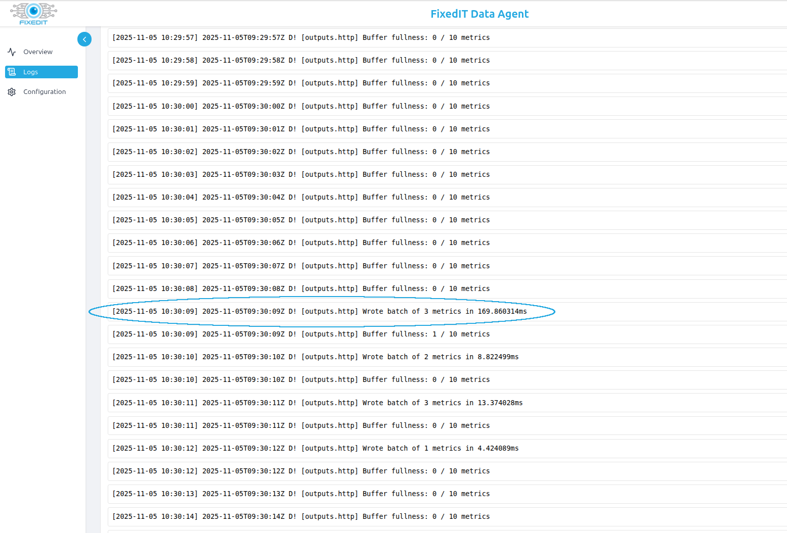

<!--
  This YAML header above configures Pandoc to prevent LaTeX from floating images.
  Images will be placed exactly where they appear in the source markdown,
  ensuring that references like "as seen in the image below" remain accurate.
-->

# FixedIT QR Code Decoder with HTTP Push

These instructions guide you through the steps to configure the [FixedIT Data Agent](https://fixedit.ai/products-data-agent/) to consume QR or barcode detections from the FixedIT QR Code Decoder ACAP application and push them to an HTTP endpoint.

## Table of Contents

<!-- toc -->

- [Compatibility](#compatibility)
  - [AXIS OS Compatibility](#axis-os-compatibility)
  - [FixedIT Data Agent Compatibility](#fixedit-data-agent-compatibility)
- [Quick Setup](#quick-setup)
  - [Installing the FixedIT Data Agent](#installing-the-fixedit-data-agent)
  - [Activating the License](#activating-the-license)
  - [Configuring the Application Parameters](#configuring-the-application-parameters)
  - [Uploading the Configuration and Helper Files](#uploading-the-configuration-and-helper-files)
  - [Install and Start the FixedIT QR Code Decoder ACAP application](#install-and-start-the-fixedit-qr-code-decoder-acap-application)
  - [Verify the Setup](#verify-the-setup)
- [Troubleshooting](#troubleshooting)
  - [Enable Verbose Logging](#enable-verbose-logging)
  - [Missing `PUSH_URL` Variable](#missing-push_url-variable)

<!-- tocstop -->

## Compatibility

### AXIS OS Compatibility

- **Minimum AXIS OS version**: AXIS OS 10.9 or newer.

### FixedIT Data Agent Compatibility

- **Minimum Data Agent version**: 1.2.0

## Quick Setup

### Installing the FixedIT Data Agent

The first step is to install the FixedIT Data Agent in your Axis device. The application is built for both `armv7hf` and `aarch64` architectures. The right version should be installed depending on each device's architecture. In AXIS OS versions 12.5 and newer, the architecture used by each device can be seen when clicking on `Add app`, under `Architecture`:



If you are using an AXIS OS version older than 12.5, check the FixedIT Data Agent's `QUICKSTART_GUIDE.pdf` for instructions on how to check a device's architecture.

### Activating the License

This application requires a license to run. After installation, the application can be turned on, but if the license is not activated, it will not perform any tasks.

If the license is not activated, a message will appear on the application in the camera's UI, as shown in the image below.



The license can be activated through the camera's UI by clicking on the three dots next to the application and either selecting `Activate license with a key` (if you have a key file) or `Activate license automatically` if you have a license code.



Using automatic license activation is usually easier, but it requires the camera to be connected to the internet. For instructions on how to do an offline registration of the license, check the FixedIT Data Agent's `QUICKSTART_GUIDE.pdf` file.

After activating the license, a new text will show on the application with the license's validity period.



If you use a yearly subscription, make sure to install a new license before the previous one expires to make sure the application does not stop working.

If you install a lifetime license, the text on the application will state `License: valid`, for a time limited license it will state `License: valid until <DATE>`.



### Configuring the Application Parameters

Some parameters used by the application can be configured from the device's user interface. The HTTP push functionality requires the `PUSH_URL` parameter to be set, but there are other optional parameters for metadata that you might want to set.

You can configure the application parameters by clicking on the three dots next to the application and selecting `Settings`.

The following is a list of parameters with explanations on how to configure them:

- `Extra Env`: this parameter contains a semicolon-separated list of all project-specific configuration variables for the QR Code Decoder HTTP push project. There is primarily one variable that you need to set:
  - `PUSH_URL`: the URL of the HTTP endpoint to which to push the messages.
  - `INSECURE_SKIP_VERIFY` (optional): set to `true` to skip verification of HTTPS certificates. Defaults to `false` for security. Only needed if you use HTTPS protocol and the HTTPS endpoint has an invalid or self-signed certificate. Use with caution in production environments.

  To set `PUSH_URL` to `http://my.server.com:8080/api/v1/metrics`, the `Extra Env` variable would be set to:

  ```text
  PUSH_URL=http://my.server.com:8080/api/v1/metrics
  ```

  To also enable insecure certificate verification:

  ```text
  PUSH_URL=https://my.server.com:8443/api/v1/metrics;INSECURE_SKIP_VERIFY=true
  ```

- `Area`: The top-most geographical level, e.g. `Europe`

- `Geography`: The second level geographical level, e.g. `Sweden`

- `Region`: The third level geographical level, e.g. `Lund`

- `Site`: The specific location, e.g. `Office`

- `Type`: The type of installation, e.g. `Gate QR Detection`

- `Latitude`: The latitude of the installation, e.g. `59.3293` for 59.3293° N

- `Longitude`: The longitude of the installation, e.g. `18.0686` for 18.0686° E

An example can be seen in the image below:


### Uploading the Configuration and Helper Files

The HTTP push functionality is implemented through a configuration file that can be uploaded to the FixedIT Data Agent. This file can be uploaded through the application's user interface, which can be accessed by clicking on the `Open` button:


In the application's user interface, click on the `Configuration` tab to the left.

The HTTP push functionality requires the bundled configuration files to be disabled, so you should disable them by clicking the `Disable` button next to the `Bundled config files` section.



Click on the `Upload Config` button at the top right corner and upload the
`combined.conf` file.

Then click on the `Enable` button next to the `combined.conf` file. The config page should now look like this:



### Install and Start the FixedIT QR Code Decoder ACAP application

Now, make sure that the FixedIT QR Code Decoder ACAP application is installed and running.

### Verify the Setup

The application should now send an HTTP post message for every detected QR code.

What you expect to see in the `Logs` page at this moment is something like the following:



The following two lines show that it is listening for QR code detections:

```text
Loaded inputs: socket_listener
[inputs.socket_listener] Listening on unix:///dev/shm/fixedit.qr_code_decoder.sock
```

The following line shows that the HTTP push output plugin is loaded:

```text
Loaded outputs: http
```

You can also see all metadata tags that it is using (in this case, some are empty since they are not configured):

```text
Tags enabled: architecture=aarch64 area= data_agent_start_time=1762331281
data_agent_version=1.2.0 device_brand=AXIS device_model=P3265-LVE
device_serial=B8A44F3B41FC device_type=Dome Camera device_variant=9mm
firmware_version=11.11.160 geography= host=axis-b8a44f3b41fc latitude=
longitude= product_full_name=AXIS P3265-LVE Dome Camera region= site=
soc=Axis Artpec-8 type=
```

## Troubleshooting

### Enable Verbose Logging

Enable the `Debug` option in the FixedIT Data Agent configuration page for detailed logs.



You should now see more verbose logs in the `Logs` page, e.g. continuous messages explaining how many detections are currently in the buffer waiting to be sent to the HTTP endpoint and a message every time a detection was successfully sent to the HTTP endpoint (circled in the image below):



If there are no messages about sending the detections and the buffer fullnes is zero, then it means that the QR Code Decoder ACAP application is not correctly sending any messages to the FixedIT Data Agent.

- Make sure that the QR Code Decoder ACAP application is installed and running.
- Inspect the video overlay to see if there are boxes and metadata being correctly displayed around the detected QR codes.
- Make sure you are using the correct version of the FixedIT QR Code Decoder ACAP application with the socket writer functionality enabled.
- Make sure that you have not specified any incorrect `READER_SOCKET_PATH` value in the `Extra Env` parameter. In most cases, the default value is sane and should be used. This means that `Extra Env` should not at all contain the `READER_SOCKET_PATH` variable.

### Missing `PUSH_URL` Variable

If you see an error like this:

```text
[2025-11-05 10:08:28] 2025-11-05T09:08:28Z E! [agent] Error writing to outputs.http:
Post "$%7BPUSH_URL%7D": unsupported protocol scheme ""
```


It means that the `Extra Env` parameter has not been correctly set to `PUSH_URL=http://my.server.com:8080/api/v1/metrics` or similar.
