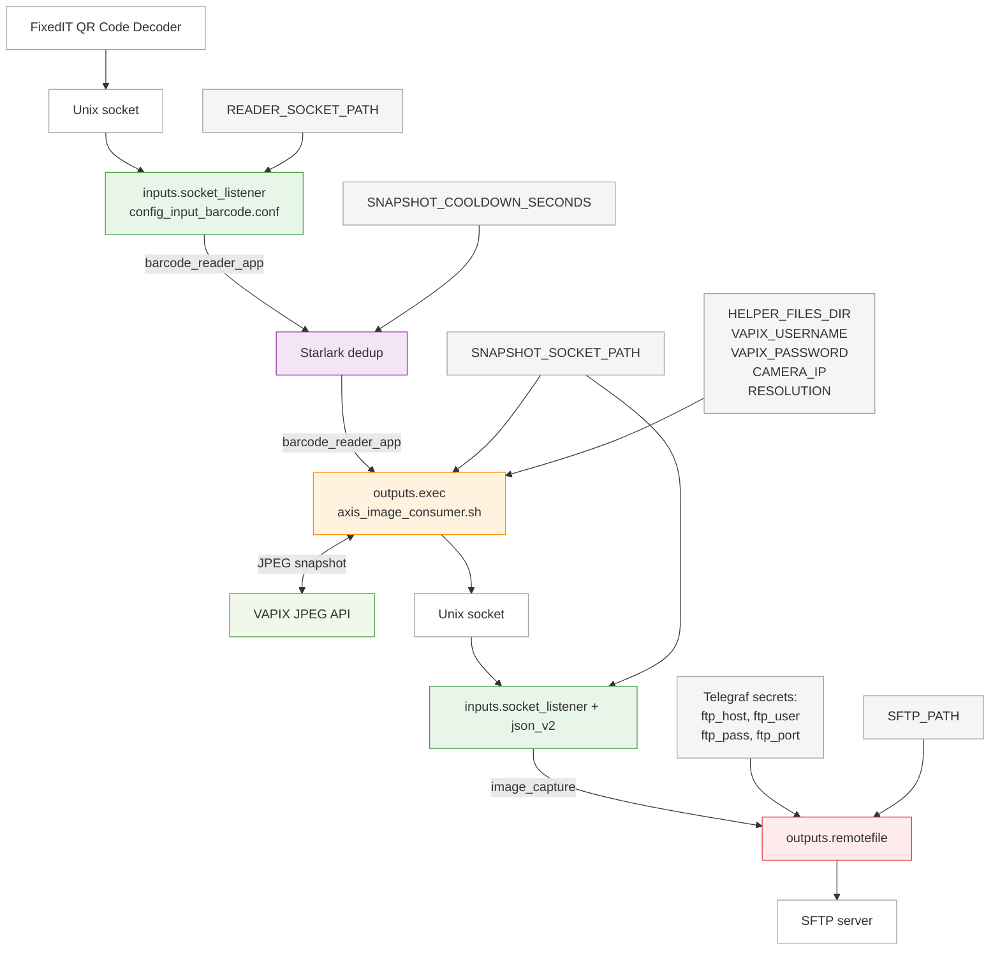

# QR Code Snapshot Upload to SFTP

This project shows how to react to [FixedIT QR Code Decoder](https://fixedit.ai/products-acaps/) detections on an Axis camera with the [FixedIT Data Agent](https://fixedit.ai/products-data-agent/): when a QR code is read in the live view, the workflow immediately grabs a JPEG snapshot from the same camera and uploads it to an SFTP server. Images are grouped by decoded QR value, for example `/cameras/SHIPMENT-ABC123/20250614T153045Z.jpg`.

The decoder and the Data Agent run on the same device. A short cooldown suppresses multiple uploads while the same code remains visible in frame.

## How It Works



Color scheme:

- Light green: Input nodes / data ingestion
- Purple: Processor nodes (Starlark)
- Orange: Script / execd steps
- Red: Output nodes / external destinations
- Light gray: Configuration variables and secrets
- White: Other

## Why Choose This Approach?

TODO

## Table of Contents

<!-- toc -->

- [Compatibility](#compatibility)
  - [AXIS OS Compatibility](#axis-os-compatibility)
  - [FixedIT Data Agent Compatibility](#fixedit-data-agent-compatibility)
- [Quick Setup](#quick-setup)
- [Troubleshooting](#troubleshooting)
- [How does it work?](#how-does-it-work)
  - [Capture using base64-encoded image](#capture-using-base64-encoded-image)
  - [Using a socket to send the image snapshot](#using-a-socket-to-send-the-image-snapshot)
  - [Obfuscating the FTP password](#obfuscating-the-ftp-password)
- [Files](#files)
- [Configuration Details](#configuration-details)
- [Known Limitations](#known-limitations)

<!-- tocstop -->

## Compatibility

### AXIS OS Compatibility

- **Minimum AXIS OS version**: TODO
- **Required tools**: `curl`, `jq`, `openssl`, and `socat`

### FixedIT Data Agent Compatibility

- **Minimum Data Agent version**: 1.6.0
- **Required features**: Uses the `secretstores.os` plugin added in FixedIT Data Agent 1.6.0. Also uses the template serializer added in FixedIT Data Agent 1.5.0.

## Quick Setup

1. **Install ACAPs** on the camera: FixedIT QR Code Decoder and FixedIT Data Agent.

2. **Set Data Agent parameters** in the UI:
   - **VAPIX username / password**: credentials for snapshot capture (viewer account is enough).
   - **Telegraf secrets** (Configuration->Variables->Telegraf secrets): add the four secrets used by `config_output_remotefile.conf`. NOTE: for the `ftp_pass`, you have to mark the "Obfuscate for remotefile" checkbox when setting the secret.

     | Secret name | Example value       |
     | ----------- | ------------------- |
     | `ftp_host`  | `sftp.example.com`  |
     | `ftp_user`  | `camera_upload`     |
     | `ftp_pass`  | Obfuscated password |
     | `ftp_port`  | `22`                |

   - **Extra env** (optional overrides; defaults apply if omitted):

     ```txt
     SFTP_PATH=/cameras;SNAPSHOT_COOLDOWN_SECONDS=30
     ```

     | Variable                    | Default    | Purpose                                               |
     | --------------------------- | ---------- | ----------------------------------------------------- |
     | `SFTP_PATH`                 | `/cameras` | Remote base directory on the SFTP server              |
     | `SNAPSHOT_COOLDOWN_SECONDS` | `30`       | Minimum seconds between uploads for the same QR value |

3. **Upload helper files** (mark `.sh` scripts executable in the UI):
   - `axis_image_consumer.sh`

4. **Upload and enable configs** in this order:
   1. `config_input_barcode.conf`
   2. `config_process_dedup.conf`
   3. `config_output_capture.conf`
   4. `config_input_image_capture.conf`
   5. `config_output_remotefile.conf`

## Troubleshooting

TODO

## How does it work?

### Capture using base64-encoded image

Since Telegraf does not support binary data in the messages, we need to encode the image as a base64-encoded string. This is done by the capture script (similar to the [timelapse project](../project-timelapse-s3/)). The image is then unpacked to a binary JPEG file again in the `remotefile` output using the `data_format = "template"` and `b64dec` serializer.

### Using a socket to send the image snapshot

One important aspect to note is that we are using a socket to send the image snapshot from the capture script. It would be more straightforward to use an `processors.execd` plugin to enrich the QR code message with the snapshot. However, the `processors.execd` plugin has a limit on the size of the stdout buffer, which can be a problem if the image is large. Therefore, we are instead using an `outputs.exec` plugin to run the capture script, but instead of reading the stdout of the script, we are using `socat` to write it to a socket. We then have another `inputs.socket_listener` plugin to read the socket. This works because the same size limit does not exist for the `inputs.socket_listener` plugin.

### Obfuscating the FTP password

The `rsync` library used in the `remotefile` output only accepts obfuscated passwords for the sftp server. Therefore, when saving the password as a secret, you need to mark the "Obfuscate for remotefile" checkbox. This makes sure that an obfuscated version of the password is stored in the secrets store.

## Files

TODO

## Configuration Details

TODO

## Known Limitations

The QR code deduplication is intended for a single QR code being visible at a time. If multiple QR codes are visible at the same time, the deduplication will jump between the codes and let each detection trigger a new upload. If this is a problem, you can change the state in the [./config_process_dedup.conf](config_process_dedup.conf) file to use a dict of QR code values instead of a single value.
