# Strobe Color From GitHub API

This project demonstrates how the [FixedIT Data Agent](https://fixedit.ai/products-data-agent/) can be deployed on an Axis strobe light to fetch GitHub API data and dynamically control the device's color based on workflow execution status. The target GitHub repository should have a configured workflow, and this project will monitor the execution status of the latest workflow run on the main branch.

## How It Works

The system operates in a continuous monitoring loop, automatically fetching GitHub workflow status and updating the strobe light color accordingly:

```mermaid
flowchart TD
    A["🔍 Fetch GitHub API<br/>Get 10 latest workflow runs<br/>Out: github_workflow"] --> B["🔍 Filter by Name<br/>Keep only target workflow<br/>In: github_workflow<br/>Out: github_workflow_filtered"]
    B --> C["🏆 Filter for Latest<br/>Keep only latest run<br/>In: github_workflow_filtered<br/>Out: github_workflow_latest"]
    C --> D["🎨 Map to Color<br/>success → green<br/>failure → red<br/>running → yellow<br/>In: github_workflow_latest<br/>Out: workflow_color"]
    D --> E["✅ Enable Profile<br/>Set color on strobe<br/>In: workflow_color"]
    E --> F["❌ Disable Other Profiles<br/>Stop yellow, red, green<br/>(except active one)"]
    F --> G["⏳ Wait<br/>Sleep for interval period<br/>(default: 5 seconds)"]
    G --> A

    style A fill:#e1f5fe
    style B fill:#e8f5e8
    style C fill:#f3e5f5
    style D fill:#fff3e0
    style E fill:#e8f5e8
    style F fill:#fce4ec
    style G fill:#f1f8e9
```



This project uses **Telegraf's Starlark processor** for flexible data transformation and filtering. Starlark is a Python-like scripting language that provides more powerful processing capabilities than Telegraf's built-in processors, especially for complex logic and environment variable support.

**Learn more about Starlark in Telegraf:**

- [How to Use Starlark with Telegraf](https://www.influxdata.com/blog/how-use-starlark-telegraf) - Overview and basic concepts
- [Quick Start Guide: Telegraf Starlark Processor](https://www.influxdata.com/blog/quick-start-telegraf-starlark-processor-plugin/) - Practical examples and state management

## Why Choose This Approach?

**No C/C++ development required!** Unlike traditional Axis ACAP applications that require complex C/C++ programming, this solution uses simple configuration files and basic shell scripting.

This example is perfect for **system integrators and IT professionals** who want to create custom device automation without the complexity of traditional embedded development. All you need is:

- Experience configuring IT services (similar to setting up monitoring tools)
- Basic shell scripting knowledge (can be learned quickly)
- Familiarity with REST APIs and JSON (common in modern IT environments)
- Access to an Axis device with strobe capability (AXIS D4100-E Network Strobe Siren, AXIS D4100-VE Mk II Network Strobe Siren, AXIS D4200-VE Network Strobe Speaker, or similar)

**The result:** Custom edge intelligence that would typically require months of ACAP development can now be implemented in hours using familiar IT tools and practices.

## Table of Contents

- [Strobe Color From GitHub API](#strobe-color-from-github-api)
  - [How It Works](#how-it-works)
  - [Why Choose This Approach?](#why-choose-this-approach)
  - [Table of Contents](#table-of-contents)
  - [Demo Video](#demo-video)
  - [Compatibility](#compatibility)
    - [AXIS OS Compatibility](#axis-os-compatibility)
    - [FixedIT Data Agent Compatibility](#fixedit-data-agent-compatibility)
  - [Quick Setup](#quick-setup)
    - [High-Level Steps](#high-level-steps)
    - [Creating the GitHub workflow](#creating-the-github-workflow)
    - [Creating a GitHub access token](#creating-a-github-access-token)
    - [Creating the color profiles in the Axis strobe](#creating-the-color-profiles-in-the-axis-strobe)
  - [Troubleshooting](#troubleshooting)
    - [Test GitHub API](#test-github-api)
  - [Configuration Files](#configuration-files)
    - [config_agent.conf](#config_agentconf)
    - [config_input_github.conf](#config_input_githubconf)
    - [config_process_filter_by_name.conf](#config_process_filter_by_nameconf)
    - [config_process_status_to_color.conf](#config_process_status_to_colorconf)
    - [config_process_select_latest.conf](#config_process_select_latestconf)
    - [config_output_strobe.conf](#config_output_strobeconf)
    - [test_files/config_output_stdout.conf](#test_filesconfig_output_stdoutconf)
    - [test_files/config_input_file.conf](#test_filesconfig_input_fileconf)
  - [Local Testing on Host](#local-testing-on-host)
    - [Prerequisites](#prerequisites)
    - [Host Testing Limitations](#host-testing-limitations)
    - [Test GitHub API data parsing using mock data](#test-github-api-data-parsing-using-mock-data)
    - [Test latest workflow selection logic](#test-latest-workflow-selection-logic)
    - [Test GitHub API integration](#test-github-api-integration)
    - [Test strobe control using mock data](#test-strobe-control-using-mock-data)
    - [Test complete workflow integration](#test-complete-workflow-integration)
  - [License](#license)

## Demo Video

[](https://www.youtube.com/watch?v=nLwVUYieFLE)

In this demo, we show how **anyone with basic IT skills can create intelligent edge devices** using the FixedIT Data Agent—no cloud dependency, no C/C++ programming, no complex development environment setup required.

Using a GitHub Actions job as an example input, we demonstrate how to:

- Make the Axis strobe fetch external API data from the GitHub Actions CI status
- Transform data using simple Starlark scripts to decide the color of the strobe light
- Trigger a change of the strobe light color via standard HTTP API calls (VAPIX)

This effectively shows how to transform an Axis strobe to an intelligent device that can poll third party APIs and set its color based on the API return status. This can easily be adapted to use any cloud-based or locally hosted API as an input. Whether you're building smart alerts, visual indicators, or edge-based automation pipelines—this is a glimpse of what FixedIT Data Agent makes possible.

## Compatibility

### AXIS OS Compatibility

- **Minimum AXIS OS version**: Should be compatible with AXIS OS 11 and 12+.
- **Required tools**: Uses `jq` which was not available in older AXIS OS versions. Uses curl and openssl which are installed by default.
- **Other notes**: Uses HTTP Digest authentication for VAPIX API calls which is supported in all AXIS OS versions.

### FixedIT Data Agent Compatibility

- **Minimum Data Agent version**: 1.0
- **Required features**: Uses the `input.http`, `processors.starlark`, `outputs.exec` plugins and the `HELPER_FILES_DIR` and `TELEGRAF_DEBUG` environment variables set by the FixedIT Data Agent.

## Quick Setup

### High-Level Steps

1. **Create a GitHub repository with a workflow** (see instructions below)

2. **Create a GitHub access token** with `workflow` scope (see instructions below)

3. **Create color profiles in your Axis strobe** named `green`, `yellow`, and `red` (see instructions below)

4. **Configure FixedIT Data Agent variables:**

   Set the custom environment variables in the `Extra env` parameter as a semicolon-separated list:

   ```txt
   GITHUB_TOKEN=your_github_token;GITHUB_USER=your_github_username;GITHUB_REPO=your_repo_name;GITHUB_BRANCH=main;GITHUB_WORKFLOW=Your Workflow Name;VAPIX_USERNAME=your_vapix_user;VAPIX_PASSWORD=your_vapix_password;
   ```

   For the VAPIX username and password, it is recommended to create a new user with `operator` privileges (which is the lowest privilege level that allows you to control the strobe light). This can be done by going to the `System` tab and click on the `Accounts` sub-tab. Then click on `Add account`.

5. **Upload the configuration files to the FixedIT Data Agent**

6. **Enable the configuration files**

The strobe light should now change color based on the status of the latest workflow run on your specified branch.

### Creating the GitHub workflow

How to create a GitHub workflow is outside the scope of this project. However, here is one example.

Adding this example file to the `<repo-root>/.github/workflows` folder will create a workflow for the repository. For more information about creating GitHub workflows, see the [GitHub Actions documentation](https://docs.github.com/en/actions).

```yml
# This job will trigger when the data.json file is changed. It will then
# validate the JSON format and fail the job if the file is not valid.
name: Validate JSON

on:
  # Run on push and pull requests that modify data.json
  push:
    paths:
      - "data.json"
  pull_request:
    paths:
      - "data.json"

jobs:
  validate-json:
    runs-on: ubuntu-latest
    steps:
      - name: Checkout repository
        uses: actions/checkout@v4

      - name: Validate JSON
        run: |
          # Check if data.json exists
          if [ ! -f data.json ]; then
            echo "Error: data.json file not found"
            exit 1
          fi

          # Validate JSON using jq
          if ! jq '.' data.json > /dev/null 2>&1; then
            echo "Error: data.json contains invalid JSON"
            exit 1
          fi

          echo "Success: data.json is valid JSON"
```

> [!IMPORTANT]
> **Important notes about the `GITHUB_WORKFLOW` variable:**
>
> - Must be set to exactly the name of the workflow you want to monitor (the `name` field in the workflow YAML file).
> - **Do NOT use quotes** around workflow names with spaces in the `Extra Env` parameter due to how the FixedIT Data Agent parses the variables. The FixedIT Data Agent preserves quotes as literal characters, so `GITHUB_WORKFLOW="Validate JSON"` would become `"Validate JSON"` (with quotes) instead of `Validate JSON`

### Creating a GitHub access token

1. Go to Github Settings by pressing your profile picture in the top right corner and select "Settings"
1. Click on "Developer settings"
1. Click on "Personal access tokens"
1. Click on "Tokens (classic)"
1. Select "workflow" under "Select scope"

Note that you can create a fine-grained token instead if you want to be more specific about what the token gives access to.


Copy this token and use it in the `GITHUB_TOKEN` environment variable in the FixedIT Data Agent configuration.

### Creating the color profiles in the Axis strobe

The application workflow will set the strobe light based on the name of the color profile. The script ensures exclusive operation by automatically deactivating all other color profiles when activating a new one, which means you don't need to worry about profile priorities or overlapping durations. Before this works, you need to login to the Axis strobe and create three color profiles named `green`, `yellow`, and `red`.

1. Go to the Axis device web interface
1. Click on "Profiles"
1. Click on "Create"
1. Enter a name for the profile (e.g. "green")
1. Choose the "Pattern" and "Intensity" based on your preference
1. Set the "Color" to "Green"
1. Set "Duration" to "Time" and select a duration that is at least as long as the sync interval specified in the `config_agent.conf` file. Since the script deactivates all other color profiles when activating a new one, the duration can be set generously (e.g., 60 seconds or more) without worrying about overlapping profiles.
1. Leave "Priority" as is - since only one profile is active at a time, priority settings don't matter
1. Click on "Save"
1. Repeat for the other two profiles


It should now look like this:


## Troubleshooting

Enable the `Debug mode` option in the FixedIT Data Agent for detailed logs.

### Strobe doesn't change color

**First, check if workflow data is being processed:**

- Enable debug mode OR upload and enable `test_files/config_output_stdout.conf` to see if workflow_color metrics are being produced
- If no data is being produced, see [No workflow data appears](#no-workflow-data-appears) section below

**If workflow data is being processed, check strobe configuration:**

- Verify color profiles (`green`, `yellow`, `red`) are created on the device
- Check that `VAPIX_USERNAME` and `VAPIX_PASSWORD` are correct
- The strobe control API requires at least operator privileges
- You'll see errors like `curl: (22) The requested URL returned error: 401` and `Failed to start profile 'green'` if the VAPIX user is not valid
- Check the FixedIT Data Agent logs page for any VAPIX-related errors

### No workflow data appears

This typically occurs when the system can't find your target workflow among the recent runs, or when there's a configuration issue. This would be indicated by FixedIT Data Agent showing "Buffer fullness: 0 / 10000 metrics" in debug logs (when `Debug mode` is enabled)

- **Workflow name mismatch**: `GITHUB_WORKFLOW` doesn't match exactly with the workflow name in your GitHub Actions YAML file
- **Quote parsing issue**: The FixedIT Data Agent's `Extra env` parameter handling (see below)
- **Target workflow not in results**: Your target workflow is not among the fetched runs due to `per_page` being too small, see [Workflow not found among recent runs](#workflow-not-found-among-recent-runs) section below
- **Invalid credentials**: GitHub token issues (you'll see 401 errors in logs)

**How the FixedIT Data Agent parses the `Extra env` parameter:**
The FixedIT Data Agent preserves quotes as literal characters instead of treating them as string delimiters. When you set `GITHUB_WORKFLOW="Validate JSON"` in the `Extra env` parameter, the actual environment variable value becomes `"Validate JSON"` (with literal quotes), not `Validate JSON`.

### Workflow not found among recent runs

If your target workflow isn't among the recent runs fetched by the API, no metrics are produced and the strobe appears "silent".

**The Problem:** The `per_page` parameter in [config_input_github.conf](./config_input_github.conf) might be too small. If you have 6 workflows but `per_page=3`, your target workflow might not be in the returned results.

**The Solution:** Increase `per_page` in [config_input_github.conf](./config_input_github.conf) to at least the number of workflows in the repository.

**Diagnose this issue:**

```bash
curl -s -H "Authorization: Bearer $GITHUB_TOKEN" \
     -H "Accept: application/vnd.github+json" \
     "https://api.github.com/repos/$GITHUB_USER/$GITHUB_REPO/actions/runs?branch=$GITHUB_BRANCH&per_page=10" | jq '.workflow_runs[] | .name'
```

Check if your `GITHUB_WORKFLOW` value appears in the output.

### GitHub API issues

**Common API errors:**

- `"Bad credentials"` (401): GitHub token is invalid or expired
- `received status code 401 (Unauthorized)`: Token lacks `workflow` scope or repository access
- Verify repository/branch/workflow names are correct

**Test the GitHub API:**

```bash
# Test fetching recent workflow runs (same as the system does)
curl -s -H "Authorization: Bearer $GITHUB_TOKEN" \
     -H "Accept: application/vnd.github+json" \
     "https://api.github.com/repos/$GITHUB_USER/$GITHUB_REPO/actions/runs?branch=$GITHUB_BRANCH&per_page=10" | jq '.workflow_runs[] | select(.name == env.GITHUB_WORKFLOW) | .conclusion' | head -1
```

The conclusion can be `success`, `failure` or null (when it is running).

An example successful response can be seen in the [sample.json](./sample.json) file.

## Configuration Files

This project uses several configuration files that work together to create a data pipeline. Each file handles a specific part of the workflow:

### config_agent.conf

Controls how often the system checks GitHub for updates (every 5 seconds by default). Also includes timing randomization to prevent multiple devices from overwhelming GitHub's servers.

### config_input_github.conf

Defines how to fetch workflow status from GitHub's REST API. Uses your GitHub token for authentication and retrieves information about the most recent workflow run on your specified branch.

### config_process_filter_by_name.conf

Uses a Starlark script to filter GitHub workflow runs by name, keeping only workflows that match the `GITHUB_WORKFLOW` environment variable. This early-stage filtering ensures only relevant workflows are processed. Uses Starlark instead of Telegraf's built-in `processors.filter` because the built-in filter doesn't support environment variable substitution.

### config_process_status_to_color.conf

Contains a Starlark script that converts GitHub's workflow status (`success`, `failure`, or `null` for running) into simple color names (`green`, `red`, or `yellow`) that the strobe can understand.

### config_process_select_latest.conf

Uses a Starlark script to select only the most recent workflow run when multiple workflow runs are returned by the GitHub API. The processor tracks the highest `run_number` seen and drops older workflow runs, ensuring the strobe always reflects the current workflow status. This needs to be run after the `config_process_filter_by_name.conf` processor.

### config_output_strobe.conf

Executes the `trigger_strobe.sh` script whenever the workflow status changes. This script uses VAPIX commands to actually change the strobe light color on your Axis device.

### test_files/config_output_stdout.conf

When enabled, this outputs all pipeline data to the FixedIT Data Agent logs. Useful for troubleshooting if the strobe isn't responding as expected. This is also very useful for on-host testing since it makes it easy to validate the data at each stage of the pipeline.

### test_files/config_input_file.conf

This file can be used together with the `sample.json` file to test the pipeline without having to wait for a GitHub Actions job to complete. This is intended primarily for on-host testing, but works well for testing in the FixedIT Data Agent too. Upload this file instead of the `config_input_github.conf` file, then upload the `sample.json` file as a helper file. You also need to set the `SAMPLE_FILE` environment variable to `sample.json` in the FixedIT Data Agent.

## Local Testing on Host

You can test the workflow on your development machine before deploying to your Axis device. This requires [Telegraf](https://www.influxdata.com/time-series-platform/telegraf/) to be installed locally.

### Prerequisites

- Install Telegraf on your development machine
- Have `jq` installed for JSON processing (used by `trigger_strobe.sh`)
- Clone this repository and navigate to the project directory

### Host Testing Limitations

**What works on host:**

- GitHub API data fetching and parsing
- Data transformation logic
- Configuration validation

**What requires an actual Axis device:**

- Strobe light control (VAPIX API calls)

The strobe control functionality requires actual Axis device hardware and VAPIX API access, which cannot be simulated on a host machine.

### Test GitHub API data parsing using mock data

Test the API parsing pipeline using sample GitHub API data without making actual API calls.

First, set up the environment variables:

```bash
# Set up environment
export HELPER_FILES_DIR=$(pwd)
export SAMPLE_FILE=sample.json
export TELEGRAF_DEBUG=true
```

Then run the following command:

```bash
# Test with mock data (no GitHub API calls needed)
telegraf --config config_agent.conf \
         --config test_files/config_input_file.conf \
         --config config_process_filter_by_name.conf \
         --config config_process_select_latest.conf \
         --config config_process_status_to_color.conf \
         --config test_files/config_output_stdout.conf \
         --once
```

**Expected output:** You'll see Telegraf load the configs and then output a JSON line like:

```json
{
  "fields": { "color": "green", "run_number": 20 },
  "name": "workflow_color",
  "tags": {},
  "timestamp": 1754301969
}
```

This shows the pipeline successfully converted the sample GitHub "success" status into "green" color output.

### Test latest workflow selection logic

Test only the latest workflow selection processor with out-of-order workflow data to verify it correctly selects the most recent run:

```bash
# Set up environment for latest selection test
export HELPER_FILES_DIR=$(pwd)
export SAMPLE_FILE=test_files/sample_select_latest.json
export GITHUB_WORKFLOW="Validate JSON"
export TELEGRAF_DEBUG=false

# Test only the latest selection logic (no color transformation)
telegraf --config config_agent.conf \
         --config test_files/config_input_file.conf \
         --config config_process_filter_by_name.conf \
         --config config_process_select_latest.conf \
         --config test_files/config_output_stdout.conf \
         --once
```

**Expected behavior:** The test data contains workflow runs with `run_number` values 16, 20, 20, 19 (intentionally out of order). The processor should:

- Let through run 16 (first metric)
- Let through run 20 (higher number)
- Let through run 20 again (same latest number)
- Drop run 19 (lower than current state)

**Expected output:** You'll see 3 JSON metrics (runs 16, 20, 20) with the original GitHub workflow data structure, demonstrating the latest selection logic works correctly.

### Test GitHub API integration

Test with live GitHub API data (requires valid credentials):

```bash
# Test with real GitHub API (requires valid credentials)
export GITHUB_TOKEN=your_github_token
export GITHUB_USER=your_github_username
export GITHUB_REPO=your_repo_name
export GITHUB_BRANCH=main
export GITHUB_WORKFLOW="Your Workflow Name"

export TELEGRAF_DEBUG=true
export HELPER_FILES_DIR=$(pwd)

telegraf --config config_agent.conf \
         --config config_input_github.conf \
         --config config_process_filter_by_name.conf \
         --config config_process_select_latest.conf \
         --config config_process_status_to_color.conf \
         --config test_files/config_output_stdout.conf \
         --once
```

**Expected output:**

- With valid credentials, you'll see the JSON result like the mock test above.
- With invalid/expired credentials, you'll see:

```
Error in plugin: received status code 401 (Unauthorized)
```

If you get a 401 error, check that your GitHub token is valid and has the required permissions.

### Test strobe control using mock data

Test the data transformation and strobe control using sample data (no GitHub API calls needed):

```bash
# Set up your Axis device credentials
export VAPIX_USERNAME=your_vapix_user
export VAPIX_PASSWORD=your_vapix_password
export VAPIX_IP=your.axis.device.ip

# Set helper files directory
export HELPER_FILES_DIR=$(pwd)
export TELEGRAF_DEBUG=true
export SAMPLE_FILE=sample.json

# Run with mock data but real strobe control
telegraf --config config_agent.conf \
         --config test_files/config_input_file.conf \
         --config config_process_filter_by_name.conf \
         --config config_process_select_latest.conf \
         --config config_process_status_to_color.conf \
         --config config_output_strobe.conf \
         --config test_files/config_output_stdout.conf \
         --once
```

This will process the sample GitHub API response and **actually control your strobe light** based on the sample data (which shows a "success" status, so it should turn the strobe green).

**Expected output:**

- With valid VAPIX credentials, you'll see the strobe light change to green.
- With invalid credentials, you'll see:

```
Error: curl: (22) The requested URL returned error: 401
Error: Failed to start profile 'green'
```

If you get a 401 error, check that your VAPIX username and password are correct and that the user has at least operator privileges.

### Test complete workflow integration

Test the whole workflow from getting the job status from the GitHub API to controlling the strobe light. This will test the same functionality that will run in the strobe device.

```bash
# Set up your GitHub credentials
export GITHUB_TOKEN=your_github_token
export GITHUB_USER=your_github_username
export GITHUB_REPO=your_repo_name
export GITHUB_BRANCH=main
export GITHUB_WORKFLOW="Your Workflow Name"

# Set up your Axis device credentials
export VAPIX_USERNAME=your_vapix_user
export VAPIX_PASSWORD=your_vapix_password
export VAPIX_IP=your.axis.device.ip

# Set helper files directory
export HELPER_FILES_DIR=$(pwd)
export TELEGRAF_DEBUG=true

# Full pipeline including strobe control
telegraf --config config_agent.conf \
         --config config_input_github.conf \
         --config config_process_filter_by_name.conf \
         --config config_process_select_latest.conf \
         --config config_process_status_to_color.conf \
         --config config_output_strobe.conf \
         --config test_files/config_output_stdout.conf \
         --once
```

You should now see the strobe change color based on the status of the last GitHub workflow. The option `--once` will make it run once and then exit, you can remove this to run it continuously.

## License

This project is licensed under the MIT License - see the [LICENSE](./LICENSE) file for details.
