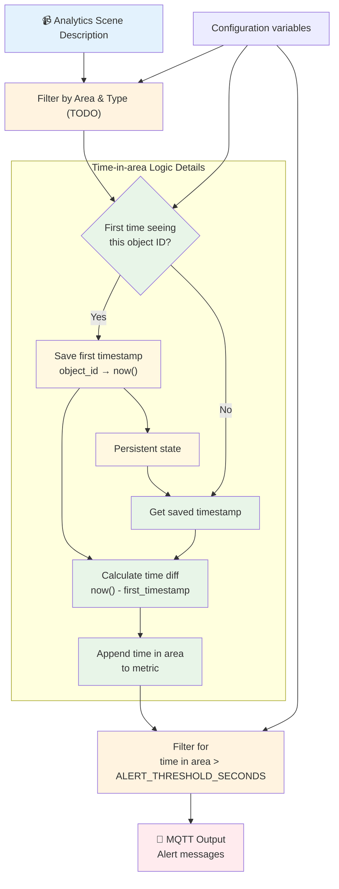

# Time-in-Area Analytics

This project demonstrates how to implement time-in-area analytics for Axis fisheye cameras using the [FixedIT Data Agent](https://fixedit.ai/products-data-agent/). While AXIS Object Analytics natively supports time-in-area detection for traditional cameras, fisheye cameras lack this capability. This solution bridges that gap by consuming real-time object detection metadata from fisheye cameras and implementing custom time-in-area logic using Telegraf's Starlark processor. The system uses object tracking IDs from [AXIS Scene Metadata](https://developer.axis.com/analytics/axis-scene-metadata/reference/concepts/) to track objects within a defined rectangular area, measures time in area, and triggers both warning (TODO) and alert notifications via MQTT when objects remain in the monitored zone beyond configured thresholds.

## How It Works

The system consumes real-time object detection data from Axis fisheye cameras and implements custom time-in-area analytics logic to track object time in area and trigger appropriate responses.



## Why Choose This Approach?

**No C/C++ development required!** This project demonstrates how to implement advanced analytics that would typically require custom ACAP development using the [FixedIT Data Agent](https://fixedit.ai/products-data-agent/) instead. Rather than writing complex embedded C++ code for fisheye camera analytics, system integrators and IT professionals can implement sophisticated time-in-area logic using familiar configuration files and simple scripting. The solution leverages existing object detection capabilities from AXIS Object Analytics and adds the missing time-in-area functionality through data processing pipelines, making it accessible to teams without embedded development expertise.

## Table of Contents

TODO

## Compatibility

### AXIS OS Compatibility

- **Minimum AXIS OS version**:
- **Required tools**:

### FixedIT Data Agent Compatibility

- **Minimum Data Agent version**: 1.0
- **Required features**:

## Quick Setup

### Troubleshooting

Enable the `Debug` option in the FixedIT Data Agent for detailed logs. Debug files will appear in the `Uploaded helper files` section (refresh page to see updates).

**Note**: Don't leave debug enabled long-term as it creates large log files.

## Configuration Files

This project uses several configuration files that work together to create a time-in-area analytics pipeline:

### config_process_track_duration.conf and track_duration_calculator.star

Calculates time in area for each detected object using the external Starlark script `track_duration_calculator.star`. This processor:

- Tracks first seen and last seen timestamps for each `track_id`
- Calculates `time_in_area_seconds` for each detection
- Automatically cleans up stale tracks (not seen for 60+ seconds)
- Outputs debug messages when tracks are removed

### config_process_threshold_filter.conf

Filters detection frames based on the configured alert threshold. Only detections where time in area (`time_in_area_seconds`) exceeds `ALERT_THRESHOLD_SECONDS` are passed through to the output stage.

### test_files/config_output_stdout.conf

Outputs processed metrics to stdout in JSON format for testing and debugging.

### test_files/sample_data_feeder.sh

Helper script that simulates camera metadata stream by reading `simple_tracks.jsonl` line by line.

## Future Enhancements

This example implements a minimal viable solution and can be easily extended:

- **Warning Threshold**: Add a warning level before the main alert threshold
- **Deactivation Messages**: Send alerts when objects leave the area after being alerted
- **Time-of-Day Rules**: Apply different thresholds based on time of day
- **Multiple Areas**: Monitor multiple rectangular areas with different configurations
- **Advanced Shapes**: Implement polygon-based areas instead of simple rectangles

## Local Testing on Host

You can test the processing logic locally using Telegraf before deploying to your Axis device.

### Prerequisites

- Install Telegraf on your development machine
- Local MQTT broker (mosquitto) for testing output
- Sample object detection JSON data for testing

### Host Testing Limitations

**Works on Host:**

- Starlark processor logic testing with sample data
- MQTT output configuration validation
- Alert threshold configuration testing

**Only works in the Axis Device:**

- Real object detection metadata consumption (camera-specific message broker)

### Test Commands

#### Test Time in Area Calculation Only

Test the time in area calculator without threshold filtering to see all detections with their calculated time in area:

```bash
# Set up test environment
export HELPER_FILES_DIR="$(pwd)"
export SAMPLE_FILE="test_files/simple_tracks.jsonl"

# Test time in area calculation only (shows all detections + debug messages)
telegraf --config test_files/config_input_sample_data.conf \
         --config config_process_track_duration.conf \
         --config test_files/config_output_stdout.conf \
         --once
```

**Expected Output:**
All detections with `time_in_area_seconds` field plus debug messages when stale tracks are cleaned up.

#### Test Complete Alert Pipeline

Test the complete alert generation pipeline with threshold filtering:

```bash
# Set up test environment
export HELPER_FILES_DIR="$(pwd)"
export SAMPLE_FILE="test_files/simple_tracks.jsonl"
export ALERT_THRESHOLD_SECONDS="2"  # Alert threshold in seconds

# Test time in area calculation + threshold filtering
telegraf --config test_files/config_input_sample_data.conf \
         --config config_process_track_duration.conf \
         --config config_process_threshold_filter.conf \
         --config test_files/config_output_stdout.conf \
         --once
```

**Expected Output:**
Only detections with time in area (`time_in_area_seconds`) > `ALERT_THRESHOLD_SECONDS` plus debug messages for track cleanup.
