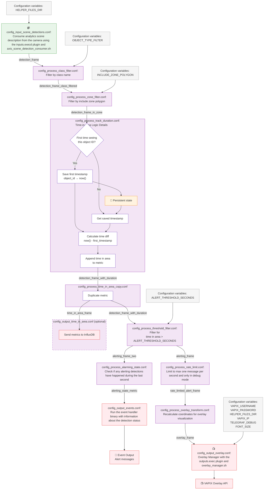
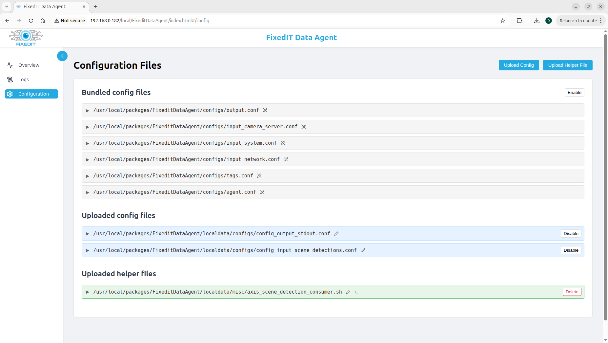
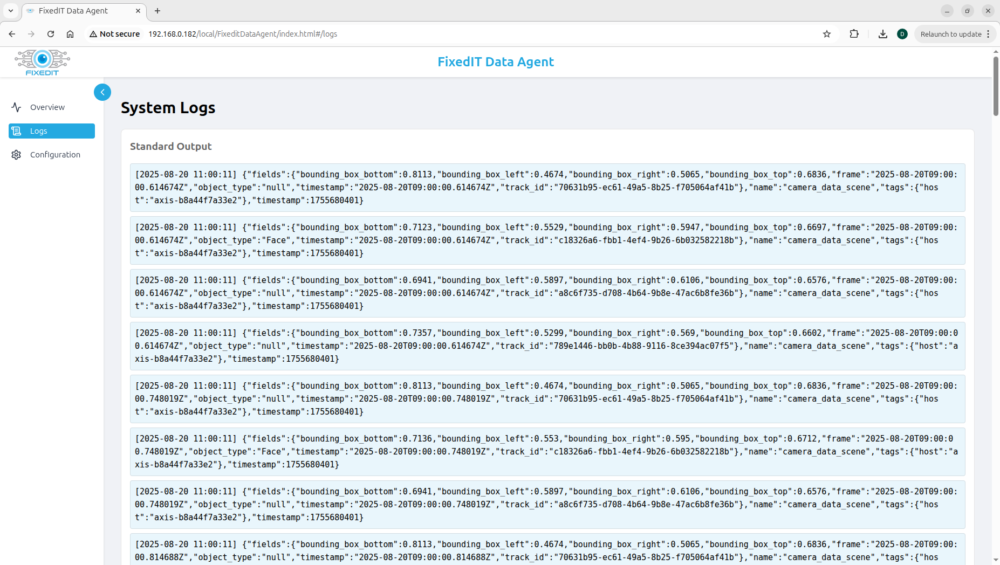
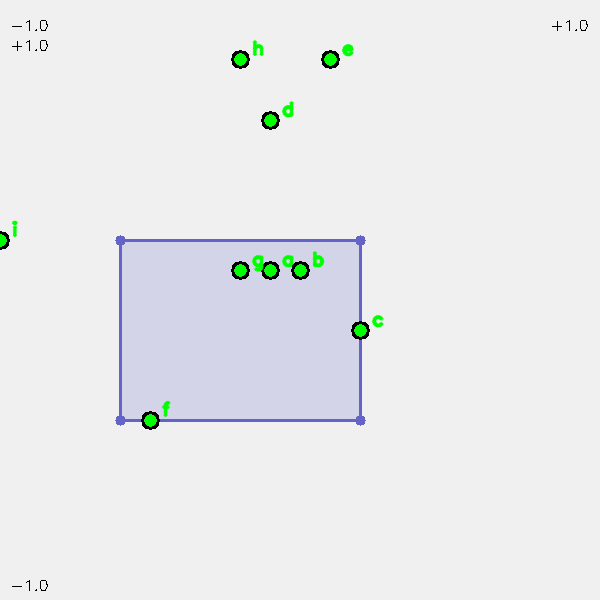
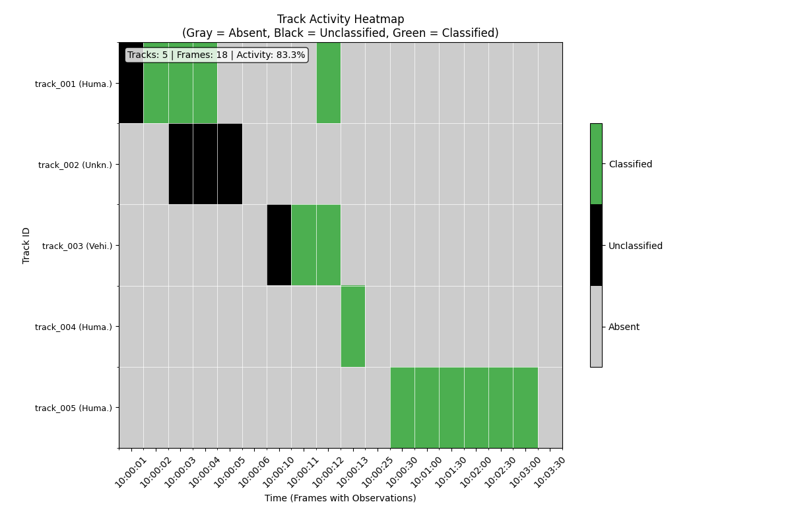

# Time-in-Area Analytics

This project demonstrates how to implement time-in-area analytics for Axis fisheye cameras using the [FixedIT Data Agent](https://fixedit.ai/products-data-agent/). While AXIS Object Analytics natively supports time-in-area detection for traditional cameras, fisheye cameras lack this capability. This solution bridges that gap by consuming real-time object detection metadata from fisheye cameras and implementing custom time-in-area logic using Telegraf's Starlark processor. The system uses object tracking IDs from [AXIS Scene Metadata](https://developer.axis.com/analytics/axis-scene-metadata/reference/concepts/) to track objects within a defined rectangular area, measures time in area, and triggers alert notifications via events when objects remain in the monitored zone beyond configured thresholds.

## How It Works

The system consumes real-time object detection data from Axis fisheye cameras and implements custom time-in-area analytics logic to track object time in area and trigger appropriate responses.


```mermaid
flowchart TD
    A["📹 config_input_scene_detections.conf:<br/>Consume analytics scene description from the camera using the inputs.execd plugin and axis_scene_detection_consumer.sh"] -->|detection_frame| B1["config_process_class_filter.conf:<br/>Filter by class name"]
    X0["Configuration variables: HELPER_FILES_DIR"] --> A
    X1a["Configuration variables: OBJECT_TYPE_FILTER"] --> B1
    B1 -->|detection_frame_class_filtered| B2["config_process_zone_filter.conf:<br/>Filter by include zone polygon"]
    X1b["Configuration variables: INCLUDE_ZONE_POLYGON"] --> B2
    B2 -->|detection_frame_in_zone| C1

    subgraph TimeLogic ["config_process_track_duration.conf:<br/>Time-in-area Logic Details"]
        C1{"First time seeing<br/>this object ID?"}
        C1 -->|Yes| C2["Save first timestamp<br/>object_id → now()"] --> C4
        C1 -->|No| C3["Get saved timestamp"]
        C3 --> C4["Calculate time diff<br/>now() - first_timestamp"]
        C4 --> C5["Append time in area<br/>to metric"]

        C2 --> CX["💾 Persistent state"]
        CX --> C3
    end

    C5 -->|detection_frame_with_duration| D1

    subgraph MetricCopy ["config_process_time_in_area_copy.conf"]
        D1["Duplicate metric"]
    end

    D1 -->|detection_frame_with_duration| D
    D1 -->|time_in_area_frame| D2

    subgraph InfluxOutput ["config_output_time_in_area.conf (optional)"]
        D2["Send metrics to InfluxDB"]
    end

    X2["Configuration variables: ALERT_THRESHOLD_SECONDS"] --> D
    D["config_process_threshold_filter.conf:<br/>Filter for<br/>time in area > ALERT_THRESHOLD_SECONDS"]

    D -->|alerting_frame_two| E0["config_process_alarming_state.conf:<br/>Check if any alerting detections have happened during the last second"]
    E0 -->|alerting_state_metric| E01["config_output_events.conf:<br/>Run the event handler binary with information about the detection status"]
    E01 --> E["🚨 Event Output<br/>Alert messages"]

    D -->|alerting_frame| E1["config_process_rate_limit.conf:<br/>Limit to max one message per second and only in debug mode"]
    E1 -->|rate_limited_alert_frame| F["config_process_overlay_transform.conf:<br/>Recalculate coordinates for overlay visualization"]
    F -->|overlay_frame| G["📺 config_output_overlay.conf:<br/>Overlay Manager with the outputs.exec plugin and overlay_manager.sh"]
    X4["Configuration variables:<br/>VAPIX_USERNAME<br/>VAPIX_PASSWORD<br/>HELPER_FILES_DIR<br/>VAPIX_IP<br/>TELEGRAF_DEBUG<br/>FONT_SIZE"] --> G
    G --> H["📺 VAPIX Overlay API"]

    style A fill:#e8f5e9,stroke:#43a047
    style B1 fill:#f3e5f5,stroke:#8e24aa
    style B2 fill:#f3e5f5,stroke:#8e24aa
    style TimeLogic fill:#f3e5f5,stroke:#8e24aa
    style C1 fill:#ffffff,stroke:#673ab7
    style C2 fill:#ffffff,stroke:#673ab7
    style C3 fill:#ffffff,stroke:#673ab7
    style C4 fill:#ffffff,stroke:#673ab7
    style C5 fill:#ffffff,stroke:#673ab7
    style CX fill:#fff3e0,stroke:#fb8c00
    style MetricCopy fill:#f3e5f5,stroke:#8e24aa
    style InfluxOutput fill:#f3e5f5,stroke:#8e24aa,stroke-dasharray: 5 5
    style D fill:#f3e5f5,stroke:#8e24aa
    style D1 fill:#ffffff,stroke:#673ab7
    style D2 fill:#ffebee,stroke:#e53935
    style E0 fill:#f3e5f5,stroke:#8e24aa
    style E01 fill:#ffebee,stroke:#e53935
    style E fill:#ffebee,stroke:#e53935
    style E1 fill:#f3e5f5,stroke:#8e24aa
    style F fill:#f3e5f5,stroke:#8e24aa
    style G fill:#ffebee,stroke:#e53935
    style H fill:#ffebee,stroke:#e53935
    style X0 fill:#f5f5f5,stroke:#9e9e9e
    style X1a fill:#f5f5f5,stroke:#9e9e9e
    style X1b fill:#f5f5f5,stroke:#9e9e9e
    style X2 fill:#f5f5f5,stroke:#9e9e9e
    style X4 fill:#f5f5f5,stroke:#9e9e9e
```

Color scheme:

- Light green: Input nodes / data ingestion
- Purple: Processing nodes / data processing and logic
- Orange: Storage nodes / persistent data
- Red: Output nodes / notifications
- Light gray: Configuration data
- White: Logical operations

## Why Choose This Approach?

**No C/C++ development required!** This project demonstrates how to implement advanced analytics that would typically require custom ACAP development using the [FixedIT Data Agent](https://fixedit.ai/products-data-agent/) instead. Rather than writing complex embedded C++ code for fisheye camera analytics, system integrators and IT professionals can implement sophisticated time-in-area logic using familiar configuration files and simple scripting. The solution leverages existing object detection capabilities from AXIS Object Analytics and adds the missing time-in-area functionality through data processing pipelines, making it accessible to teams without embedded development expertise.

## Table of Contents

<!-- toc -->

- [Compatibility](#compatibility)
  - [AXIS OS Compatibility](#axis-os-compatibility)
  - [FixedIT Data Agent Compatibility](#fixedit-data-agent-compatibility)
- [Quick Setup](#quick-setup)
  - [Troubleshooting](#troubleshooting)
    - [Make sure AXIS Object Analytics is enabled](#make-sure-axis-object-analytics-is-enabled)
    - [Verbose Logging](#verbose-logging)
    - [Gradual Testing](#gradual-testing)
    - [Unresolved variable errors](#unresolved-variable-errors)
    - ["Text area is too big!" in overlay](#text-area-is-too-big-in-overlay)
- [Configuration Files](#configuration-files)
  - [config_input_scene_detections.conf and axis_scene_detection_consumer.sh](#config_input_scene_detectionsconf-and-axis_scene_detection_consumersh)
  - [config_process_class_filter.conf](#config_process_class_filterconf)
  - [config_process_zone_filter.conf and zone_filter.star](#config_process_zone_filterconf-and-zone_filterstar)
  - [config_process_track_duration.conf and track_duration_calculator.star](#config_process_track_durationconf-and-track_duration_calculatorstar)
  - [config_process_time_in_area_copy.conf](#config_process_time_in_area_copyconf)
  - [config_process_threshold_filter.conf](#config_process_threshold_filterconf)
  - [config_process_rate_limit.conf](#config_process_rate_limitconf)
  - [config_process_overlay_transform.conf](#config_process_overlay_transformconf)
  - [config_output_overlay.conf and overlay_manager.sh](#config_output_overlayconf-and-overlay_managersh)
  - [config_output_time_in_area.conf](#config_output_time_in_areaconf)
  - [test_files/config_output_stdout.conf](#test_filesconfig_output_stdoutconf)
  - [test_files/sample_data_feeder.sh](#test_filessample_data_feedersh)
- [Future Enhancements](#future-enhancements)
- [Local Testing on Host](#local-testing-on-host)
  - [Prerequisites](#prerequisites)
  - [Host Testing Limitations](#host-testing-limitations)
  - [Test Commands](#test-commands)
    - [Test Class Filter Only](#test-class-filter-only)
    - [Test Zone Filter Only](#test-zone-filter-only)
    - [Test Time in Area Calculation Only](#test-time-in-area-calculation-only)
    - [Test Alert Pipeline](#test-alert-pipeline)
    - [Test Alert Pipeline with Rate Limit](#test-alert-pipeline-with-rate-limit)
    - [Test with Real Device Data](#test-with-real-device-data)
    - [Test Overlay Functionality Only](#test-overlay-functionality-only)
- [Analytics Data Structure](#analytics-data-structure)
  - [Raw Analytics Data (from camera)](#raw-analytics-data-from-camera)
  - [Data Transformed for Telegraf](#data-transformed-for-telegraf)
  - [Data Transformed for Overlay](#data-transformed-for-overlay)
- [Automated Testing](#automated-testing)
  - [GitHub Workflow](#github-workflow)
  - [Test Data](#test-data)
  - [PR Comments](#pr-comments)
- [Generate a combined.conf file](#generate-a-combinedconf-file)

<!-- tocstop -->

## Compatibility

### AXIS OS Compatibility

- **Minimum AXIS OS version**: AXIS OS 12.X. Note that the beta topic will be replaced by a new one in AXIS OS 13.
- **Required tools**: Uses `message-broker-cli` which was not stable before AXIS OS 12. Uses `jq` for JSON processing which was not available in older AXIS OS versions, `sed` for text filtering, and standard Unix utilities (`sh`). Uses the analytics scene description message broker topic `com.axis.analytics_scene_description.v0.beta` which is available in AXIS OS 12. Uses `curl` (to send requests to the VAPIX Dynamic Overlay API), `grep` (error checks on API responses), and typical POSIX shell utilities including `cat`, `cut`, or `echo` that already come installed.

### FixedIT Data Agent Compatibility

- **Minimum Data Agent version**: v1.4.0.
- **Required features**: Uses the `inputs.execd`, `processors.starlark` plugins and the `HELPER_FILES_DIR` environment variable set by the FixedIT Data Agent. Uses the `output_event` binary packaged with versions of the application 1.4.0 and above.

## Quick Setup

This section includes quick setup instructions for the project. You can find more detailed instructions, including images showing the process step-by-step, in [this blog post](https://learning.fixedit.ai/posts/blog-fixedit-edge-unlocked-trigger-alarms-and-get-detailed-statistics-about-time-in-area-using-the-fixedit-data-agent).

Upload [`generated/combined.conf`](./generated/combined.conf) as a config file and enable it. This single file contains the full alert and overlay pipeline (including inlined `.star` and `.sh` helpers) and duplicates detection metrics as `time_in_area_frame` so you can add InfluxDB output later without changing the main config. To regenerate it after changing individual config files, see [Generate a combined.conf file](#generate-a-combinedconf-file).

Go to the custom UI tab and upload the `frontend/time_in_area.html` file.

Modify the `App settings` to adapt to your use case and press `Save`.

**Optional: InfluxDB output**

To send `time_in_area_frame` metrics to InfluxDB, upload and enable [`config_output_time_in_area.conf`](./config_output_time_in_area.conf) in addition to `generated/combined.conf`. You must also set the following application parameters or Telegraf will fail to start the workflow:

- Influx DB host
- Influx DB port
- Influx DB token
- Influx DB organization
- Influx DB bucket

### Troubleshooting

#### Make sure AXIS Object Analytics is enabled

If you want to import zones from AXIS Object Analytics in the user interface, it needs to be running. You can go to the `Analytics` -> `Metadata visualization` page and verify that there are actual detections.

#### Verbose Logging

Enable the `Debug` option in the FixedIT Data Agent for detailed logs. Debug files will appear in the `Uploaded helper files` section (refresh page to see updates).

**Note**: Don't leave debug enabled long-term as it creates large log files.

#### Gradual Testing

You can test the logic gradually on the camera by enabling one config at a time. Upload [`test_files/config_output_stdout.conf`](./test_files/config_output_stdout.conf) first and keep it enabled throughout so metrics appear in the Logs tab as you add each stage:

1. **Stdout logging**: Upload and enable `test_files/config_output_stdout.conf` to make output metrics visible in the Logs tab

2. **Basic Detection**: Upload `config_input_scene_detections.conf` and `axis_scene_detection_consumer.sh` to see if the camera is sending out detection messages

   
   _Configuration files uploaded to the camera_

   
   _Log messages showing detection data from the camera_

3. **Time Calculation**: Upload `config_process_track_duration.conf` and `track_duration_calculator.star` to see if the time in area is calculated correctly
4. **Metric copy**: Upload `config_process_time_in_area_copy.conf` to create two separate copies of the `detection_frame_with_duration` metric
5. **Threshold Filtering**: Upload `config_process_threshold_filter.conf` to see if the threshold filter is working correctly
6. **Rate Limiting**: Upload `config_process_rate_limit.conf` to rate limit the alert metrics
7. **Overlay Display**: Finally, upload `config_process_overlay_transform.conf` and `config_output_overlay.conf` to draw the overlays on the live video

#### Unresolved variable errors

If you see an error like this:

```
[2025-08-20 11:43:40] 2025-08-20T09:43:40Z E! [telegraf] Error running agent: could not initialize processor processors.starlark: :6:23: unexpected input character '$'
```

It usually means an environment variable (like `ALERT_THRESHOLD_SECONDS`) is not set correctly as an `Extra Env` variable. These environment variables are automatically set when you save the `App settings` in the time-in-area user interface; make sure you have set and saved these settings.

#### "Text area is too big!" in overlay

If the only text you see in the overlay is "Text area is too big!", it means that too much text is being rendered or that the text size is too big. Try reducing the font size by setting `FONT_SIZE=32` in the `Extra Env` variable.

## Configuration Files

This project uses several configuration files that work together to create a time-in-area analytics pipeline:

### config_input_scene_detections.conf and axis_scene_detection_consumer.sh

Configuration and script pair that work together to consume real-time object detection data from the camera's analytics scene description stream. The configuration file (`config_input_scene_detections.conf`) uses the consumer script (`axis_scene_detection_consumer.sh`) to connect directly to the camera's internal message broker and transform the raw analytics data into individual detection messages.

Can also be used for reproducible testing on host systems by setting `CONSUMER_SCRIPT="test_files/sample_data_feeder.sh"` to use a file reader that simulates the camera's detection data output. This allows you to test the processing pipeline using pre-recorded sample data without needing live camera hardware.

**Environment Variables:**

- `HELPER_FILES_DIR`: Directory containing project files (required)
- `CONSUMER_SCRIPT`: Path to consumer script (defaults to `axis_scene_detection_consumer.sh`)
- `SAMPLE_FILE`: Path to sample data file (required when using `sample_data_feeder.sh`)

### config_process_class_filter.conf

Filters the incoming detection frames based on the configured object type. This processor:

- Reads the `OBJECT_TYPE_FILTER` env var to get the filtering mode or target class
- Uses inline Starlark logic to determine if the detected object's class matches the filter
- Only passes detections that match the filter to the next stage
- Outputs debug messages when detections are filtered

**OBJECT_TYPE_FILTER Values:**

The `object_type` field in incoming detections comes from the camera's `.class.type` field or JSON `null` when the camera has not yet verified/classified the object.

| Value                           | Behavior                                                                                    | Use Case                                                                                         |
| ------------------------------- | ------------------------------------------------------------------------------------------- | ------------------------------------------------------------------------------------------------ |
| `ALL`                           | Pass only verified detections where `object_type != null`                                   | Include all object classes, but exclude objects still being classified                           |
| `ALL_UNVERIFIED`                | Pass all detections (both verified and unverified null values)                              | Include all objects including those still being classified (less predictable but more sensitive) |
| `"Human"` (or other class name) | Pass only detections where `object_type` exactly matches the given class (case-insensitive) | Filter by specific object type (e.g., "Human", "Vehicle" or "Face")                              |
| Not set or unresolved           | Defaults to `ALL` and logs a warning                                                        | Not recommended                                                                                  |

### config_process_zone_filter.conf and zone_filter.star

Filters the incoming detection frames based on the configured include zone polygon. This processor:

- Read the `INCLUDE_ZONE_POLYGON` env var to get the zone polygon
- Uses the `zone_filter.star` script to determine if the detected object's bounding box center is within the polygon
- Only passes detections that are within the polygon to the next stage
- Outputs debug messages when detections are filtered

### config_process_track_duration.conf and track_duration_calculator.star

Calculates time in area for each detected object using the external Starlark script `track_duration_calculator.star`. This processor:

- Tracks first seen and last seen timestamps for each `track_id`
- Calculates `time_in_area_seconds` for each detection
- Automatically cleans up stale tracks (not seen for 60+ seconds)
- Outputs debug messages when tracks are removed

### config_process_time_in_area_copy.conf

Duplicates each `detection_frame_with_duration` metric so the same detection can feed both the alert pipeline and an optional InfluxDB output. This processor:

- Passes through `detection_frame_with_duration` unchanged (for threshold filtering and overlays)
- Emits a copy named `time_in_area_frame` (for InfluxDB)

The reason we need to do this is because only one processor can use a metric unless it emits it again. Duplicating it with a new names creates a more modular design where the components are not as dependent on each other.

### config_process_threshold_filter.conf

Filters detection frames based on the configured alert threshold. Only detections where time in area (`time_in_area_seconds`) exceeds `ALERT_THRESHOLD_SECONDS` are passed through to the output stage.

### config_process_rate_limit.conf

Rate limits messages to protect the overlay API from being overloaded and only allows messages through in debug mode. This processor:

- Only allows messages through when `TELEGRAF_DEBUG` is set to `true`
- Uses system time (not message timestamps) to enforce rate limiting
- Only allows one message per second to pass through

### config_process_overlay_transform.conf

Transforms analytics data into the format expected by the overlay manager (e.g. center coordinates in -1 ... 1 range and box size).

### config_output_overlay.conf and overlay_manager.sh

Displays text overlays on the video. This configuration:

- Uses Telegraf's exec output plugin to trigger the `overlay_manager.sh` script
- Shows overlay text at the center of detected objects using the VAPIX overlay API
- Displays time in area, object class, and size information
- Positions overlays using pre-calculated coordinates from the Starlark processor

### config_output_time_in_area.conf

Optional InfluxDB output for time-in-area telemetry. Upload and enable this file separately when you want to send metrics to InfluxDB.

Requires `config_process_time_in_area_copy.conf` to be enabled to create the `time_in_area_frame` metric.

- Sends `time_in_area_frame` metrics to InfluxDB
- Includes comprehensive track information: time in area, track ID, object type, bounding box coordinates, and timestamps
- Uses InfluxDB v2 API with token-based authentication
- Supports querying by track ID and object type through tags

**Environment Variables:**

- `INFLUX_HOST`: InfluxDB server hostname or IP address (required)
- `INFLUX_PORT`: InfluxDB server port (required, typically 8086)
- `INFLUX_TOKEN`: InfluxDB API token for authentication (required)
- `INFLUX_ORG`: InfluxDB organization name (required)
- `INFLUX_BUCKET`: InfluxDB bucket name for storing metrics (required)

**Measurement Name:**

Metrics are written to the `time_in_area_frame` measurement in InfluxDB.

### test_files/config_output_stdout.conf

Outputs processed metrics to stdout in JSON format for testing and debugging.

### test_files/sample_data_feeder.sh

Helper script that simulates camera metadata stream by reading sample JSON files line by line. This script is used for host testing to simulate the output of the live camera's message broker without requiring actual camera hardware.

## Future Enhancements

This example should implement a minimal viable solution and can be easily extended:

- **Warning Threshold**: Add a warning level before the main alert threshold
- **Deactivation Messages**: Send alerts when objects leave the area after being alerted
- **Time-of-Day Rules**: Apply different thresholds based on time of day
- **Multiple Areas**: Monitor multiple include zones with different configurations

## Local Testing on Host

You can test the processing logic locally using Telegraf before deploying to your Axis device.

### Prerequisites

- Install Telegraf on your development machine
- Local MQTT broker (mosquitto) for testing output
- Sample object detection JSON data for testing

### Host Testing Limitations

**Only works in the Axis Device:**

- Real object detection metadata consumption (camera-specific message broker): in host testing, you can use the `sample_data_feeder.sh` script to simulate the camera metadata stream using pre-recorded data in the `test_files/simple_tracks.jsonl` or `test_files/real_device_data.jsonl` files.
- The VAPIX overlay API requires direct access to the Axis device and cannot be tested on host systems.

### Test Commands

#### Test Class Filter Only

Test the class filter to ensure it correctly filters detections by object type:

```bash
# Set up test environment
export HELPER_FILES_DIR="$(pwd)"
export CONSUMER_SCRIPT="test_files/sample_data_feeder.sh"
export SAMPLE_FILE="test_files/simple_tracks.jsonl"
export TELEGRAF_DEBUG=true

# Filter for only verified detections (exclude unclassified)
export OBJECT_TYPE_FILTER="Human"

# Test class filter only
telegraf --config config_agent.conf \
         --config config_input_scene_detections.conf \
         --config config_process_class_filter.conf \
         --config test_files/config_output_stdout.conf \
         --once
```

**Expected Output:**
When set to `Human`, only detections with a class name of `Human` are passed through. You can try to change to `ALL` which should show all detections that has a class, or `ALL_UNVERIFIED` which should show all detections even if the class data is not available yet.

#### Test Zone Filter Only

We have two files with fake detections that are good for testing the zone filter:

- `test_files/simple_tracks.jsonl`: simple tracks that are good for testing the zone filter
- `test_files/test_zone_filter_complex.jsonl`: complex tracks that are good for testing the zone filter with a complex polygon

The figure below shows the zone the test is intended to be used with (from a comment in the `.jsonl` file) and the sample detections, so you can see which points are inside or outside and what to expect from the Telegraf pipeline test using this file.



Test the zone filter to ensure it correctly filters detections based on the polygon:

```bash
# Set up test environment
export HELPER_FILES_DIR="$(pwd)"
export CONSUMER_SCRIPT="test_files/sample_data_feeder.sh"
export SAMPLE_FILE="test_files/test_zone_filter_simple.jsonl"
export TELEGRAF_DEBUG=true

# Set the zone polygon from the test file (example for simple rectangular zone)
export INCLUDE_ZONE_POLYGON='[[[-0.6, -0.4], [0.2, -0.4], [0.2, 0.2], [-0.6, 0.2]]]'

# Test zone filter only
telegraf --config config_agent.conf \
         --config config_input_scene_detections.conf \
         --config config_process_class_filter.conf \
         --config config_process_zone_filter.conf \
         --config test_files/config_output_stdout.conf \
         --once
```

**How it works:** By setting `CONSUMER_SCRIPT="test_files/sample_data_feeder.sh"`, we override the default live camera script with a file reader that simulates the camera's message broker output by reading from the file specified in `SAMPLE_FILE`. This allows us to test the zone filter on the host using pre-recorded sample data instead of connecting to the live camera infrastructure.

**Expected Output:**
Three detections should be outputted by the filter. These can be identified by their `track_id`:

- `inside_zone_a`
- `inside_zone_b`
- `crossing_edge_g`

#### Test Time in Area Calculation Only

Test the time in area calculator without threshold filtering to see all detections with their calculated time in area:

```bash
# Set up test environment
export HELPER_FILES_DIR="$(pwd)"
export CONSUMER_SCRIPT="test_files/sample_data_feeder.sh"
export SAMPLE_FILE="test_files/simple_tracks.jsonl"
export TELEGRAF_DEBUG=true

# Set zone to cover entire view (so all detections pass through)
export INCLUDE_ZONE_POLYGON='[[[-1.0, -1.0], [1.0, -1.0], [1.0, 1.0], [-1.0, 1.0]]]'

# Test time in area calculation only (shows all detections + debug messages)
telegraf --config config_agent.conf \
         --config config_input_scene_detections.conf \
         --config config_process_class_filter.conf \
         --config config_process_zone_filter.conf \
         --config config_process_track_duration.conf \
         --config test_files/config_output_stdout.conf \
         --once
```

**How it works:** By setting `CONSUMER_SCRIPT="test_files/sample_data_feeder.sh"`, we override the default live camera script with a file reader that simulates the camera's message broker output by reading from the file specified in `SAMPLE_FILE`. This allows us to test the processing pipeline on the host using pre-recorded sample data instead of connecting to the live camera infrastructure.

**Expected Output:**
All detections with `time_in_area_seconds` field and `name` set to `detection_frame_with_duration`.

Example output:

```json
{
  "fields": {
    "bounding_box_bottom": 0.62,
    "bounding_box_left": 0.22,
    "bounding_box_right": 0.32,
    "bounding_box_top": 0.42,
    "frame": "2024-01-15T10:00:02.789012Z",
    "object_type": "Human",
    "timestamp": "2024-01-15T10:00:02.789012Z",
    "track_id": "track_001",
    "time_in_area_seconds": 1.67
  },
  "name": "detection_frame_with_duration",
  "tags": { "host": "test-host" },
  "timestamp": 1755677033
}
```

The `time_in_area_seconds` field is added by the time-in-area processor, showing how long this object has been tracked in the monitored area. The metric name changes from `detection_frame` → `detection_frame_in_zone` → `detection_frame_with_duration` as it flows through the pipeline.

#### Test Alert Pipeline

Test the alert generation pipeline with threshold filtering:

```bash
# Set up test environment
export HELPER_FILES_DIR="$(pwd)"
export CONSUMER_SCRIPT="test_files/sample_data_feeder.sh"
export SAMPLE_FILE="test_files/simple_tracks.jsonl"
export TELEGRAF_DEBUG=true
export ALERT_THRESHOLD_SECONDS="2"  # Alert threshold in seconds

# Set zone to cover entire view (so all detections pass through)
export INCLUDE_ZONE_POLYGON='[[[-1.0, -1.0], [1.0, -1.0], [1.0, 1.0], [-1.0, 1.0]]]'

# Test time in area calculation + threshold filtering
telegraf --config config_agent.conf \
         --config config_input_scene_detections.conf \
         --config config_process_class_filter.conf \
         --config config_process_zone_filter.conf \
         --config config_process_track_duration.conf \
         --config config_process_threshold_filter.conf \
         --config test_files/config_output_stdout.conf \
         --once
```

**How it works:** Same as above, we use the file reader script to simulate camera data on the host by reading from the file specified in `SAMPLE_FILE`, allowing us to test the complete pipeline including threshold filtering without needing live camera hardware.

**Expected Output:**
Only detections with time in area (`time_in_area_seconds`) > `ALERT_THRESHOLD_SECONDS`.

#### Test Alert Pipeline with Rate Limit

Test the complete pipeline including threshold filtering and rate limiting for overlay protection:

```bash
# Set up test environment
export HELPER_FILES_DIR="$(pwd)"
export CONSUMER_SCRIPT="test_files/sample_data_feeder.sh"
export SAMPLE_FILE="test_files/simple_tracks.jsonl"
export TELEGRAF_DEBUG=true
export ALERT_THRESHOLD_SECONDS="2"  # Alert threshold in seconds

# Set zone to cover entire view (so all detections pass through)
export INCLUDE_ZONE_POLYGON='[[[-1.0, -1.0], [1.0, -1.0], [1.0, 1.0], [-1.0, 1.0]]]'

# Test complete pipeline with rate limiting
telegraf --config config_agent.conf \
         --config config_input_scene_detections.conf \
         --config config_process_class_filter.conf \
         --config config_process_zone_filter.conf \
         --config config_process_track_duration.conf \
         --config config_process_threshold_filter.conf \
         --config config_process_rate_limit.conf \
         --config test_files/config_output_stdout.conf \
         --once
```

**How it works:** Same as the alert pipeline test, but adds the rate limiting processor that ensures no more than one message per second is passed through to protect the overlay API from being overloaded.

**Expected Output:**
Only the first message with a `time_in_area_seconds` > `ALERT_THRESHOLD_SECONDS` is passed through, the other are suppressed.

#### Test with Real Device Data

You can also test with real analytics scene description data recorded from an Axis device:

```bash
# Set up test environment with real device data
export HELPER_FILES_DIR="$(pwd)"
export CONSUMER_SCRIPT="test_files/sample_data_feeder.sh"
export SAMPLE_FILE="test_files/real_device_data.jsonl"
export TELEGRAF_DEBUG=true

# Set zone to cover entire view (so all detections pass through)
export INCLUDE_ZONE_POLYGON='[[[-1.0, -1.0], [1.0, -1.0], [1.0, 1.0], [-1.0, 1.0]]]'

# Test time in area calculation with real data
telegraf --config config_agent.conf \
         --config config_input_scene_detections.conf \
         --config config_process_class_filter.conf \
         --config config_process_zone_filter.conf \
         --config config_process_track_duration.conf \
         --config test_files/config_output_stdout.conf \
         --once
```

**How it works:** We set `CONSUMER_SCRIPT="test_files/sample_data_feeder.sh"` to use a file reader that simulates the camera's message broker output. This allows us to test on the host using pre-recorded real device data instead of connecting to the live camera infrastructure. The `real_device_data.jsonl` file contains actual analytics scene description data recorded from an Axis device, providing realistic testing with real track IDs, timestamps, and object detection patterns.

#### Test Overlay Functionality Only

Test just the overlay functionality with a single detection from a static file. To run this, you need to have access to an Axis device which will show the overlay on the video.

```bash
# Set up camera info
export VAPIX_USERNAME="your-username"
export VAPIX_PASSWORD="your-password"
export VAPIX_IP="your-device-ip"

# Set up test environment for overlay testing only
export HELPER_FILES_DIR="$(pwd)"
export SAMPLE_FILE="test_files/single_overlay_test.jsonl"
export TELEGRAF_DEBUG="true"

# Test overlay functionality with single detection
telegraf --config test_files/config_input_overlay_test.conf \
         --config config_process_overlay_transform.conf \
         --config config_output_overlay.conf \
         --once
```

This should now have created an overlay in the camera and a file in your current directory called `.overlay_identity_time_in_area_overlay` which will contain the ID of the overlay. If you rerun the same command, it should find that file and instead update the overlay with that identity.

**How it works:**

1. `config_input_overlay_test.conf` reads a single detection from `single_overlay_test.jsonl`
2. `config_process_overlay_transform.conf` transforms coordinates and standardizes fields
3. `config_output_overlay.conf` receives the transformed data and executes the overlay manager
4. Creates an overlay on the video showing the object information

**Expected Result:** A red text overlay will appear on the video showing:

```
← ID: b1718a5c-0...
  Type: Human
  Time in area: 00:00:52
  Last seen at: 2025-10-13 16:36:55 UTC
```

The overlay text will point at 55% from the left of the video and 76% from the top to the bottom of the video.

## Analytics Data Structure

The analytics data goes through three formats:

### Raw Analytics Data (from camera)

Each line contains a JSON object with this structure:

```json
{
  "frame": {
    "observations": [
      {
        "bounding_box": {
          "bottom": 0.6,
          "left": 0.2,
          "right": 0.3,
          "top": 0.4
        },
        "class": { "type": "Human" },
        "timestamp": "2024-01-15T10:00:01Z",
        "track_id": "track_001"
      }
    ],
    "operations": [],
    "timestamp": "2024-01-15T10:00:01Z"
  }
}
```

- **Sparse Output**: Frames are primarily output when objects are detected, with occasional empty frames
- **Time Gaps**: Periods with no activity result in no output (creating gaps in timestamps)
- **Occasional Empty Frames**: Sporadically output with `"observations": []`, usually for cleanup operations or periodic heartbeats
- **Optional Classification**: The `class` field may be missing from observations, especially for short-lived tracks where classification hasn't completed yet

### Data Transformed for Telegraf

The raw analytics data needs transformation for Telegraf's JSON parser because metrics must be flat, the contained list of detections would cause strange concatenations if parsed directly. Both the `sample_data_feeder.sh` script and the real `axis_metadata_consumer.sh` running on the camera perform this transformation.

**From:** Frame-based format (multiple observations per frame)

```json
{
  "frame": {
    "observations": [
      {"track_id": "track_001", "class": {"type": "Human"}, ...},
      {"track_id": "track_002", "class": {"type": "Human"}, ...}
    ],
    "timestamp": "2024-01-15T10:00:01Z"
  }
}
```

**To:** Individual detection messages (one observation per message, multiple messages per frame)

```json
{
  "name": "detection_frame",
  "fields": {
    "frame": "2024-01-15T10:00:01Z",
    "timestamp": "2024-01-15T10:00:01Z",
    "track_id": "track_001",
    "object_type": "Human",
    "bounding_box_bottom": 0.6,
    "bounding_box_left": 0.2,
    "bounding_box_right": 0.3,
    "bounding_box_top": 0.4
  }
}
{
  "name": "detection_frame",
  "fields": {
    "frame": "2024-01-15T10:00:01Z",
    "timestamp": "2024-01-15T10:00:01Z",
    "track_id": "track_002",
    "object_type": "Human",
    "bounding_box_bottom": 0.58,
    "bounding_box_left": 0.14,
    "bounding_box_right": 0.20,
    "bounding_box_top": 0.38
  }
}
```

This transformation:

- **Splits** nested observations into individual messages
- **Flattens** nested objects automatically (Telegraf's JSON parser adds the parent field name as prefix, e.g., `bounding_box_left`)
- **Simplifies** object classification to just the type
- **Skips** frames with no observations entirely
- **Adds** metric name and fields structure for Telegraf
- **Preserves** string fields like timestamps and IDs

### Data Transformed for Overlay

The `config_process_overlay_transform.conf` processor transforms the `detection_frame` into an `overlay_frame` intended to be more suitable for use with the VAPIX overlay API:

1. **Coordinate Transformation**:
   - Input: `bounding_box_left`, `bounding_box_right`, `bounding_box_top`, `bounding_box_bottom` (range 0.0 to 1.0)
   - Output: `center_x`, `center_y` (range -1.0 to 1.0)

2. **Field Preservation**:
   - Copies `object_type`, `track_id`, `time_in_area_seconds`, and `timestamp`
   - These fields are used for overlay text content

Note that when we draw the overlay text in `overlay_manager.sh`, the coordinate for the text indicates the top-left corner of the text box. This is also where we place the arrow pointing to the object center.

## Automated Testing

This project includes automated testing for the Telegraf pipeline so time-in-area behavior stays consistent.

### GitHub Workflow

The automated tests run on every push and pull request via the `project-time-in-area-test-analytics.yml` workflow:

In file `project-time-in-area-test-analytics.yml`:

- `test-telegraf-pipeline`: Validates time-in-area algorithms and workflows in Telegraf

If you have [Act](https://github.com/nektos/act) installed, you can run the tests locally from the terminal. Note that you need to run them from the root of the repo. Run e.g. the following:

```bash
cd ..
act -j test-telegraf-pipeline -W .github/workflows/project-time-in-area-test-analytics.yml -P ubuntu-24.04=catthehacker/ubuntu:act-24.04
```

If you have the [VS Code plugin "GitHub Local Actions"](https://marketplace.visualstudio.com/items?itemName=SanjulaGanepola.github-local-actions) installed, then you can just open the plugin and press play on any of the test jobs to run them locally.

### Test Data

The tests use `test_files/simple_tracks.jsonl` which contains simplified track data with:

- `track_001`: Appears twice with 8s gap (total time: 11.33s)
- `track_002`: Continuous presence for 2.22s
- `track_003`: Continuous presence for 2.22s
- `track_004`: Single appearance (0s)
- `track_005`: Long duration track for 2.5 minutes (150s)



### PR Comments

The workflow automatically posts detailed comments to pull requests with:

- ✅ Success confirmation when all tests pass
- ❌ Specific failure diagnostics and troubleshooting steps when tests fail

This helps catch regressions early in the development process.

## Generate a combined.conf file

The checked-in [`generated/combined.conf`](./generated/combined.conf) is a self-contained Telegraf configuration which can be generated from this project directory by running the following command.

Note that the files have to be specified in the correct load order. Starlark and shell scripts can be inlined so you do not need to upload separate helper files.

```bash
mkdir -p generated
python3 ../tools/combine-files/combine_files.py \
  --config config_agent.conf \
  --config config_input_scene_detections.conf \
  --config config_process_class_filter.conf \
  --config config_process_zone_filter.conf \
  --config config_process_track_duration.conf \
  --config config_process_time_in_area_copy.conf \
  --config config_process_threshold_filter.conf \
  --config config_process_rate_limit.conf \
  --config config_process_overlay_transform.conf \
  --config config_output_overlay.conf \
  --config config_process_alarming_state.conf \
  --config config_output_events.conf \
  --inline-starlark \
  --inline-shell-script \
  --temporary-expand-var HELPER_FILES_DIR=. \
  --temporary-expand-var TELEGRAF_DEBUG=true \
  --file-path-root . \
  --output generated/combined.conf
```

When regenerating, choose one of these approaches:

| Use case                       | Included files                                                                                                   | Effect                                                                                                                        |
| ------------------------------ | ---------------------------------------------------------------------------------------------------------------- | ----------------------------------------------------------------------------------------------------------------------------- |
| Sure you want InfluxDB         | Include both `config_process_time_in_area_copy.conf` and `config_output_time_in_area.conf` in `combined.conf`    | Single file sends `time_in_area_frame` to InfluxDB. You have to set all InfluxDB application parameters in the Data Agent UI. |
| Unsure                         | Include only `config_process_time_in_area_copy.conf` in `combined.conf`                                          | If needed, you can upload and enable `config_output_time_in_area.conf` separately later.                                      |
| Sure you will not use InfluxDB | Include neither `config_process_time_in_area_copy.conf` nor `config_output_time_in_area.conf` in `combined.conf` | InfluxDB cannot be enabled later without regenerating `combined.conf`                                                         |
