# Time-in-Area Analytics

This project demonstrates how to implement time-in-area analytics for Axis fisheye cameras using the [FixedIT Data Agent](https://fixedit.ai/products-data-agent/). While AXIS Object Analytics natively supports time-in-area detection for traditional cameras, fisheye cameras lack this capability. This solution bridges that gap by consuming real-time object detection metadata from fisheye cameras and implementing custom time-in-area logic using Telegraf's Starlark processor. The system uses object tracking IDs from [AXIS Scene Metadata](https://developer.axis.com/analytics/axis-scene-metadata/reference/concepts/) to track objects within a defined rectangular area, measures time in area, and triggers both warning (TODO) and alert notifications via MQTT (TODO) when objects remain in the monitored zone beyond configured thresholds.

## How It Works

The system consumes real-time object detection data from Axis fisheye cameras and implements custom time-in-area analytics logic to track object time in area and trigger appropriate responses.

```mermaid
flowchart TD
    A["📹 Analytics Scene Description"] --> B["Filter by Area & Type (TODO)"]
    X["Configuration variables"] --> B
    B --> C1
    X --> C1

    subgraph TimeLogic ["Time-in-area Logic Details"]
        C1{"First time seeing<br/>this object ID?"}
        C1 -->|Yes| C2["Save first timestamp<br/>object_id → now()"] --> C4
        C1 -->|No| C3["Get saved timestamp"]
        C3 --> C4["Calculate time diff<br/>now() - first_timestamp"]
        C4 --> C5["Append time in area<br/>to metric"]

        C2 --> CX["Persistent state"]
        CX --> C3
    end

    C5 --> D["Filter for<br/>time in area > ALERT_THRESHOLD_SECONDS"]
    X --> D

    D --> E["🚨 MQTT Output<br/>Alert messages"]

    style A fill:#e3f2fd
    style B fill:#fff3e0
    style C1 fill:#e8f5e8
    style C2 fill:#fff8e1
    style C3 fill:#e8f5e8
    style C4 fill:#e8f5e8
    style C5 fill:#e8f5e8
    style CX fill:#fff8e1
    style D fill:#fff3e0
    style E fill:#ffebee
```



## Why Choose This Approach?

**No C/C++ development required!** This project demonstrates how to implement advanced analytics that would typically require custom ACAP development using the [FixedIT Data Agent](https://fixedit.ai/products-data-agent/) instead. Rather than writing complex embedded C++ code for fisheye camera analytics, system integrators and IT professionals can implement sophisticated time-in-area logic using familiar configuration files and simple scripting. The solution leverages existing object detection capabilities from AXIS Object Analytics and adds the missing time-in-area functionality through data processing pipelines, making it accessible to teams without embedded development expertise.

## Table of Contents

<!-- toc -->

- [Compatibility](#compatibility)
  - [AXIS OS Compatibility](#axis-os-compatibility)
  - [FixedIT Data Agent Compatibility](#fixedit-data-agent-compatibility)
- [Quick Setup](#quick-setup)
  - [Troubleshooting](#troubleshooting)
- [Configuration Files](#configuration-files)
  - [config_process_track_duration.conf and track_duration_calculator.star](#config_process_track_durationconf-and-track_duration_calculatorstar)
  - [config_process_threshold_filter.conf](#config_process_threshold_filterconf)
  - [test_files/config_output_stdout.conf](#test_filesconfig_output_stdoutconf)
  - [test_files/sample_data_feeder.sh](#test_filessample_data_feedersh)
- [Future Enhancements](#future-enhancements)
- [Local Testing on Host](#local-testing-on-host)
  - [Prerequisites](#prerequisites)
  - [Host Testing Limitations](#host-testing-limitations)
  - [Test Commands](#test-commands)
    - [Test Time in Area Calculation Only](#test-time-in-area-calculation-only)
    - [Test Complete Alert Pipeline](#test-complete-alert-pipeline)
    - [Test with Real Device Data](#test-with-real-device-data)
- [Analytics Data Structure](#analytics-data-structure)
  - [Data Format](#data-format)
  - [Data Behavior](#data-behavior)
  - [Data Transformation for Telegraf](#data-transformation-for-telegraf)
- [Track Activity Visualization](#track-activity-visualization)
- [Recording Real Device Data](#recording-real-device-data)
- [Automated Testing](#automated-testing)
  - [GitHub Workflow](#github-workflow)
  - [Test Data](#test-data)
  - [PR Comments](#pr-comments)

<!-- tocstop -->

## Compatibility

### AXIS OS Compatibility

- **Minimum AXIS OS version**: TODO
- **Required tools**: TODO

### FixedIT Data Agent Compatibility

- **Minimum Data Agent version**: 1.0
- **Required features**: TODO

## Quick Setup

### Troubleshooting

Enable the `Debug` option in the FixedIT Data Agent for detailed logs. Debug files will appear in the `Uploaded helper files` section (refresh page to see updates).

**Note**: Don't leave debug enabled long-term as it creates large log files.

## Configuration Files

This project uses several configuration files that work together to create a time-in-area analytics pipeline:

### config_process_track_duration.conf and track_duration_calculator.star

Calculates time in area for each detected object using the external Starlark script `track_duration_calculator.star`. This processor:

- Tracks first seen and last seen timestamps for each `track_id`
- Calculates `time_in_area_seconds` for each detection
- Automatically cleans up stale tracks (not seen for 60+ seconds)
- Outputs debug messages when tracks are removed

### config_process_threshold_filter.conf

Filters detection frames based on the configured alert threshold. Only detections where time in area (`time_in_area_seconds`) exceeds `ALERT_THRESHOLD_SECONDS` are passed through to the output stage.

### test_files/config_output_stdout.conf

Outputs processed metrics to stdout in JSON format for testing and debugging.

### test_files/sample_data_feeder.sh

Helper script that simulates camera metadata stream by reading `simple_tracks.jsonl` line by line.

## Future Enhancements

This example should implement a minimal viable solution and can be easily extended:

- **Warning Threshold**: Add a warning level before the main alert threshold
- **Deactivation Messages**: Send alerts when objects leave the area after being alerted
- **Time-of-Day Rules**: Apply different thresholds based on time of day
- **Multiple Areas**: Monitor multiple rectangular areas with different configurations
- **Advanced Shapes**: Implement polygon-based areas instead of simple rectangles

## Local Testing on Host

You can test the processing logic locally using Telegraf before deploying to your Axis device.

### Prerequisites

- Install Telegraf on your development machine
- Local MQTT broker (mosquitto) for testing output
- Sample object detection JSON data for testing

### Host Testing Limitations

**Works on Host:**

- Starlark processor logic testing with sample data
- MQTT output configuration validation (TODO)
- Alert threshold configuration testing

**Only works in the Axis Device:**

- Real object detection metadata consumption (camera-specific message broker) - in host testing, you can use the `sample_data_feeder.sh` script to simulate the camera metadata stream using pre-recorded data in the `test_files/simple_tracks.jsonl` or `test_files/real_device_data.jsonl` files.

### Test Commands

#### Test Time in Area Calculation Only

Test the time in area calculator without threshold filtering to see all detections with their calculated time in area:

```bash
# Set up test environment
export HELPER_FILES_DIR="$(pwd)"
export SAMPLE_FILE="test_files/simple_tracks.jsonl"

# Test time in area calculation only (shows all detections + debug messages)
telegraf --config test_files/config_input_sample_data.conf \
         --config config_process_track_duration.conf \
         --config test_files/config_output_stdout.conf \
         --once
```

**Expected Output:**
All detections with `time_in_area_seconds` field plus debug messages when stale tracks are cleaned up.

#### Test Complete Alert Pipeline

Test the complete alert generation pipeline with threshold filtering:

```bash
# Set up test environment
export HELPER_FILES_DIR="$(pwd)"
export SAMPLE_FILE="test_files/simple_tracks.jsonl"
export ALERT_THRESHOLD_SECONDS="2"  # Alert threshold in seconds

# Test time in area calculation + threshold filtering
telegraf --config test_files/config_input_sample_data.conf \
         --config config_process_track_duration.conf \
         --config config_process_threshold_filter.conf \
         --config test_files/config_output_stdout.conf \
         --once
```

**Expected Output:**
Only detections with time in area (`time_in_area_seconds`) > `ALERT_THRESHOLD_SECONDS` plus debug messages for track cleanup.

#### Test with Real Device Data

You can also test with real analytics scene description data recorded from an Axis device:

```bash
# Set up test environment with real device data
export HELPER_FILES_DIR="$(pwd)"
export SAMPLE_FILE="test_files/real_device_data.jsonl"

# Test time in area calculation with real data
telegraf --config test_files/config_input_sample_data.conf \
         --config config_process_track_duration.conf \
         --config test_files/config_output_stdout.conf \
         --once
```

**Note:** The `real_device_data.jsonl` file contains actual analytics scene description data recorded from an Axis device. This provides more realistic testing with real track IDs, timestamps, and object detection patterns.

## Analytics Data Structure

The analytics scene description data follows a specific format and behavior:

### Data Format

Each line contains a JSON object with this structure:

```json
{
  "frame": {
    "observations": [
      {
        "bounding_box": {
          "bottom": 0.6,
          "left": 0.2,
          "right": 0.3,
          "top": 0.4
        },
        "class": { "type": "Human" },
        "timestamp": "2024-01-15T10:00:01Z",
        "track_id": "track_001"
      }
    ],
    "operations": [],
    "timestamp": "2024-01-15T10:00:01Z"
  }
}
```

### Data Behavior

- **Sparse Output**: Frames are primarily output when objects are detected, with occasional empty frames
- **Time Gaps**: Periods with no activity result in no output (creating gaps in timestamps)
- **Occasional Empty Frames**: Sporadically output with `"observations": []`, usually for cleanup operations or periodic heartbeats
- **Operations Array**: May contain delete operations when tracks disappear
- **Optional Classification**: The `class` field may be missing from observations, especially for short-lived tracks where classification hasn't completed yet

### Data Transformation for Telegraf

The raw analytics data needs transformation for Telegraf's JSON parser because metrics must be flat - the contained list of detections would cause strange concatenations if parsed directly. Both the `sample_data_feeder.sh` script and the real `axis_metadata_consumer.sh` running on the camera perform this transformation.

**From:** Frame-based format (multiple observations per frame)

```json
{
  "frame": {
    "observations": [
      {"track_id": "track_001", "class": {"type": "Human"}, ...},
      {"track_id": "track_002", "class": {"type": "Human"}, ...}
    ],
    "timestamp": "2024-01-15T10:00:01Z"
  }
}
```

**To:** Individual detection messages (one observation per message, multiple messages per frame)

```json
{
  "frame": "2024-01-15T10:00:01Z",
  "timestamp": "2024-01-15T10:00:01Z",
  "track_id": "track_001",
  "object_type": "Human",
  "bounding_box": {"bottom": 0.6, "left": 0.2, "right": 0.3, "top": 0.4}
}
{
  "frame": "2024-01-15T10:00:01Z",
  "timestamp": "2024-01-15T10:00:01Z",
  "track_id": "track_002",
  "object_type": "Human",
  "bounding_box": {"bottom": 0.58, "left": 0.14, "right": 0.20, "top": 0.38}
}
```

This transformation:

- **Flattens** nested observations into individual messages
- **Preserves** object bounding box coordinates
- **Simplifies** object classification to just the type
- **Skips** frames with no observations entirely

## Recording Real Device Data

You can record real analytics scene description data from your Axis camera for deterministic testing and analysis. This allows you to run the analytics pipeline on your host machine with reproducible results.

```bash
python test_scripts/record_real_data.py --host <device_ip> --username <username>
```

The recorded data works with the track heatmap visualization and other analysis tools. For detailed usage instructions, see the [test_scripts README](test_scripts/README.md).

## Track Activity Visualization

This project includes a track heatmap visualization script that shows when different track IDs are active over time, helping you analyze track patterns and activity density in your data.

```bash
python test_scripts/track_heatmap_viewer.py test_files/simple_tracks.jsonl
```

For installation, usage details, and examples, see the [test_scripts README](test_scripts/README.md).


_Example heatmap showing track activity over time with labeled components_

## Automated Testing

This project includes comprehensive automated testing to ensure both the visualization script and Telegraf pipeline work correctly and produce consistent results.

### GitHub Workflow

The automated tests run on every push and pull request via the `project-time-in-area-test-analytics.yml` workflow, which includes:

**Two Independent Test Jobs:**

- **Track Heatmap Viewer Tests**: Validates alarm detection in the visualization script
- **Telegraf Pipeline Tests**: Validates time-in-area calculations and threshold filtering

**Three Test Scenarios per Tool:**

- **No alarms scenario**: High threshold (15s) should produce no alarms
- **Some alarms scenario**: Moderate threshold (2s) should identify 3 specific tracks
- **All alarms scenario**: Low threshold (0s) should identify all 4 tracks

Both tools now behave identically, calculating total time-in-area including brief gaps under 60 seconds. If a gap is longer than 60 seconds (should not happen in data from the Axis cameras!?), then the Telegraf pipeline would forget about the track and the time-in-area would be reset to 0 once the track reappears.

### Test Data

The tests use `test_files/simple_tracks.jsonl` which contains simplified track data with:

- `track_001`: Appears twice with 8s gap (total time: 11.33s)
- `track_002`: Continuous presence for 2.22s
- `track_003`: Continuous presence for 2.22s
- `track_004`: Single appearance (0s)
- `track_005`: Long duration track for 2.5 minutes (150s)


### PR Comments

The workflow automatically posts detailed comments to pull requests with:

- ✅ Success confirmation when all tests pass
- ❌ Specific failure diagnostics and troubleshooting steps when tests fail

This ensures both tools maintain consistent alarm detection behavior and helps catch regressions early in the development process.
