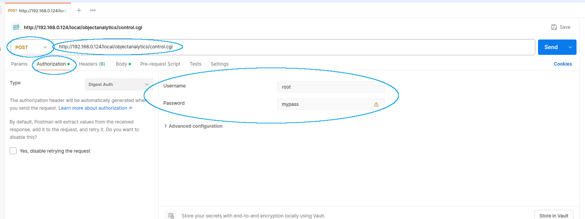
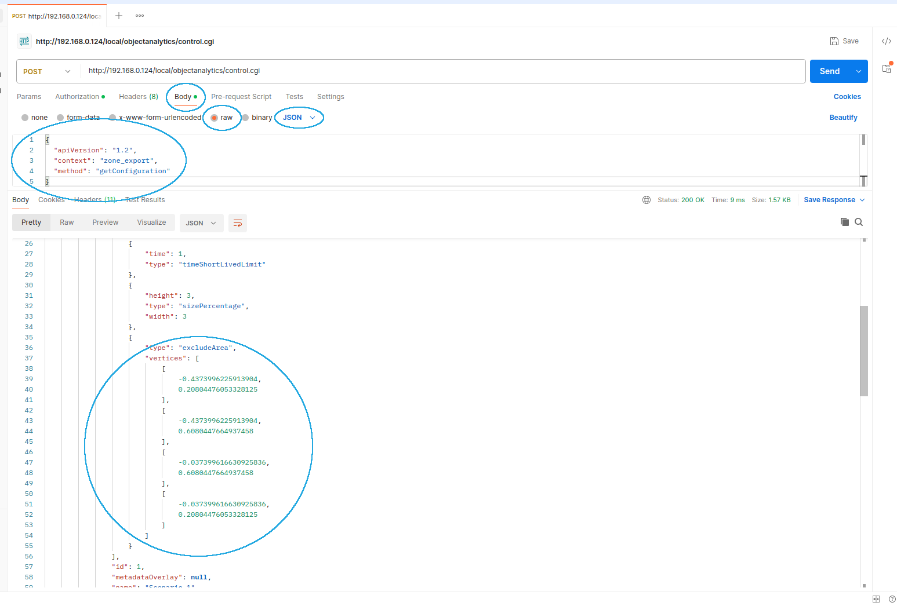

# Include Zone for Analytics

We make use of the same format for the include zone as the AXIS Object Analytics ACAP app does. That way, we can export the zone from there and use the same zone for this analytics too.

## Exporting the Include Zone

The [AOA VAPIX API is documented here](https://developer.axis.com/vapix/applications/axis-object-analytics-api/).

You can run the following command:

```bash
curl -X POST \
 --digest -u root:ACAPdev \
 -H "Content-Type: application/json" \
 -d '{"apiVersion": "1.2", "context": "zone_export", "method": "getConfiguration"}' \
 "http://${CAMERA_IP}/local/objectanalytics/control.cgi"
```

This will contain information about the configuration, including one or multiple include zones for a scenario:

```json
"vertices":[[-0.97,-0.97],[-0.97,0.97],[-0.1209,0.9616],[-0.7562,0.6008],[-0.7652,0.05951],[0.05851,0.5204],[0.04617,-0.9691]]
```

The example above is from the `data.scenarios[0].triggers[0].vertices` field.

You can also use [Postman](https://www.postman.com/downloads/) to get the zone from the camera.

First:

- Set method to `POST`
- Set the URL (including the IP of the camera)
- Press `Authorization` and select `Digest Auth`
- Specify the username and password for the camera



Then:

- Press `Body`
- Specify `raw` format and select `JSON` in the drop-down
- Specify the following JSON:
  ```json
  {
    "apiVersion": "1.2",
    "context": "zone_export",
    "method": "getConfiguration"
  }
  ```
- Press the `Send` button



You can see the zone in the `vertices` field. To use the zone in the application configuration, you need to have it with no new lines. Press the `Raw` button to remove the new lines.

Note that when you use the zone in the application configuration, you need to enclose it in an extra pair of square brackets. The format of it should look like this: `[[[-1.0, -1.0], [1.0, -1.0], [1.0, 1.0], [-1.0, 1.0]]]`.

## The coordinate system

The AXIS Object Analytics API uses a normalized coordinate system where all coordinates are in the range **[-1, 1]**:

- **X-axis**: `-1` (left edge) to `+1` (right edge)
- **Y-axis**: `-1` (bottom edge) to `+1` (top edge)

The center of the image is at coordinates `(0, 0)`.

## Visualizing the Zone

To visualize the zone on a camera snapshot, use the `visualize_zone.py` script in the `test_scripts` directory:

```bash
# Display the zone
python test_scripts/visualize_zone.py \
  -v '[[-0.97,-0.97],[-0.97,0.97],[-0.1209,0.9616],[-0.7562,0.6008],[-0.7652,0.05951],[0.05851,0.5204],[0.04617,-0.9691]]' \
  -i test_files/snapshot.jpg
```

This will overlay the zone polygon on the image with a semi-transparent green fill, showing exactly which area is being monitored.

### Testing the Point-in-Zone Algorithm

The script includes an `is_in_zone()` function that uses the ray tracing algorithm to determine if a point is inside the zone. You can test it by adding random points:

```bash
python test_scripts/visualize_zone.py \
  -v '[[-0.97,-0.97],[-0.97,0.97],[-0.1209,0.9616],[-0.7562,0.6008],[-0.7652,0.05951],[0.05851,0.5204],[0.04617,-0.9691]]' \
  -i test_files/snapshot.jpg \
  --add-random-points 500
```

Points will be drawn in:

- **Red**: Inside the zone
- **Yellow**: Outside the zone

The algorithm uses basic Python only (no numpy) for easy porting to Starlark.
