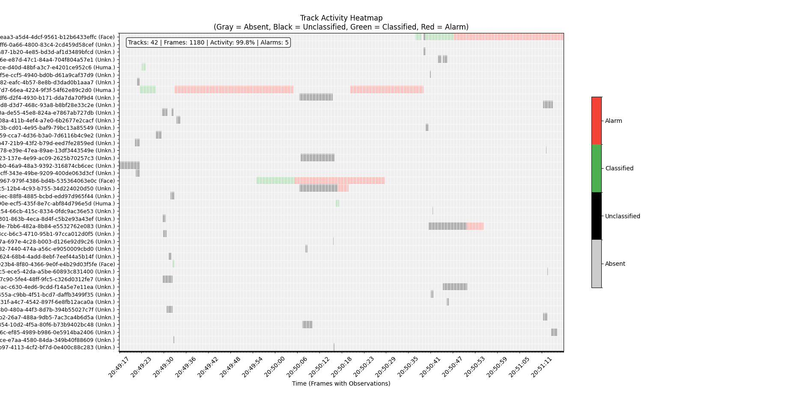

# Test Scripts

This directory contains helper scripts for testing and visualizing the time-in-area analytics functionality. All scripts work seamlessly together with the same JSONL data format used throughout this project.

## Table of Contents

<!-- toc -->

- [Installation](#installation)
- [Recording Real Device Data](#recording-real-device-data)
  - [Basic Usage](#basic-usage)
  - [Advanced Usage](#advanced-usage)
  - [Parameters](#parameters)
  - [Authentication](#authentication)
  - [AXIS OS Compatibility](#axis-os-compatibility)
  - [Use Cases](#use-cases)
- [Track Heatmap Visualization](#track-heatmap-visualization)
  - [Basic Usage](#basic-usage-1)
  - [Advanced Usage](#advanced-usage-1)
  - [Features & Example Output](#features--example-output)
    - [Activity Percentage Calculation](#activity-percentage-calculation)
- [Prerequisites](#prerequisites)

<!-- tocstop -->

## Installation

Install the required dependencies for all scripts:

```bash
pip install -r requirements.txt
```

## Recording Real Device Data

The `record_real_data.py` script allows you to record live analytics scene description data from Axis cameras for testing and analysis purposes.

### Basic Usage

```bash
python record_real_data.py --host <device_ip> --username <username>
```

This will record 30 seconds of data by default and save it to `test_files/real_device_data.jsonl`.

### Advanced Usage

```bash
python record_real_data.py \
    --host <device_ip> \
    --username <username> \
    --duration 60 \
    --topic "com.axis.analytics_scene_description.v0.beta" \
    --source "1" \
    --output-file "my_recording.jsonl"
```

### Parameters

- `--host, -h`: Device IP address or hostname (default: 192.168.1.2)
- `--username, -u`: SSH username (default: acap-fixeditdataagent)
- `--password, -p`: SSH password (optional, will prompt if needed)
- `--duration, -d`: Recording duration in seconds (default: 30)
- `--topic`: Message broker topic to consume (default: com.axis.analytics_scene_description.v0.beta)
- `--source`: Message broker source (default: 1)
- `--output-file, -o`: Output file path (default: test_files/real_device_data.jsonl)

### Authentication

The script supports multiple authentication methods in this order:

1. **CLI Password**: If `--password` is provided, uses that directly
2. **SSH Key Authentication**: Tries key authentication if no password specified
3. **Password Prompt**: Falls back to prompting for password if key auth fails

### AXIS OS Compatibility

- **AXIS OS < 12**: You can SSH as root without restrictions:

  ```bash
  python record_real_data.py --host <device_ip> --username root
  ```

- **AXIS OS 12+**: SSH as root is disabled. Regular SSH users cannot access the message broker. If you are a [Technology Integration Partner](https://www.axis.com/partner/technology-integration-partner-program), you can enable dev mode in the camera (instructions included in [this e-learning course](https://learning.fixedit.ai/spaces/11778313/content)) and use the FixedIT Data Agent user:
  ```bash
  python record_real_data.py --host <device_ip> --username acap-fixeditdataagent
  ```

### Use Cases

- **Deterministic Testing**: Record real data to test analytics pipelines with reproducible results
- **Algorithm Development**: Capture edge cases and specific scenarios for algorithm tuning
- **Data Analysis**: Use recorded data with visualization tools like `track_heatmap_viewer.py`
- **Debugging**: Capture problematic scenarios for investigation

## Track Heatmap Visualization

The `track_heatmap_viewer.py` script creates heatmap visualizations showing track activity over time. This helps visualize when different track IDs are active across frames, making it easy to understand track lifecycles and identify patterns in object detection data.

### Basic Usage

Display heatmap interactively:

```bash
python track_heatmap_viewer.py ../test_files/simple_tracks.jsonl
```

### Advanced Usage

Enable verbose output with detailed statistics:

```bash
python track_heatmap_viewer.py ../test_files/simple_tracks.jsonl --verbose
```

Show alarm visualization (tracks exceeding threshold appear in red):

```bash
python track_heatmap_viewer.py ../test_files/simple_tracks.jsonl --alarm-threshold 2.0
```

Get help:

```bash
python track_heatmap_viewer.py --help
```

### Features & Example Output

The following image is an example of the output when running with `--alarm-threshold 10`, i.e. 10 seconds before a track turns red.


_Example heatmap showing track activity over time with labeled components_

**Understanding the Heatmap Elements:**

- **Statistics Overlay (top-left white box)**: Shows key dataset metrics
  - **Tracks: 42** - Total unique track IDs detected across all frames
  - **Frames: 1180** - Number of frames containing at least one detection (not total elapsed frames)
  - **Activity: 99.8%** - Percentage of frames with detections present
  - **Alarms: 5** - Number of tracks exceeding the alarm threshold duration
- **X-axis (Time)**: Timestamps of frames with observations only - time gaps without detections are not shown
- **Y-axis (Track IDs)**: Individual object identifiers (e.g., `3effc`, `58cef`) sorted alphabetically
- **Color Legend (right side)**: Visual scale showing track states from Absent (gray) to Present (green) to Alarm (red)

#### Activity Percentage Calculation

The **Activity** percentage shows what portion of the time period had detections present. It is calculated as:

```
Activity = (Frames with ≥1 detection / Total frames) × 100
```

This metric answers: "What percentage of the time period had activity?" A higher percentage means activity was present during most of the monitored time, while a lower percentage indicates activity was sporadic or brief.
