# Timelapse with AWS S3 Upload

This project demonstrates how to create automated timelapse videos using the [FixedIT Data Agent](https://fixedit.ai/products-data-agent/) by capturing images from an AXIS device and uploading them to AWS S3. The solution creates a time-series collection of images that can be used to generate timelapse videos or for long-term storage and analysis. This approach is perfect for construction sites, environmental monitoring, safety applications, or any scenario requiring periodic visual documentation.

[](https://youtu.be/mcw3iAlBOj8)

_Click the image above to watch the timelapse video on YouTube_

## How It Works

The system captures images at regular intervals and uploads them to AWS S3 with timestamped filenames, creating a chronological sequence perfect for timelapse generation.

Since Telegraf in the Data Agent automatically handles buffering if an output is not available, you don't need to worry about losing frames if the device is offline for a short time. They will simply be buffered in memory and uploaded when the connection is restored. In this particular example, the buffering works a little differently than usual since the `remotefile` output will accept metrics even if the remote connection is temporarily unavailable, it will buffer these internally until the connection is restored. Internally in the `remotefile` plugin, `rsync` is used to upload the files to the S3 bucket. This means that you can change to uploading the images to e.g. an SFTP server by changing the remote URL.

JPEGs are fetched from the camera, then internally represented as a [base64 string](https://en.wikipedia.org/wiki/Base64) inside Telegraf. Two [remotefile](https://github.com/influxdata/telegraf/blob/master/plugins/outputs/remotefile/README.md) outputs receive the same metric: one uses `data_format = "template"` and `b64dec` to write a binary image file (`.jpg`); the other writes a small `.json` metadata file with `timestamp` and tags copied from the metric. This works around the standardized format for Telegraf metrics not carrying raw binary fields.

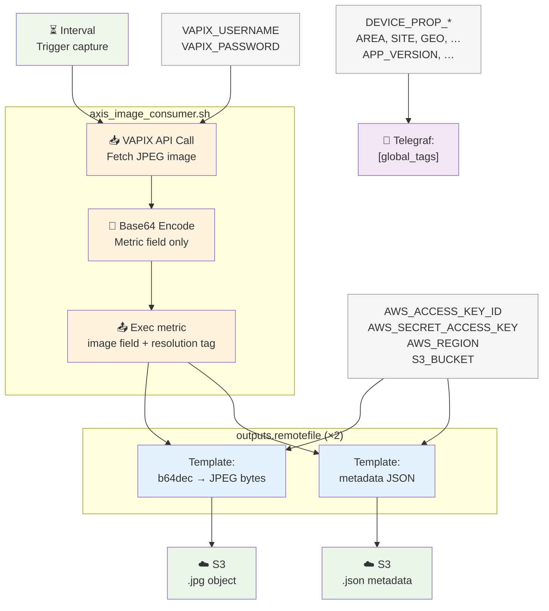
```mermaid
flowchart TD
    A["⏳ Interval<br/>Trigger capture"] --> B1["📥 VAPIX API Call<br/>Fetch JPEG image"]
    B4 --> J["☁️ S3<br/>.jpg object"]
    B5 --> M["☁️ S3<br/>.json metadata"]

    GT["📌 Telegraf:<br/>[global_tags]"]

    XMeta["DEVICE_PROP_*<br/>AREA, SITE, GEO, …<br/>APP_VERSION, …"]
    XMeta --> GT

    XVapix["VAPIX_USERNAME<br/>VAPIX_PASSWORD"]
    XVapix --> B1

    XAws["AWS_ACCESS_KEY_ID<br/>AWS_SECRET_ACCESS_KEY<br/>AWS_REGION<br/>S3_BUCKET"]
    XAws --> B4
    XAws --> B5

    subgraph "axis_image_consumer.sh"
        B1["📥 VAPIX API Call<br/>Fetch JPEG image"] --> B2["🔄 Base64 Encode<br/>Metric field only"]
        B2 --> B3["📤 Exec metric<br/>image field + resolution tag"]
    end

    subgraph "outputs.remotefile (×2)"
        B3 --> B4["Template:<br/>b64dec → JPEG bytes"]
        B3 --> B5["Template:<br/>metadata JSON"]
    end

    style A fill:#f1f8e9
    style GT fill:#f3e5f5
    style J fill:#e8f5e8
    style M fill:#e8f5e8
    style B1 fill:#fff3e0
    style B2 fill:#fff3e0
    style B3 fill:#fff3e0
    style B4 fill:#e3f2fd
    style B5 fill:#e3f2fd
    style XMeta fill:#f5f5f5,stroke:#9e9e9e
    style XVapix fill:#f5f5f5,stroke:#9e9e9e
    style XAws fill:#f5f5f5,stroke:#9e9e9e
```

## Why Choose This Approach?

**No C/C++ development required!** This solution leverages the FixedIT Data Agent's built-in capabilities to create a sophisticated timelapse system without traditional embedded programming. Instead of developing a custom ACAP application, you can achieve the same result using familiar IT tools:

- **Configuration-based setup**: Uses Telegraf configuration files instead of compiled code
- **Shell script integration**: Leverages existing VAPIX APIs through simple shell scripts
- **Cloud-native storage**: Direct integration with AWS S3 for scalable, reliable storage
- **Flexible scheduling**: Easy to adjust capture intervals and timing parameters
- **Extensible foundation**: Can be expanded with custom logic for filtering based on time, object detection, or other criteria

This approach makes timelapse functionality accessible to system integrators and IT professionals who may not have embedded development experience but are comfortable with cloud services and configuration management. The solution provides unprecedented customization capabilities not available in other timelapse software for AXIS cameras.

## Table of Contents

- [Timelapse with AWS S3 Upload](#timelapse-with-aws-s3-upload)
- [How It Works](#how-it-works)
- [Why Choose This Approach?](#why-choose-this-approach)
- [Compatibility](#compatibility)
  - [AXIS OS Compatibility](#axis-os-compatibility)
  - [FixedIT Data Agent Compatibility](#fixedit-data-agent-compatibility)
- [Create an S3 Bucket in AWS](#create-an-s3-bucket-in-aws)
  - [Create a new bucket](#create-a-new-bucket)
  - [Create a user for the FixedIT Data Agent](#create-a-user-for-the-fixedit-data-agent)
  - [Create a user for the viewer script](#create-a-user-for-the-viewer-script)
- [Quick Setup](#quick-setup)
- [Viewing Timelapses](#viewing-timelapses)
- [Troubleshooting](#troubleshooting)
- [Files](#files)
- [Configuration Details](#configuration-details)
  - [Image Capture Process](#image-capture-process)
  - [AWS S3 Integration](#aws-s3-integration)
  - [Output File Format](#output-file-format)
  - [S3 Bucket Structure](#s3-bucket-structure)
- [Local Testing on Host](#local-testing-on-host)
  - [Prerequisites](#prerequisites)
  - [Host Testing Limitations](#host-testing-limitations)
  - [Test Commands](#test-commands)
- [Known issues](#known-issues)
- [License](#license)

## Compatibility

### AXIS OS Compatibility

- **Minimum AXIS OS version**: Should be compatible with AXIS OS 11 and 12+.
- **Required tools**: Uses `jq` which was not available in older AXIS OS versions, but could easily be changed to not depend on it. Uses `curl` and `openssl` which are installed by default.
- **Authentication**: Uses HTTP to localhost with DIGEST authentication which is supported by all AXIS OS versions.

### FixedIT Data Agent Compatibility

- **Minimum Data Agent version**: 1.5.0
- **Required features**: Uses the `serializers.template` plugin which was added in FixedIT Data Agent 1.5.0. Uses the `input.exec` and `output.remotefile` plugins. Uses the `TELEGRAF_DEBUG`, `HELPER_FILES_DIR` and `DEVICE_PROP_*` environment variables which are available in all FixedIT Data Agent versions. Uses the `VAPIX_USERNAME` and `VAPIX_PASSWORD` environment variables which was added in FixedIT Data Agent v1.1.

## Create an S3 Bucket in AWS

This demo will upload images to an S3 bucket in AWS, so you need to create one and generate user credentials that are allowed to interact with that bucket.

### Create a new bucket

Go to the S3 service in AWS and create a new bucket. All you need to specify is the name of the bucket, the rest of the settings can be left as default.

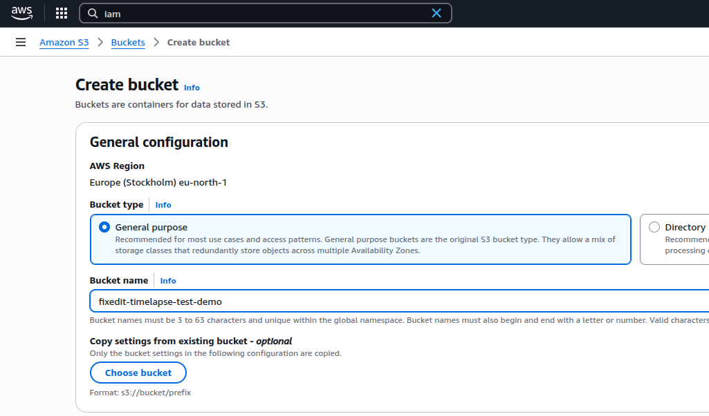

### Create a user for the FixedIT Data Agent

For the FixedIT Data Agent you can create a very limited user that only has the permissions to upload data to the bucket.

Go to the IAM service in AWS, then to `Users` and create a new user. Give it a name, then click `Next`.

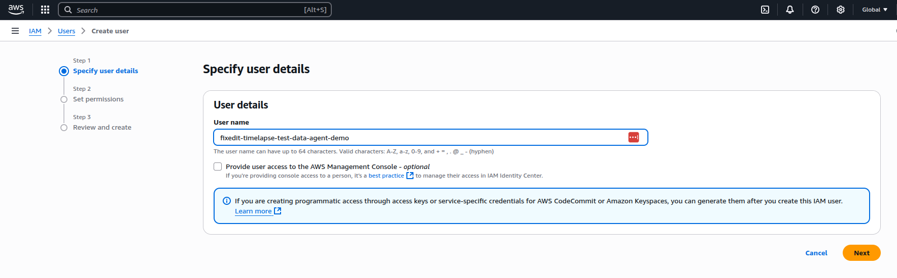

On "Set permissions", click `Next` without adding any permissions.

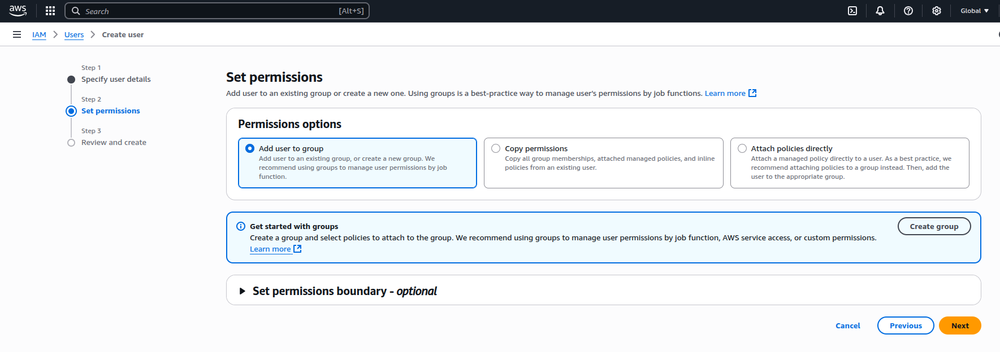

On "Review and create", click `Create user`.

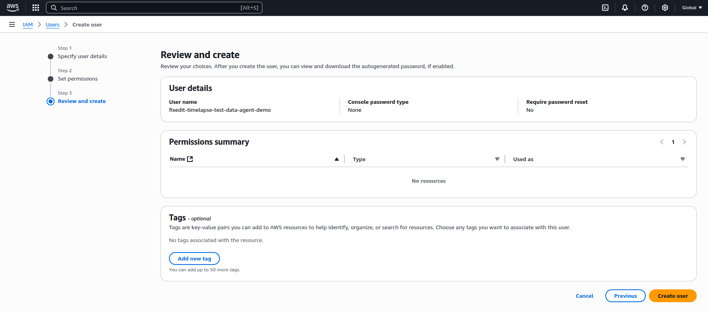

Then go to the user and click `Add permissions`, then `create inline policy`.

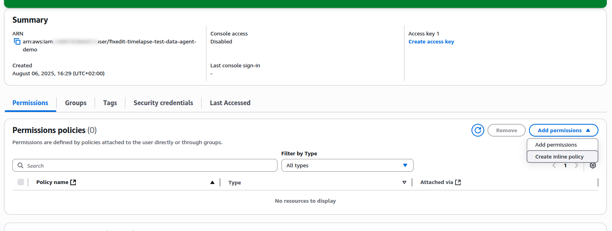

Select `S3` as the Service. Under "Actions allowed", expand `List` and select `ListBucket`. Expand `Write` and select `PutObject`.

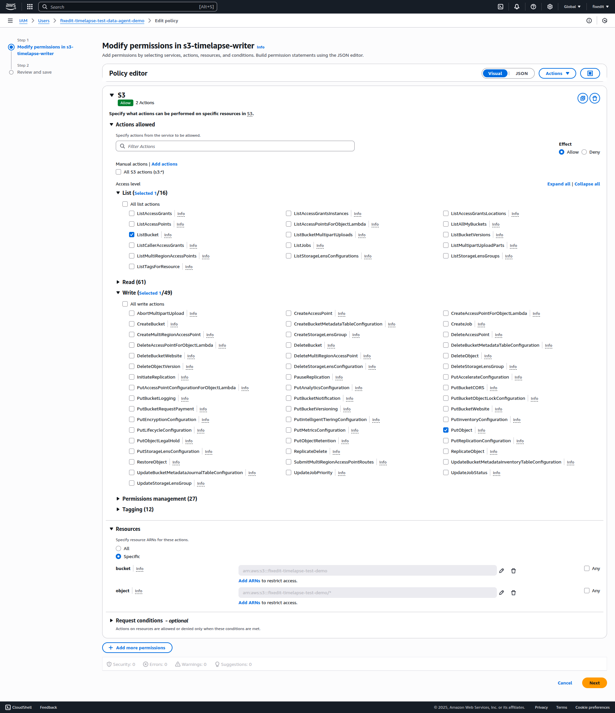

Under `Resources`, select `Specific`. Then click on `Add ARN` next to `bucket` and paste the name of the bucket.

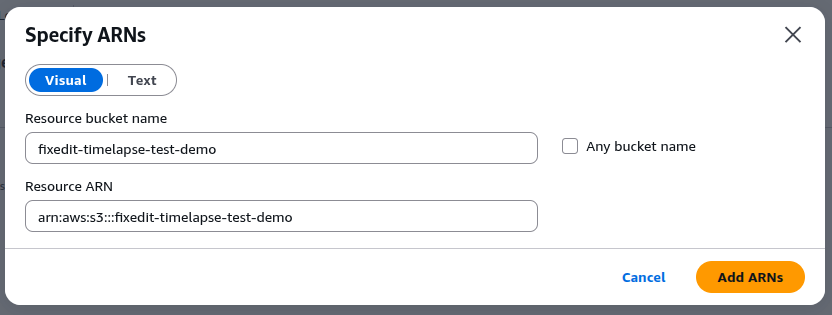

Next to `object`, click `Add ARN` and paste the name of the bucket again and make sure that `Any object name` is selected.

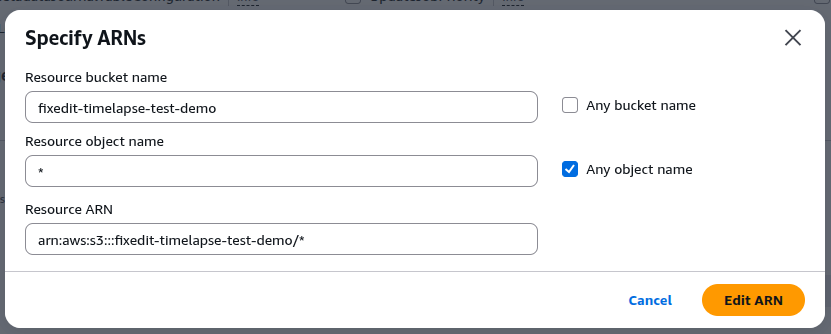

After creating the user and setting up the permissions, you need to create access keys for the FixedIT Data Agent to authenticate with AWS.

Go to the IAM user you just created and click on the "Security credentials" tab. Click "Create access key".

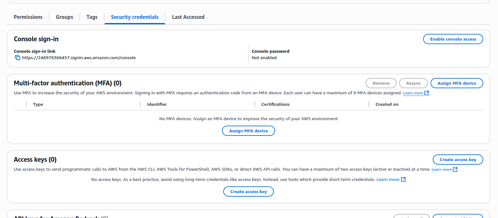

Select "Command Line Interface (CLI)" as the use case.

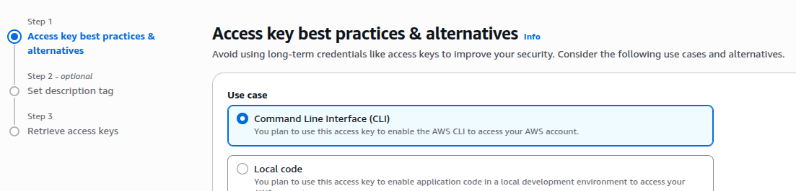

Click "Next" and then "Create access key". Copy both the access key ID and secret access key - you will need them later.

### Create a user for the viewer script

Repeat the same steps as for the FixedIT Data Agent user above, but this time, select all S3 actions (including listing and viewing data).

After creating the user and setting up the permissions, create access keys following the same process as above. You will need these credentials to view the timelapse videos using the viewer script.

## Quick Setup

1. **Configure FixedIT Data Agent variables:**

   Click the three dots next to the FixedIT Data Agent application in the camera's "Apps" section and select "Settings". Then set the following parameters:
   - `VAPIX Username`: The username for a viewer in the camera
   - `VAPIX Password`: The password for a viewer in the camera

   Set the following environment variables in the `Extra env` parameter as a semicolon-separated list:

   ```txt
   AWS_ACCESS_KEY_ID=your_aws_access_key;AWS_SECRET_ACCESS_KEY=your_aws_secret_key;AWS_REGION=your_aws_region;S3_BUCKET=your_timelapse_bucket;CAPTURE_INTERVAL_SEC=300
   ```

   **Required variables:**
   - `VAPIX_USERNAME` / `VAPIX_PASSWORD`: These are configured in the Data Agent settings and used to fetch the images using the network API
   - `AWS_ACCESS_KEY_ID` / `AWS_SECRET_ACCESS_KEY`: AWS credentials for S3 access
   - `AWS_REGION`: AWS region (depends on your S3 bucket setup)
   - `S3_BUCKET`: Target S3 bucket name
   - `CAPTURE_INTERVAL_SEC`: Image capture interval in seconds (default: 300 = 5 minutes)

   **Optional variables:**
   - `RESOLUTION`: Image resolution (optional; if not set, camera default will be used)
   - `CAMERA_IP`: Camera IP address for image capture (optional; if not set, `localhost` will be used). If you want to use images from the camera that is running the FixedIT Data Agent, this does not need to be set.

2. **Upload the files to the FixedIT Data Agent**

   Upload all configuration files and scripts to your FixedIT Data Agent instance.

3. **Enable the configuration files**

   The system will begin capturing images at the specified interval and uploading them to your S3 bucket with timestamped filenames.

## Viewing Timelapses

After uploading images to S3, you can view them using the timelapse viewer in the `test_scripts/` directory:

First, export your AWS credentials for the viewer script user:

```bash
export AWS_ACCESS_KEY_ID="your_viewer_access_key"
export AWS_SECRET_ACCESS_KEY="your_viewer_secret_key"
export AWS_REGION="your_aws_region"
```

You can find the AWS region in the "Properties" tab of the S3 bucket in AWS, this would be e.g. `us-east-1` or `eu-north-1`.

Then run the timelapse viewer:

```bash
cd test_scripts
pip install -r requirements.txt
python timelapse_viewer.py view --bucket <your_s3_bucket_name> --device <DEVICE_SERIAL> --fps 10
```

For more information, see the [test_scripts/README.md](test_scripts/README.md) file.

## Troubleshooting

Enable the `Debug` option in the FixedIT Data Agent for detailed logs. Debug files will appear in the `Uploaded helper files` section (refresh page to see updates).

**No files are being uploaded:**

Since the upload happens asynchronously, there is not always an immediate status available on successful or failed uploads in the `remotefile` plugin. You can enable debug mode which will show logs about "wrote metric", but that just means that the `remotefile` plugin has cached it locally and scheduled it for upload.

Upload failures could be due to:

- **Invalid AWS credentials**: Check that your `AWS_ACCESS_KEY_ID` and `AWS_SECRET_ACCESS_KEY` are correct
- **Incorrect bucket name**: Verify that your `S3_BUCKET` parameter matches an existing S3 bucket
- **Wrong AWS region**: Ensure your `AWS_REGION` parameter matches the region where your S3 bucket is located
- **Network connectivity issues**: The device may not have internet access or firewall rules may be blocking S3 connections
- **S3 bucket permissions**: Your AWS credentials may not have the necessary permissions to write to the specified bucket

If the AWS permissions are not enough, you should see an error like this in the debug logs after a while:

```txt
[2025-08-06 16:42:50] 2025-08-06T14:42:50Z E! [agent] Failed to connect to [outputs.remotefile], retrying in 15s, error was "operation error S3: ListObjectsV2, https response error StatusCode: 403, RequestID: **, HostID: **, api error AccessDenied: User: arn:aws:iam::248976366457:user/fixedit-timelapse-test-data-agent-demo is not authorized to perform: s3:ListBucket on resource: \"arn:aws:s3:::fixedit-timelapse-test-demo\" because no identity-based policy allows the s3:ListBucket action"
```

**Note**: Don't leave debug enabled long-term as it creates large log files.

## Files

- `timelapse-to-s3.conf` - Complete Telegraf configuration combining all components
- `axis_image_consumer.sh` - Image capture script using VAPIX API
- `test_scripts/` - Testing and viewing tools (see [test_scripts/README.md](test_scripts/README.md))

## Configuration Details

### Image Capture Process

1. **Exec Input Plugin**: Runs `axis_image_consumer.sh` at specified intervals
2. **Image Processing**: Script fetches JPEG from camera's VAPIX API and encodes as base64 for the `image_base64` field
3. **JSON metric**: Exec plugin parses stdout into a Telegraf metric (string field + metadata)
4. **S3 upload**: Two remotefile outputs write `timelapse-HH-MM-SS.jpg` (binary) and `timelapse-HH-MM-SS.json` (metadata) under the same folder

### AWS S3 Integration

- **File naming**: `${DEVICE_PROP_SERIAL}/YYYY-MM-DD/timelapse-HH-MM-SS.(jpg|json)` objects
- **JPEG object**: Raw bytes (`image/jpeg`)
- **JSON object**: Metadata file with image tags
- **Access Control**: Uses AWS IAM credentials for authentication

### Output file layout

Each capture produces a pair of objects with the same path prefix and clock-based name:

- **`*.jpg`**: The frame as a normal JPEG file.
- **`*.json`**: Metadata only, for example:

```json
{
  "timestamp": 1691328000,
  "tags": {
    "host": "axis-b8a44f717321",
    "area": "Europe",
    "geography": "Sweden",
    "region": "Lund",
    "site": "Office",
    "latitude": "55.714794",
    "longitude": "13.214984",
    "type": "Construction Site",
    "resolution": "1920x1080",
    "device_brand": "AXIS",
    "device_model": "M3045-LVE",
    "device_variant": "48mm",
    "device_type": "Dome Camera",
    "product_full_name": "AXIS M3045-LVE Dome Camera",
    "device_serial": "B8A44F717321",
    "firmware_version": "12.5.56",
    "architecture": "aarch64",
    "soc": "Axis Artpec-7",
    "data_agent_version": "1.5.0",
    "data_agent_start_time": "1760454197"
  }
}
```

### S3 Bucket Structure

The timelapse images are organized in the S3 bucket with the following structure:

```
s3://your-timelapse-bucket/
├── DEVICE_SERIAL_001/
│   ├── 2025-08-06/
│   │   ├── timelapse-10-38-33.jpg
│   │   ├── timelapse-10-38-33.json
│   │   ├── timelapse-10-38-37.jpg
│   │   ├── timelapse-10-38-37.json
│   │   └── ...
│   ├── 2025-08-07/
│   │   ├── timelapse-09-15-30.jpg
│   │   ├── timelapse-09-15-30.json
│   │   └── ...
│   └── ...
├── DEVICE_SERIAL_002/
│   ├── 2025-08-06/
│   │   └── ...
│   └── ...
└── ...
```

## Local Testing on Host

You can test this project locally using Telegraf before deploying to your AXIS device.

### Prerequisites

- Install Telegraf on your development machine
- Access to an S3 bucket for testing
- Network access to an AXIS device for image capture

### Host Testing Limitations

Everything works on host, you just need network access to a camera to capture the frames.

### Test Commands

First, set up the environment variables:

```bash
# Required variables (must be configured)
export VAPIX_USERNAME="your_vapix_username"
export VAPIX_PASSWORD="your_vapix_password"
export CAMERA_IP="your.camera.ip"

export AWS_ACCESS_KEY_ID="your_access_key"
export AWS_SECRET_ACCESS_KEY="your_secret_key"
export AWS_REGION="your_aws_region"
export S3_BUCKET="your_timelapse_bucket"

# Set the directory where the shell script is located.
export HELPER_FILES_DIR="$(pwd)"

# Set the capture interval in seconds.
export CAPTURE_INTERVAL_SEC="60"

# Device serial, used for the S3 path prefix
export DEVICE_PROP_SERIAL="host-test"

# Set image resolution (optional, otherwise camera default will be used)
export RESOLUTION="1920x1080"

# Enable debug mode (optional)
export TELEGRAF_DEBUG="true"
```

Then run the test:

```bash
# Run continuously (use Ctrl+C to stop)
telegraf --config timelapse-to-s3.conf
```

Note that running `--once` will not work as expected since it will only run one of the outputs and either write the image or the metadata file, but not both. Running with `--test` should be avoided since it will print the whole base64 encoded image to the console.

## Known issues

Although the `remotefile` output will buffer frames in memory for later upload if no internet connection is available, it is blocking the initialization of the workflow until it can connect to the S3 bucket the first time. This means that if the device boots up with no internet connection, the workflow will not start capturing frames until it has managed to connect to the S3 bucket at least once. This can be seen in the logs below:

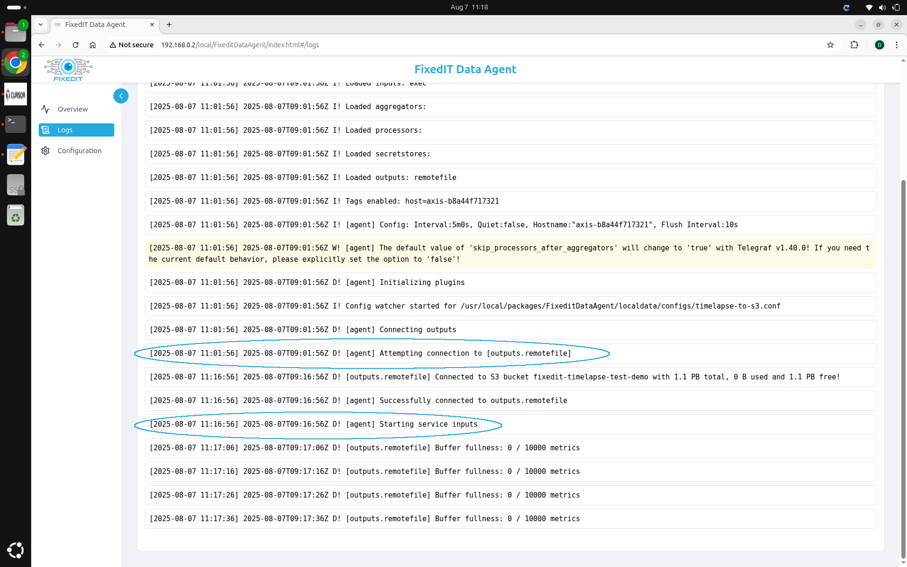

## License

This project is licensed under the MIT License - see the [LICENSE](LICENSE) file for details.
