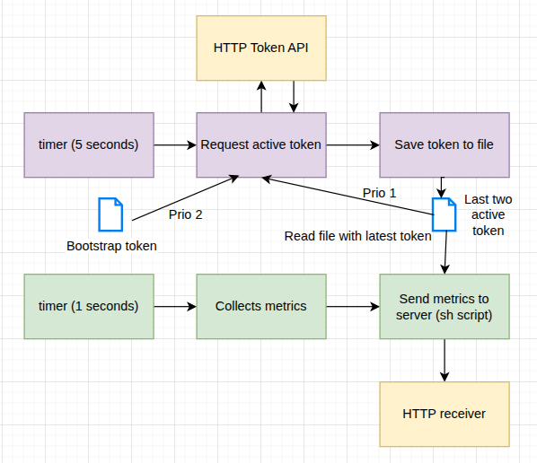

# Example of token rotation for the FixedIT Data Agent

When sending data to the cloud from the FixedIT Data Agent we might want to use token rotation so that any specific token is not used for too long.

This project was created during a screencast that can be found [here](https://www.youtube.com/watch?v=zeWdbDNvj_w).

The data flow can be seen in the following diagram:

## Table of contents

<!-- toc -->

- [Compatibility](#compatibility)
  - [AXIS OS Compatibility](#axis-os-compatibility)
  - [FixedIT Data Agent Compatibility](#fixedit-data-agent-compatibility)
- [Parts of the project](#parts-of-the-project)
- [Authentication flow](#authentication-flow)
- [Quick start](#quick-start)

<!-- tocstop -->

## Compatibility

### AXIS OS Compatibility

- **Minimum AXIS OS version**: TBD
- **Required tools**: Requires `jq` and the `curl` command. Uses the `local` identifier which is not guaranteed in all versions of `sh`.

### FixedIT Data Agent Compatibility

- **Minimum Data Agent version**: 1.3
- **Required features**: Uses the `inputs.mock` plugin that was added in FixedIT Data Agent v1.3.

## Parts of the project

- `test_scripts/example_server.py`: Example server that receives data from the FixedIT Data Agent and shows it in the terminal. This server will also be responsible for creating new tokens.
- `inputs.conf`: Telegraf config for creation of example data every second.
- `output.conf`: Telegraf config for sending the example data to the example server.
- `update_token.conf`: Telegraf config for updating the token on the device every 5 seconds.
- `send_http_request.sh`: Helper script for the FixedIT Data Agent to send HTTP requests using token-based authentication and the token file created by the `update_token.conf` workflow.

## Authentication flow

From the start, all devices share a bootstrapping key. The first time a new device connects to the server, it will be issued a new token. After this, the bootstrap token will no longer be accepted by the server for this particular device.

The device has a workflow that will request the latest active token from the server's `/generate-token` endpoint every 5 seconds. The workflow will then save this token to the `${HELPER_FILES_DIR}/token.txt` file.

All the workflows in the device that are pushing data to the server will make use of the `send_metrics.sh` script which will read the token from the `${HELPER_FILES_DIR}/token.txt` file and use it to authenticate the request.

## Quick start

1. Install and start the FixedIT Data Agent.
2. Set the `Extra env` parameter in the FixedIT Data Agent to the following:
   `SERVER_URL=my.server.address;BOOTSTRAP_TOKEN=bootstrap-key-12345`
   where `my.server.address` is replaced by the hostname or IP address of the server that runs the `example_server.py` script. The `BOOTSTRAP_TOKEN` matches the example token that is currently hardcoded in the `example_server.py` script.
3. Upload the script file to the data agent by pressing the `Upload Helper File` button in the top right corner of the UI and select the `send_http_request.sh` file. Make sure to check the `Make executable` checkbox.
4. Upload the `inputs.conf`, `output.conf`, and `update_token.conf` files to the data agent by pressing the `Upload Config` button in the top right corner of the UI.
5. Enable the `inputs.conf`, `output.conf`, and `update_token.conf` files by pressing the `Enable` button.

The device will now start sending data to the server every second using a new token every 5 seconds.
